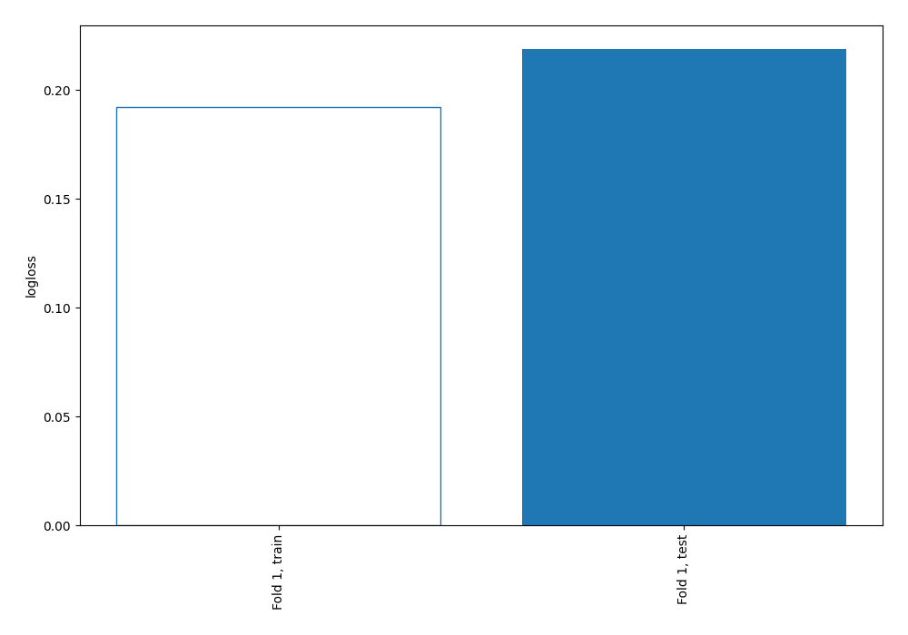
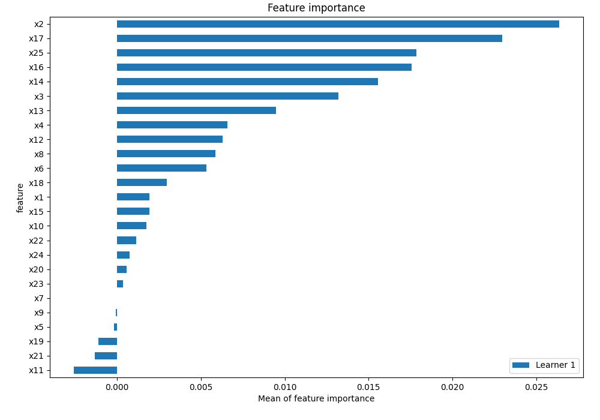
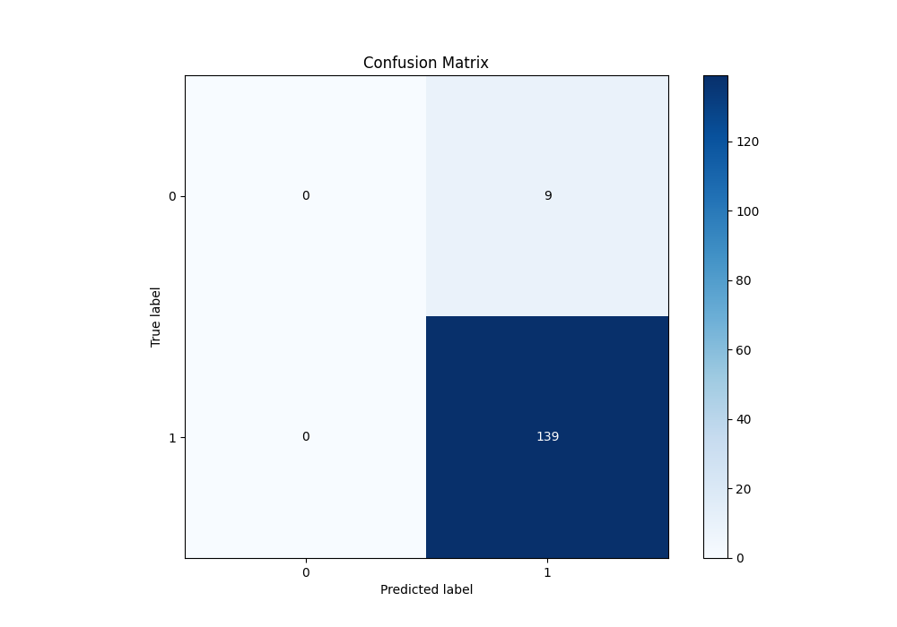
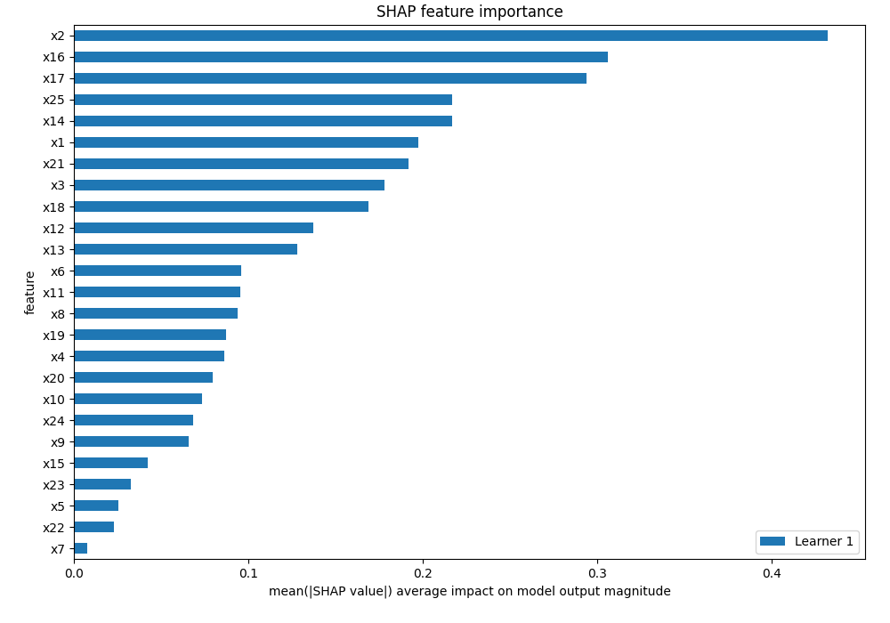
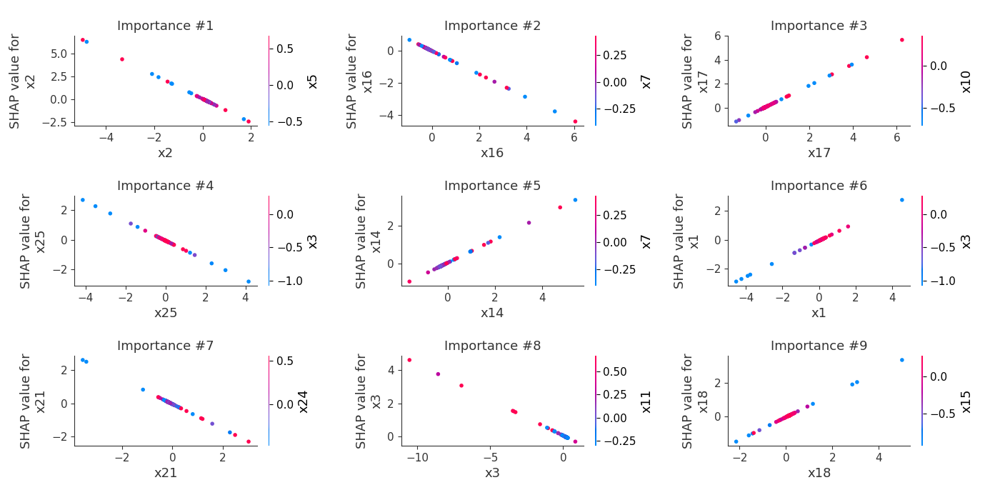
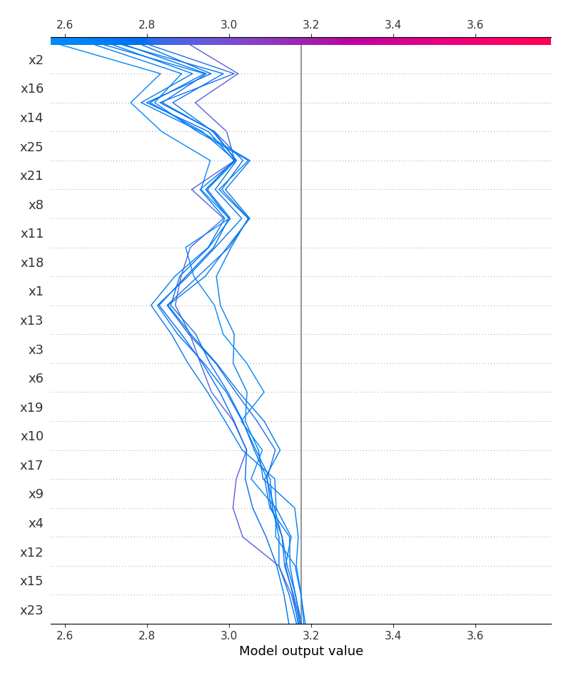
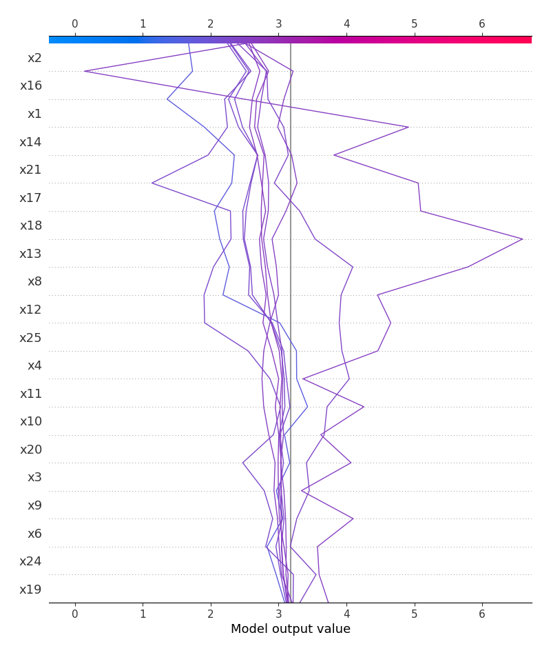
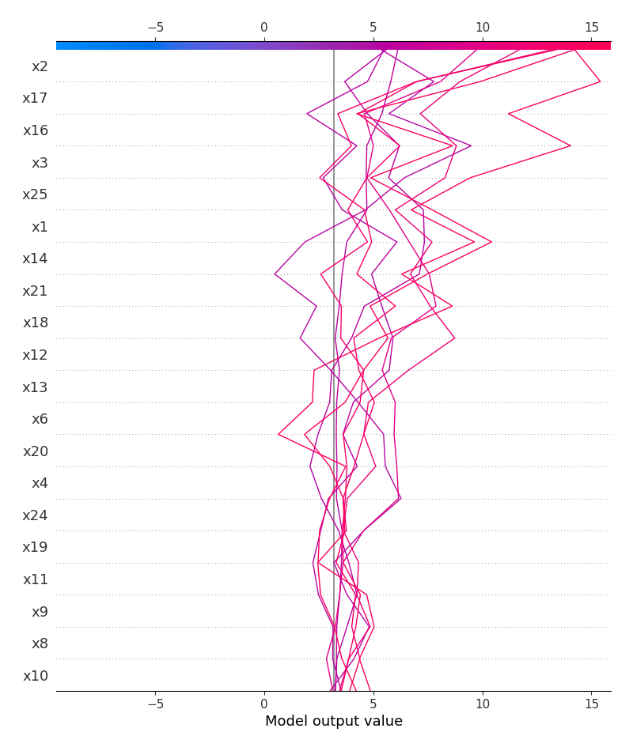

# Summary of 2_Linear

[<< Go back](../README.md)

## Logistic Regression (Linear)
- **n_jobs**: -1
- **explain_level**: 2

## Validation
 - **validation_type**: split
 - **train_ratio**: 0.75
 - **shuffle**: True
 - **stratify**: True

## Optimized metric
logloss

## Training time

5.5 seconds

## Metric details
|           |    score |   threshold |
|:----------|---------:|------------:|
| logloss   | 0.218842 |  nan        |
| auc       | 0.709033 |  nan        |
| f1        | 0.968641 |    0.757955 |
| accuracy  | 0.939189 |    0.757955 |
| precision | 1        |    0.948233 |
| recall    | 1        |    0.757955 |
| mcc       | 0.208398 |    0.942933 |

## Metric details with threshold from accuracy metric
|           |    score |   threshold |
|:----------|---------:|------------:|
| logloss   | 0.218842 |  nan        |
| auc       | 0.709033 |  nan        |
| f1        | 0.968641 |    0.757955 |
| accuracy  | 0.939189 |    0.757955 |
| precision | 0.939189 |    0.757955 |
| recall    | 1        |    0.757955 |
| mcc       | 0        |    0.757955 |

## Confusion matrix (at threshold=0.757955)
|              |   Predicted as 0 |   Predicted as 1 |
|:-------------|-----------------:|-----------------:|
| Labeled as 0 |                0 |                9 |
| Labeled as 1 |                0 |              139 |

## Learning curves

## Coefficients
| feature   |   Learner_1 |
|:----------|------------:|
| intercept |   3.19754   |
| x17       |   0.897433  |
| x18       |   0.681409  |
| x12       |   0.639394  |
| x1        |   0.625621  |
| x14       |   0.60738   |
| x4        |   0.412733  |
| x19       |   0.342472  |
| x24       |   0.238276  |
| x6        |   0.218453  |
| x20       |   0.2141    |
| x23       |   0.0954593 |
| x5        |   0.059508  |
| x22       |   0.0593622 |
| x7        |   0.0349623 |
| x9        |  -0.194681  |
| x15       |  -0.197499  |
| x10       |  -0.229146  |
| x8        |  -0.305428  |
| x11       |  -0.353797  |
| x13       |  -0.410818  |
| x3        |  -0.432758  |
| x25       |  -0.666114  |
| x16       |  -0.727222  |
| x21       |  -0.750691  |
| x2        |  -1.29319   |

## Permutation-based Importance

## Confusion Matrix

## Normalized Confusion Matrix

## SHAP Importance

## SHAP Dependence plots

### Dependence (Fold 1)

## SHAP Decision plots

### Top-10 Worst decisions for class 0 (Fold 1)

### Top-10 Best decisions for class 0 (Fold 1)

### Top-10 Worst decisions for class 1 (Fold 1)

### Top-10 Best decisions for class 1 (Fold 1)

[<< Go back](../README.md)
