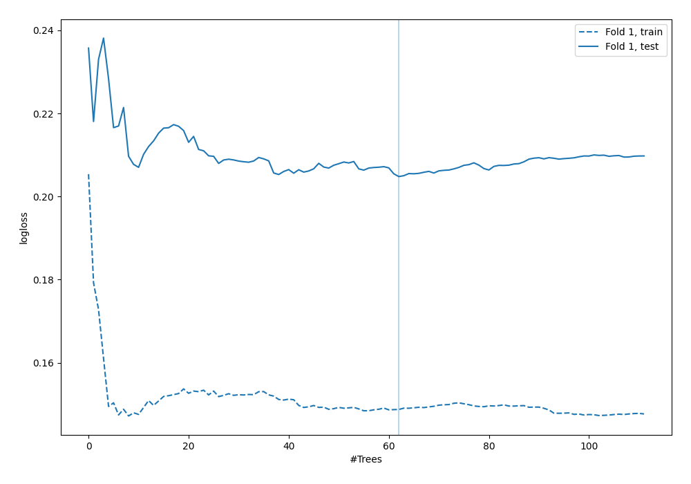
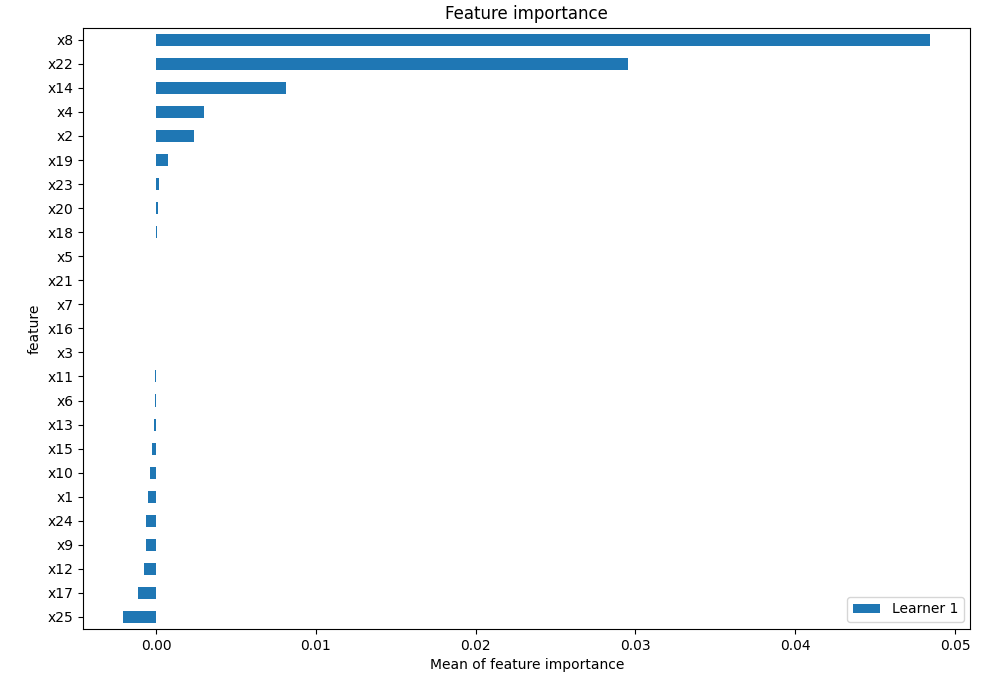
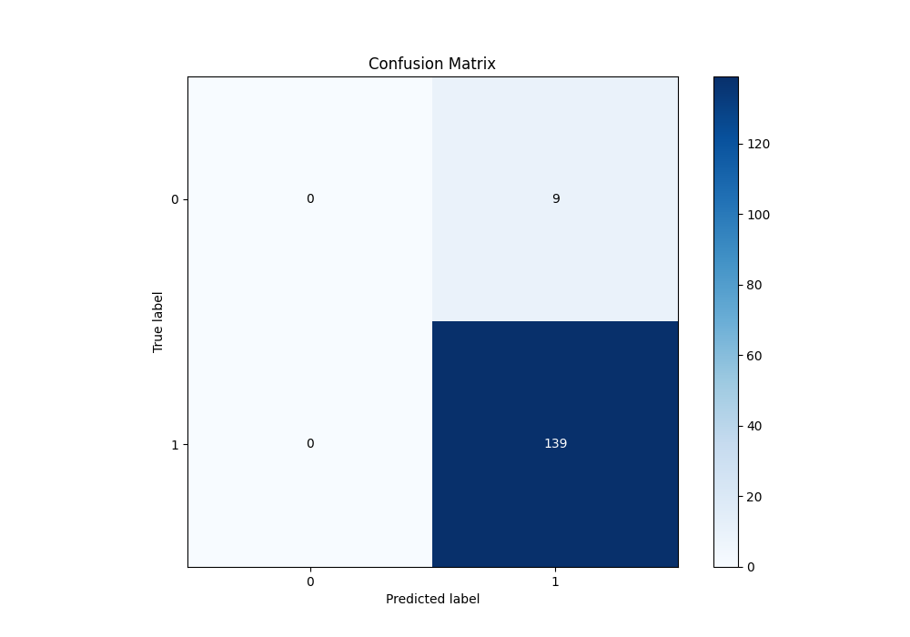

# Summary of 3_Default_RandomForest

[<< Go back](../README.md)

## Random Forest
- **n_jobs**: -1
- **criterion**: gini
- **max_features**: 0.9
- **min_samples_split**: 30
- **max_depth**: 4
- **eval_metric_name**: logloss
- **explain_level**: 2

## Validation
 - **validation_type**: split
 - **train_ratio**: 0.75
 - **shuffle**: True
 - **stratify**: True

## Optimized metric
logloss

## Training time

3.8 seconds

## Metric details
|           |    score |   threshold |
|:----------|---------:|------------:|
| logloss   | 0.20482  |  nan        |
| auc       | 0.791367 |  nan        |
| f1        | 0.968641 |    0.543243 |
| accuracy  | 0.939189 |    0.543243 |
| precision | 1        |    0.978159 |
| recall    | 1        |    0.543243 |
| mcc       | 0.347893 |    0.938353 |

## Metric details with threshold from accuracy metric
|           |    score |   threshold |
|:----------|---------:|------------:|
| logloss   | 0.20482  |  nan        |
| auc       | 0.791367 |  nan        |
| f1        | 0.968641 |    0.543243 |
| accuracy  | 0.939189 |    0.543243 |
| precision | 0.939189 |    0.543243 |
| recall    | 1        |    0.543243 |
| mcc       | 0        |    0.543243 |

## Confusion matrix (at threshold=0.543243)
|              |   Predicted as 0 |   Predicted as 1 |
|:-------------|-----------------:|-----------------:|
| Labeled as 0 |                0 |                9 |
| Labeled as 1 |                0 |              139 |

## Learning curves

## Permutation-based Importance

## Confusion Matrix

## Normalized Confusion Matrix

[<< Go back](../README.md)
