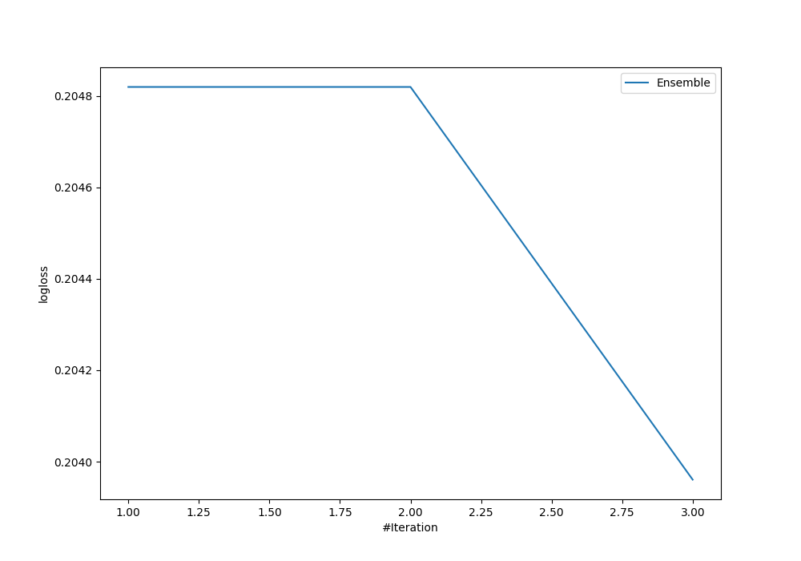

# Summary of Ensemble

[<< Go back](../README.md)

## Ensemble structure
| Model                  |   Weight |
|:-----------------------|---------:|
| 2_Linear               |        1 |
| 3_Default_RandomForest |        2 |

## Metric details
|           |    score |   threshold |
|:----------|---------:|------------:|
| logloss   | 0.203961 |  nan        |
| auc       | 0.801759 |  nan        |
| f1        | 0.968641 |    0.624739 |
| accuracy  | 0.939189 |    0.624739 |
| precision | 1        |    0.96668  |
| recall    | 1        |    0.624739 |
| mcc       | 0.354451 |    0.938529 |

## Metric details with threshold from accuracy metric
|           |    score |   threshold |
|:----------|---------:|------------:|
| logloss   | 0.203961 |  nan        |
| auc       | 0.801759 |  nan        |
| f1        | 0.968641 |    0.624739 |
| accuracy  | 0.939189 |    0.624739 |
| precision | 0.939189 |    0.624739 |
| recall    | 1        |    0.624739 |
| mcc       | 0        |    0.624739 |

## Confusion matrix (at threshold=0.624739)
|              |   Predicted as 0 |   Predicted as 1 |
|:-------------|-----------------:|-----------------:|
| Labeled as 0 |                0 |                9 |
| Labeled as 1 |                0 |              139 |

## Learning curves

## Confusion Matrix

## Normalized Confusion Matrix

[<< Go back](../README.md)
