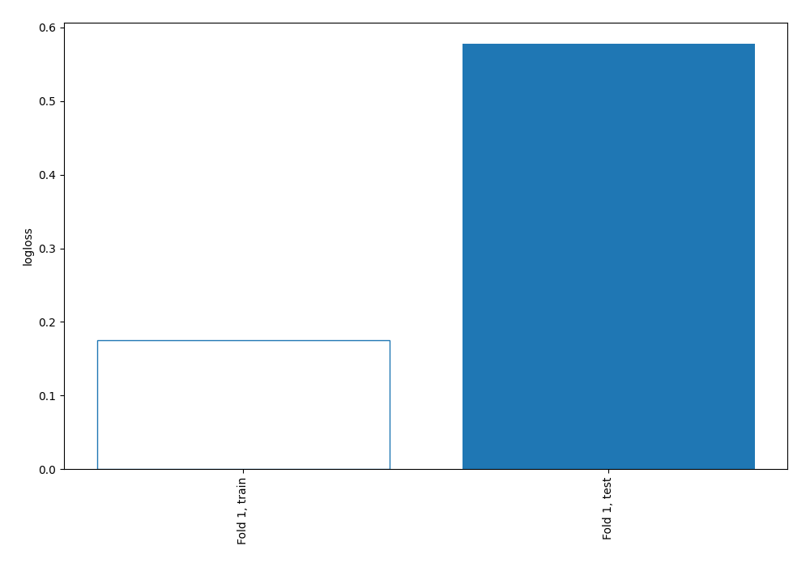
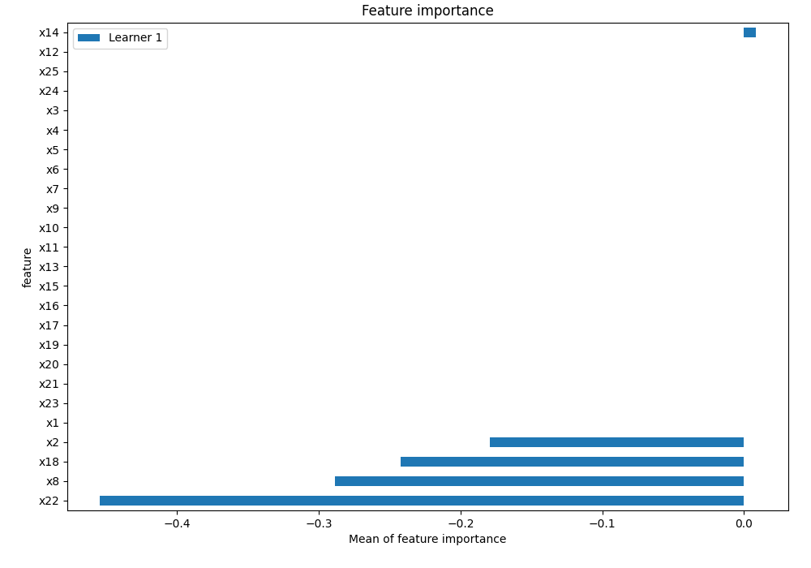
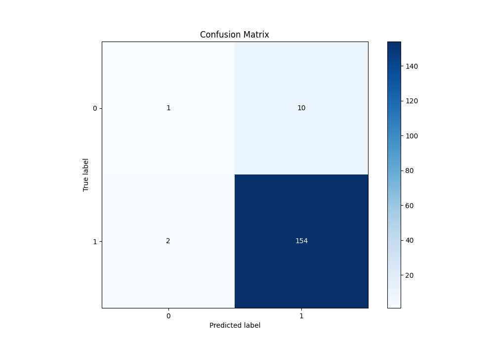
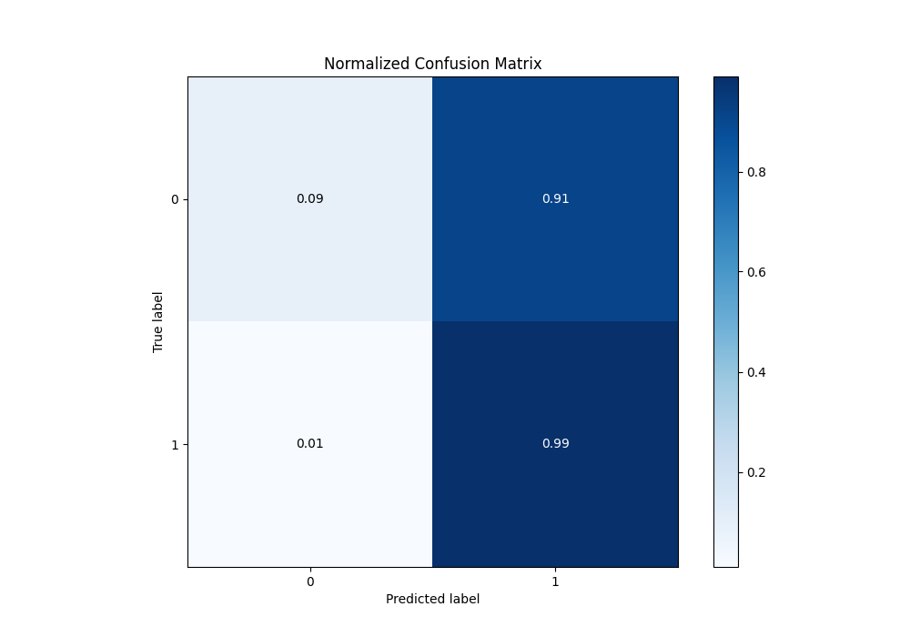

# Summary of 1_DecisionTree

[<< Go back](../README.md)

## Decision Tree
- **n_jobs**: -1
- **criterion**: gini
- **max_depth**: 3
- **explain_level**: 2

## Validation
 - **validation_type**: split
 - **train_ratio**: 0.75
 - **shuffle**: True
 - **stratify**: True

## Optimized metric
logloss

## Training time

2.2 seconds

## Metric details
|           |    score |   threshold |
|:----------|---------:|------------:|
| logloss   | 0.577802 |   nan       |
| auc       | 0.638695 |   nan       |
| f1        | 0.9625   |     0       |
| accuracy  | 0.928144 |     0       |
| precision | 0.96875  |     0.96875 |
| recall    | 0.987179 |     0       |
| mcc       | 0.252834 |     0.96875 |

## Metric details with threshold from accuracy metric
|           |    score |   threshold |
|:----------|---------:|------------:|
| logloss   | 0.577802 |         nan |
| auc       | 0.638695 |         nan |
| f1        | 0.9625   |           0 |
| accuracy  | 0.928144 |           0 |
| precision | 0.939024 |           0 |
| recall    | 0.987179 |           0 |
| mcc       | 0.145836 |           0 |

## Confusion matrix (at threshold=0.0)
|              |   Predicted as 0 |   Predicted as 1 |
|:-------------|-----------------:|-----------------:|
| Labeled as 0 |                1 |               10 |
| Labeled as 1 |                2 |              154 |

## Learning curves

## Permutation-based Importance

## Confusion Matrix

## Normalized Confusion Matrix

[<< Go back](../README.md)
