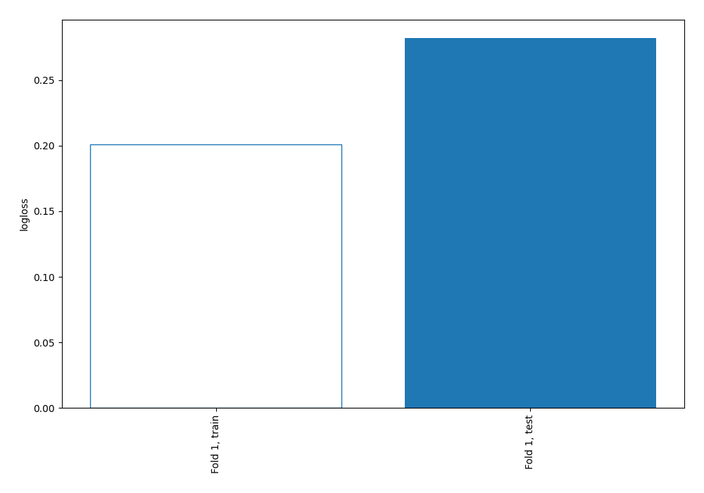
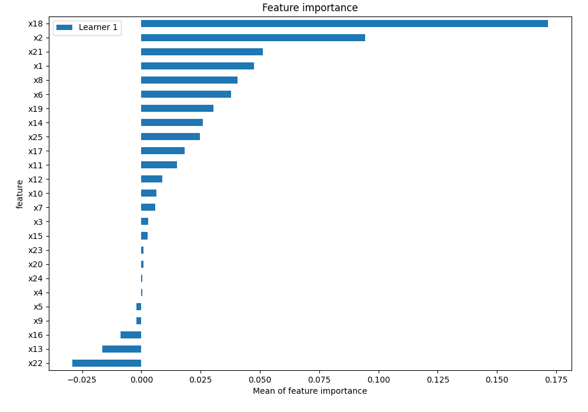
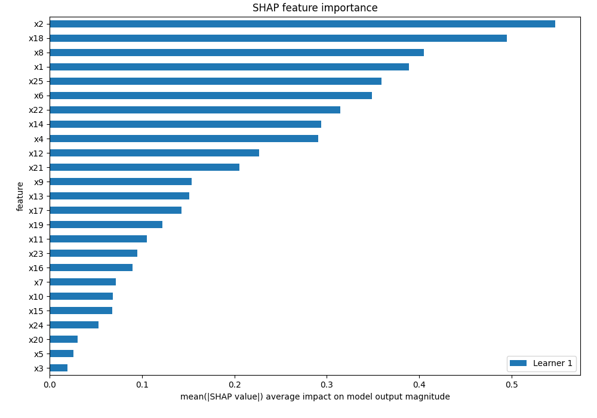
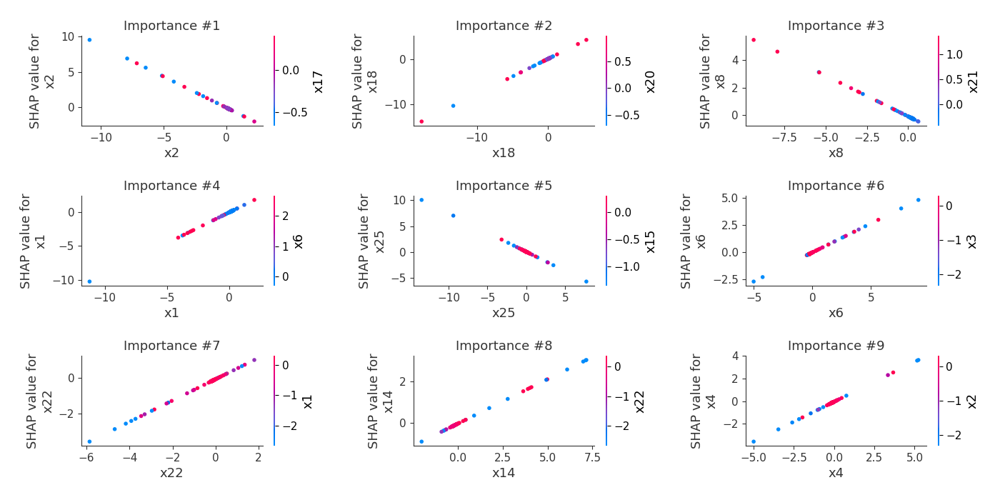
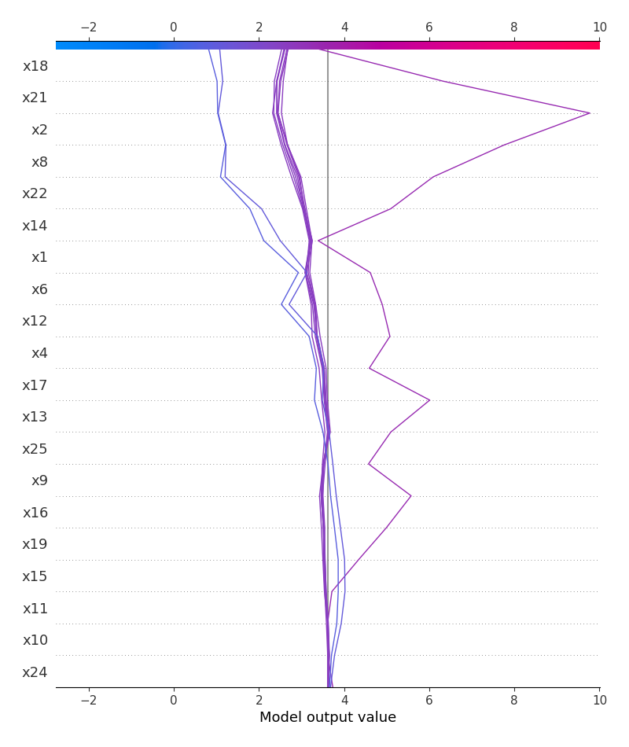
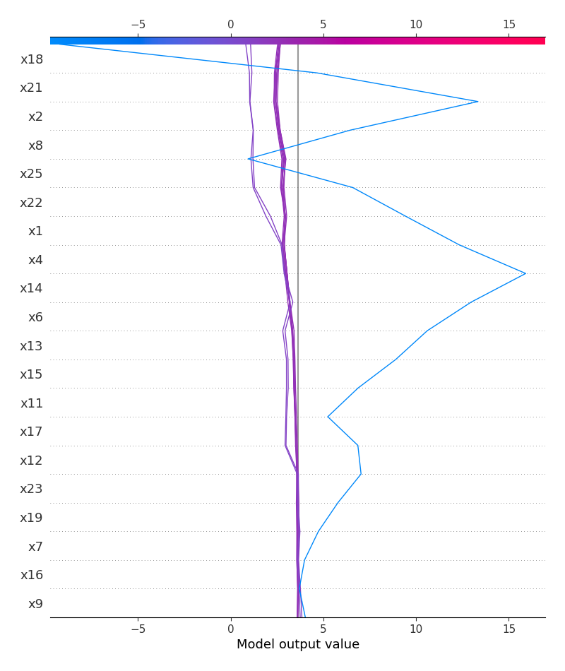
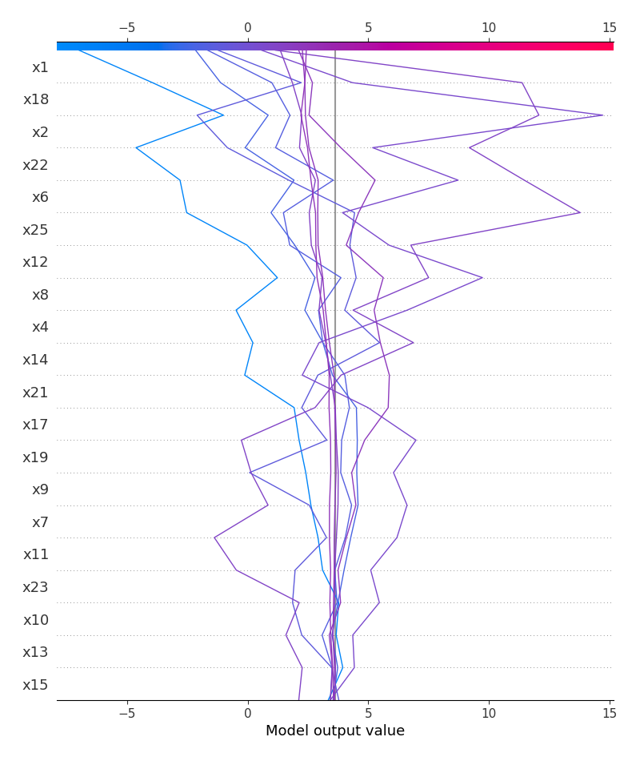
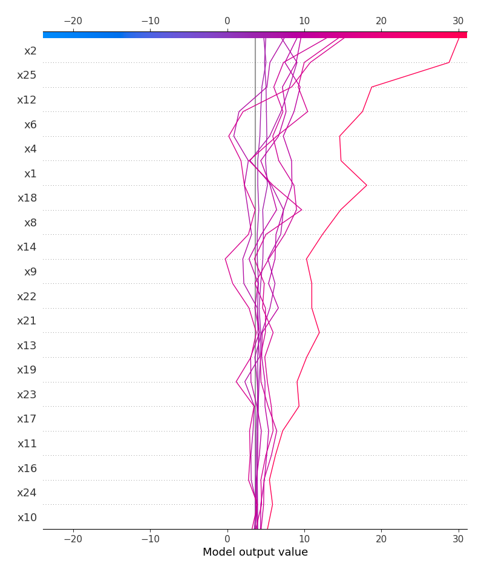

# Summary of 2_Linear

[<< Go back](../README.md)

## Logistic Regression (Linear)
- **n_jobs**: -1
- **explain_level**: 2

## Validation
 - **validation_type**: split
 - **train_ratio**: 0.75
 - **shuffle**: True
 - **stratify**: True

## Optimized metric
logloss

## Training time

3.9 seconds

## Metric details
|           |    score |    threshold |
|:----------|---------:|-------------:|
| logloss   | 0.282063 | nan          |
| auc       | 0.680653 | nan          |
| f1        | 0.965944 |   8.9984e-05 |
| accuracy  | 0.934132 |   8.9984e-05 |
| precision | 0.986667 |   0.936106   |
| recall    | 1        |   8.9984e-05 |
| mcc       | 0.279543 |   0.752145   |

## Metric details with threshold from accuracy metric
|           |    score |    threshold |
|:----------|---------:|-------------:|
| logloss   | 0.282063 | nan          |
| auc       | 0.680653 | nan          |
| f1        | 0.965944 |   8.9984e-05 |
| accuracy  | 0.934132 |   8.9984e-05 |
| precision | 0.934132 |   8.9984e-05 |
| recall    | 1        |   8.9984e-05 |
| mcc       | 0        |   8.9984e-05 |

## Confusion matrix (at threshold=9e-05)
|              |   Predicted as 0 |   Predicted as 1 |
|:-------------|-----------------:|-----------------:|
| Labeled as 0 |                0 |               11 |
| Labeled as 1 |                0 |              156 |

## Learning curves

## Coefficients
| feature   |   Learner_1 |
|:----------|------------:|
| intercept |   3.32931   |
| x1        |   0.909312  |
| x18       |   0.787712  |
| x4        |   0.707417  |
| x22       |   0.592849  |
| x6        |   0.536012  |
| x14       |   0.427419  |
| x12       |   0.426026  |
| x17       |   0.325623  |
| x11       |   0.232908  |
| x19       |   0.232571  |
| x7        |   0.214425  |
| x16       |   0.138029  |
| x20       |   0.122606  |
| x5        |   0.0916084 |
| x3        |  -0.030361  |
| x10       |  -0.0988093 |
| x15       |  -0.1216    |
| x24       |  -0.126031  |
| x23       |  -0.260947  |
| x9        |  -0.299499  |
| x13       |  -0.401142  |
| x21       |  -0.484422  |
| x8        |  -0.598053  |
| x25       |  -0.739538  |
| x2        |  -0.881368  |

## Permutation-based Importance

## Confusion Matrix

## Normalized Confusion Matrix

## SHAP Importance

## SHAP Dependence plots

### Dependence (Fold 1)

## SHAP Decision plots

### Top-10 Worst decisions for class 0 (Fold 1)

### Top-10 Best decisions for class 0 (Fold 1)

### Top-10 Worst decisions for class 1 (Fold 1)

### Top-10 Best decisions for class 1 (Fold 1)

[<< Go back](../README.md)
