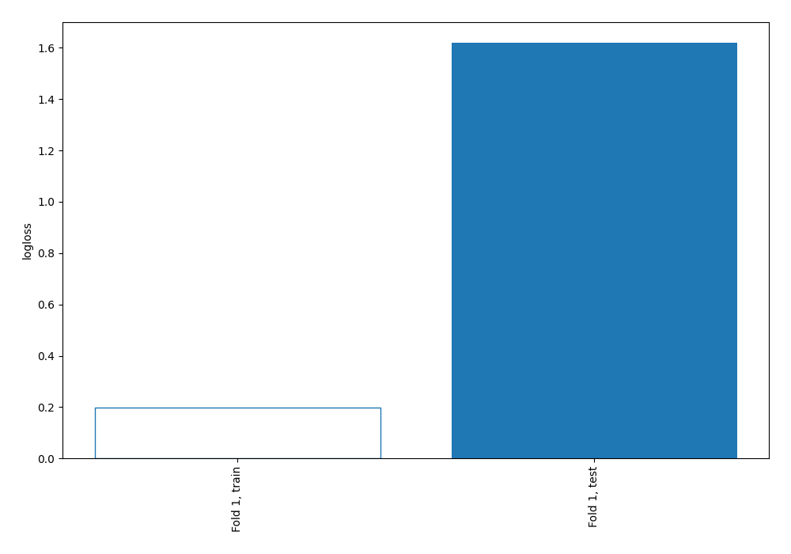
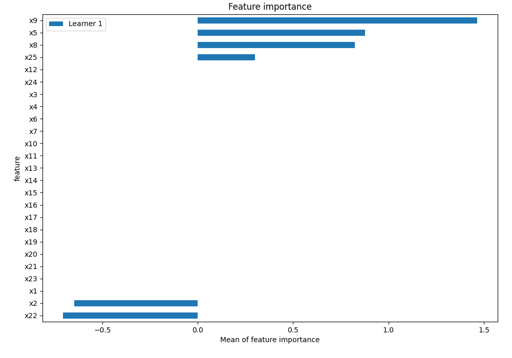
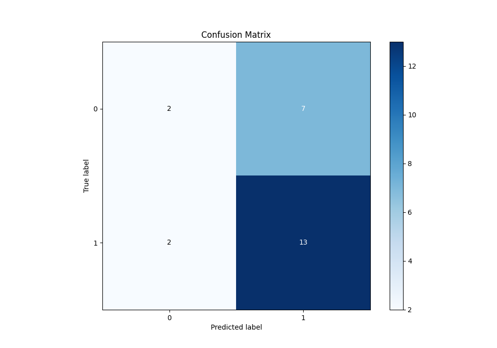
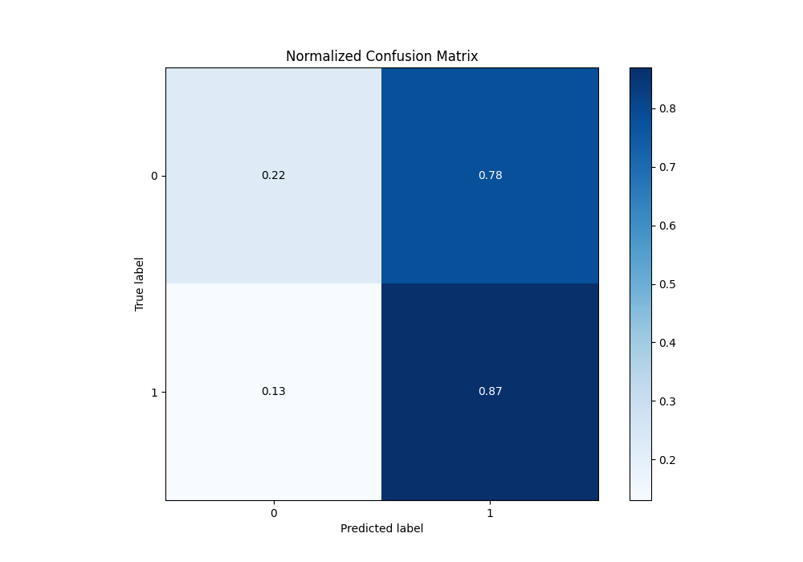

# Summary of 1_DecisionTree

[<< Go back](../README.md)

## Decision Tree
- **n_jobs**: -1
- **criterion**: gini
- **max_depth**: 3
- **explain_level**: 2

## Validation
 - **validation_type**: split
 - **train_ratio**: 0.75
 - **shuffle**: True
 - **stratify**: True

## Optimized metric
logloss

## Training time

7.2 seconds

## Metric details
|           |    score |   threshold |
|:----------|---------:|------------:|
| logloss   | 1.61974  | nan         |
| auc       | 0.533333 | nan         |
| f1        | 0.742857 |   0.0588235 |
| accuracy  | 0.625    |   0.0588235 |
| precision | 0.65     |   0.0588235 |
| recall    | 0.933333 |   0         |
| mcc       | 0.11547  |   0.0588235 |

## Metric details with threshold from accuracy metric
|           |    score |   threshold |
|:----------|---------:|------------:|
| logloss   | 1.61974  | nan         |
| auc       | 0.533333 | nan         |
| f1        | 0.742857 |   0.0588235 |
| accuracy  | 0.625    |   0.0588235 |
| precision | 0.65     |   0.0588235 |
| recall    | 0.866667 |   0.0588235 |
| mcc       | 0.11547  |   0.0588235 |

## Confusion matrix (at threshold=0.058824)
|              |   Predicted as 0 |   Predicted as 1 |
|:-------------|-----------------:|-----------------:|
| Labeled as 0 |                2 |                7 |
| Labeled as 1 |                2 |               13 |

## Learning curves

## Permutation-based Importance

## Confusion Matrix

## Normalized Confusion Matrix

[<< Go back](../README.md)
