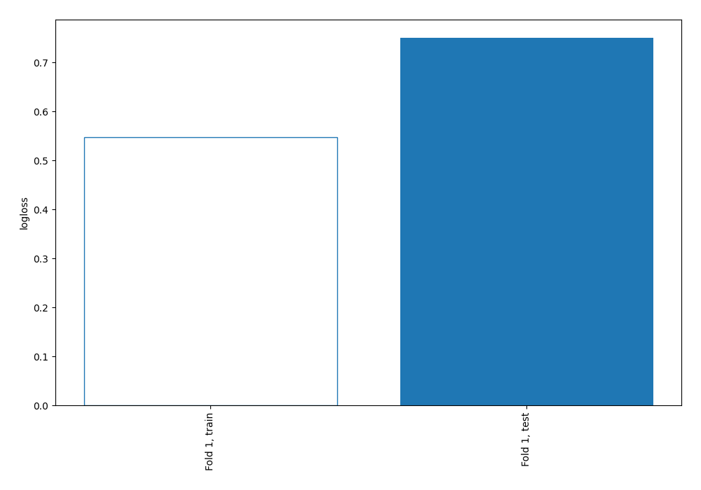
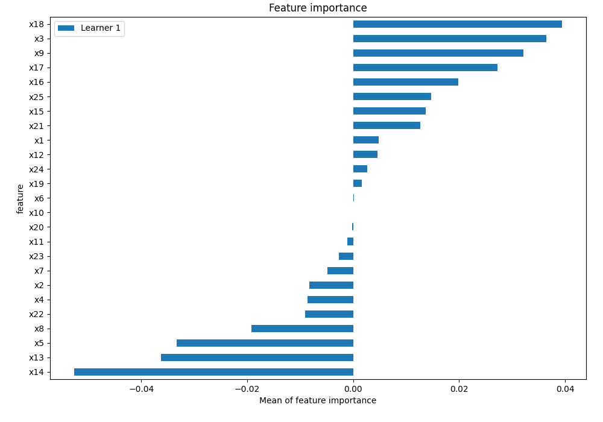
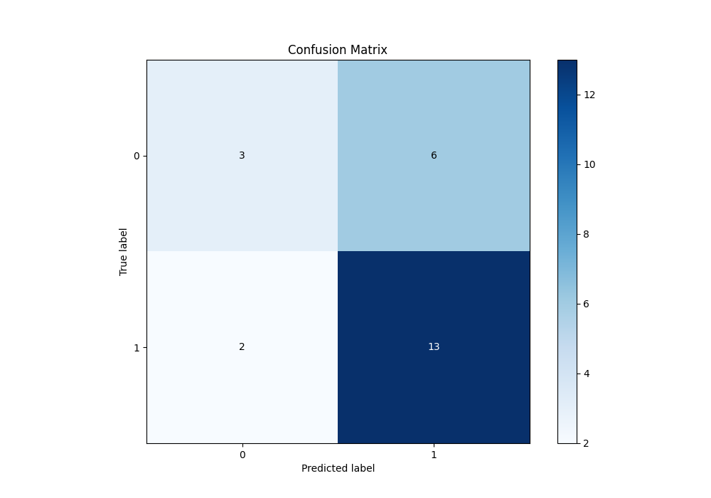
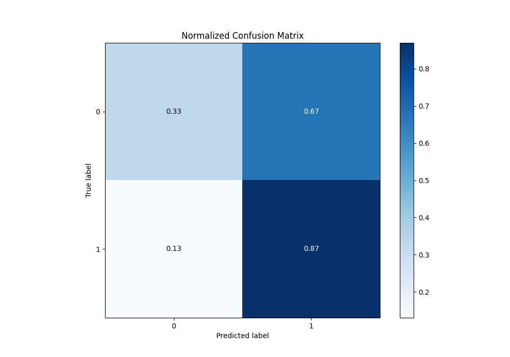
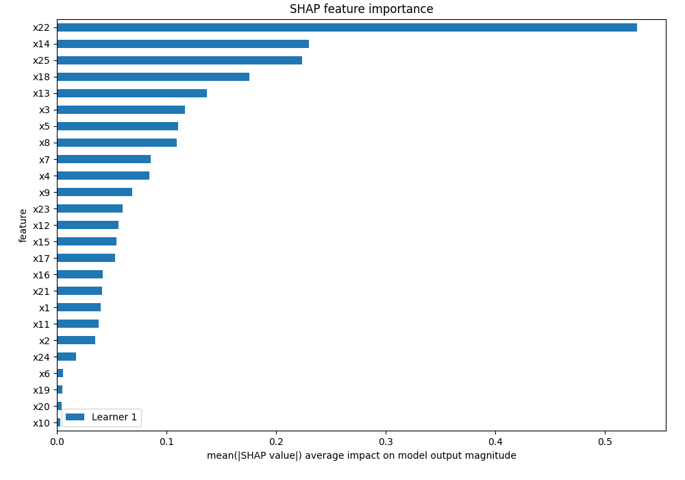
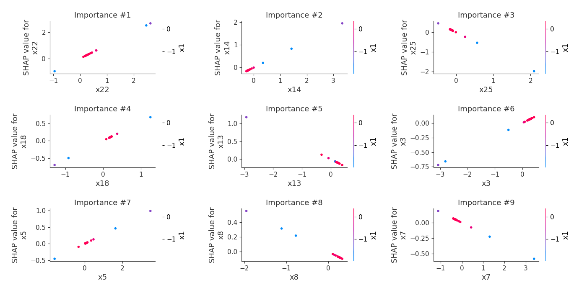
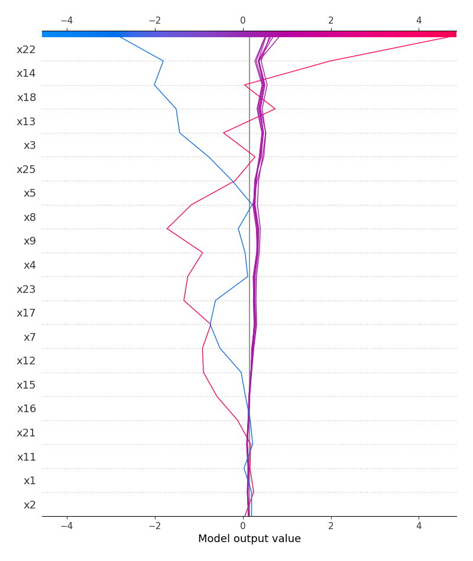
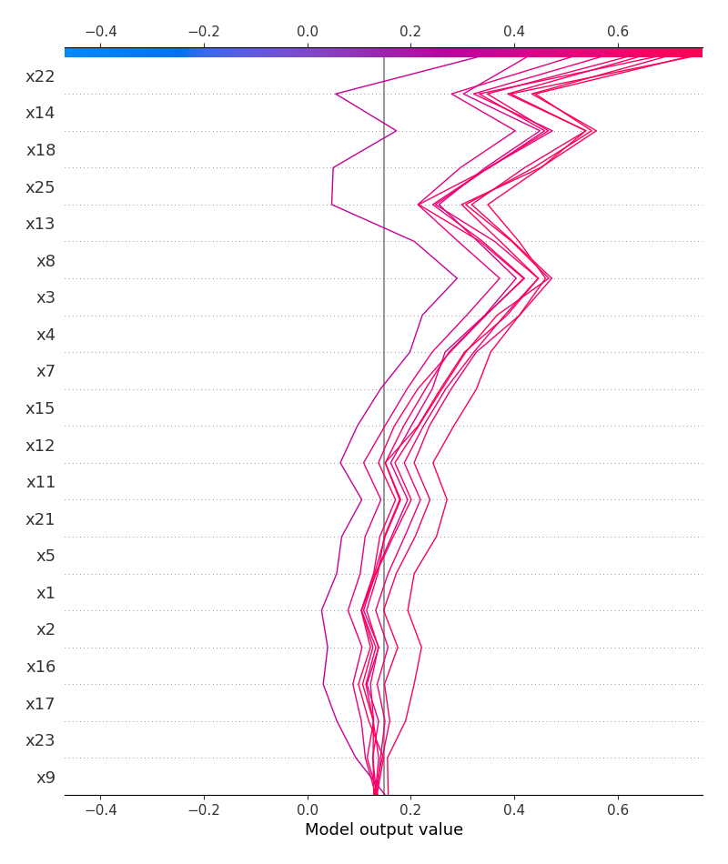
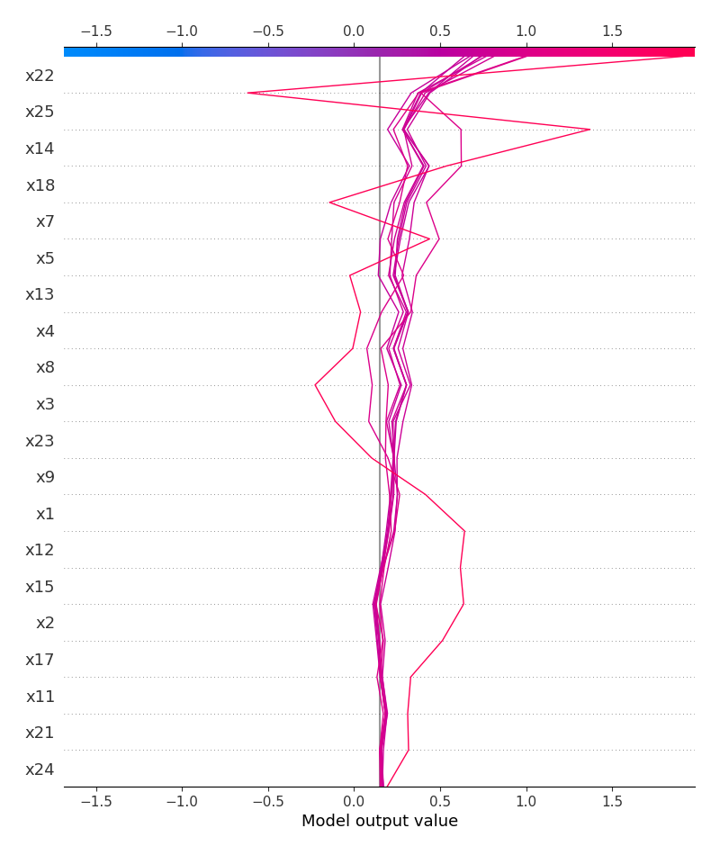

# Summary of 2_Linear

[<< Go back](../README.md)

## Logistic Regression (Linear)
- **n_jobs**: -1
- **explain_level**: 2

## Validation
 - **validation_type**: split
 - **train_ratio**: 0.75
 - **shuffle**: True
 - **stratify**: True

## Optimized metric
logloss

## Training time

3.4 seconds

## Metric details
|           |    score |   threshold |
|:----------|---------:|------------:|
| logloss   | 0.750095 | nan         |
| auc       | 0.62963  | nan         |
| f1        | 0.769231 |   0.0521784 |
| accuracy  | 0.666667 |   0.624455  |
| precision | 0.8      |   0.66544   |
| recall    | 1        |   0.0521784 |
| mcc       | 0.323875 |   0.654046  |

## Metric details with threshold from accuracy metric
|           |    score |   threshold |
|:----------|---------:|------------:|
| logloss   | 0.750095 |  nan        |
| auc       | 0.62963  |  nan        |
| f1        | 0.764706 |    0.624455 |
| accuracy  | 0.666667 |    0.624455 |
| precision | 0.684211 |    0.624455 |
| recall    | 0.866667 |    0.624455 |
| mcc       | 0.238416 |    0.624455 |

## Confusion matrix (at threshold=0.624455)
|              |   Predicted as 0 |   Predicted as 1 |
|:-------------|-----------------:|-----------------:|
| Labeled as 0 |                3 |                6 |
| Labeled as 1 |                2 |               13 |

## Learning curves

## Coefficients
| feature   |   Learner_1 |
|:----------|------------:|
| x22       |   1.02286   |
| x14       |   0.585043  |
| x18       |   0.543325  |
| x4        |   0.45798   |
| x23       |   0.308222  |
| x5        |   0.284686  |
| x17       |   0.245586  |
| x3        |   0.234299  |
| x12       |   0.226864  |
| x15       |   0.163549  |
| intercept |   0.147592  |
| x11       |   0.123308  |
| x1        |   0.0808371 |
| x20       |   0.0208651 |
| x6        |   0.0134052 |
| x10       |   0.010192  |
| x19       |  -0.0134386 |
| x24       |  -0.0547397 |
| x16       |  -0.0921976 |
| x2        |  -0.111555  |
| x21       |  -0.119389  |
| x7        |  -0.171654  |
| x9        |  -0.190377  |
| x8        |  -0.284451  |
| x13       |  -0.401243  |
| x25       |  -0.949999  |

## Permutation-based Importance

## Confusion Matrix

## Normalized Confusion Matrix

## SHAP Importance

## SHAP Dependence plots

### Dependence (Fold 1)

## SHAP Decision plots

### Top-10 Worst decisions for class 0 (Fold 1)

### Top-10 Best decisions for class 0 (Fold 1)

### Top-10 Worst decisions for class 1 (Fold 1)

### Top-10 Best decisions for class 1 (Fold 1)

[<< Go back](../README.md)
