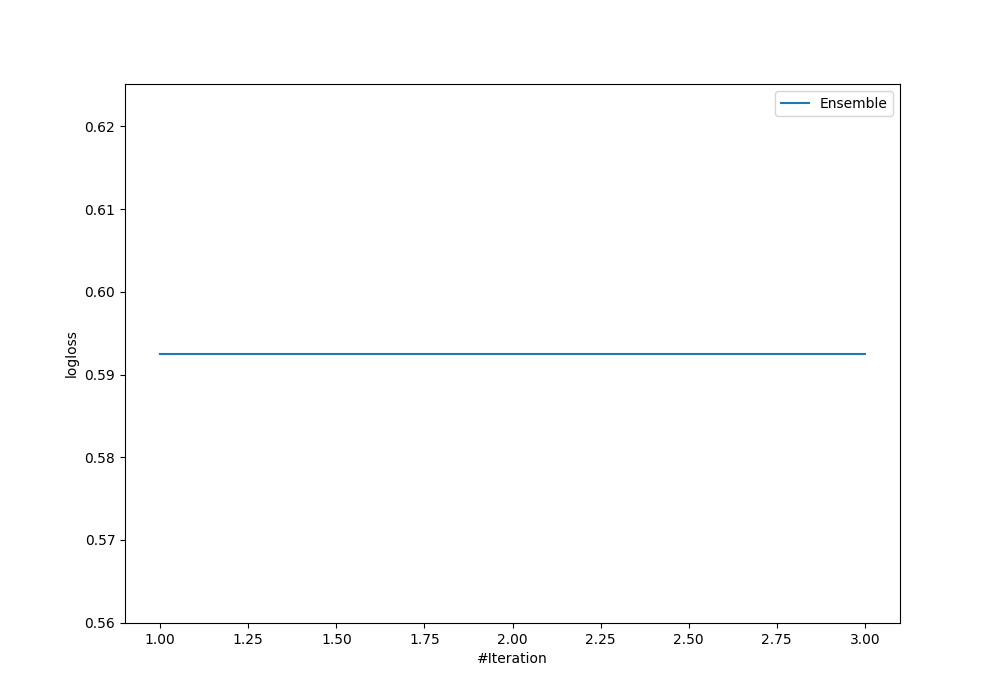
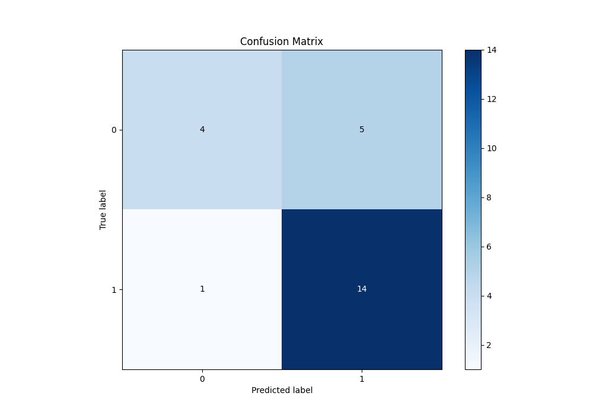
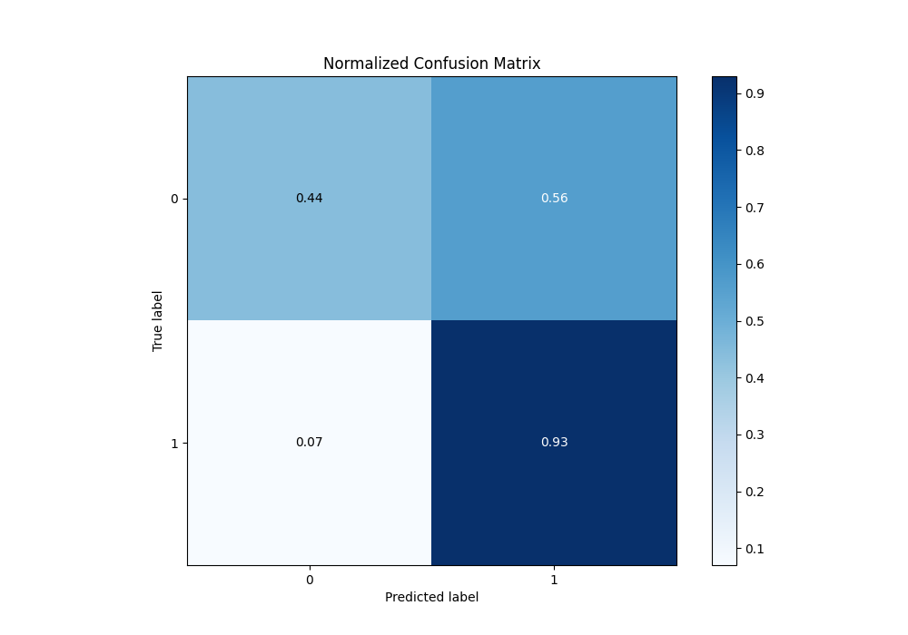

# Summary of Ensemble

[<< Go back](../README.md)

## Ensemble structure
| Model                  |   Weight |
|:-----------------------|---------:|
| 3_Default_RandomForest |        1 |

## Metric details
|           |    score |   threshold |
|:----------|---------:|------------:|
| logloss   | 0.592545 |  nan        |
| auc       | 0.707407 |  nan        |
| f1        | 0.823529 |    0.459194 |
| accuracy  | 0.75     |    0.459194 |
| precision | 1        |    0.842638 |
| recall    | 1        |    0.303667 |
| mcc       | 0.450341 |    0.459194 |

## Metric details with threshold from accuracy metric
|           |    score |   threshold |
|:----------|---------:|------------:|
| logloss   | 0.592545 |  nan        |
| auc       | 0.707407 |  nan        |
| f1        | 0.823529 |    0.459194 |
| accuracy  | 0.75     |    0.459194 |
| precision | 0.736842 |    0.459194 |
| recall    | 0.933333 |    0.459194 |
| mcc       | 0.450341 |    0.459194 |

## Confusion matrix (at threshold=0.459194)
|              |   Predicted as 0 |   Predicted as 1 |
|:-------------|-----------------:|-----------------:|
| Labeled as 0 |                4 |                5 |
| Labeled as 1 |                1 |               14 |

## Learning curves

## Confusion Matrix

## Normalized Confusion Matrix

[<< Go back](../README.md)
