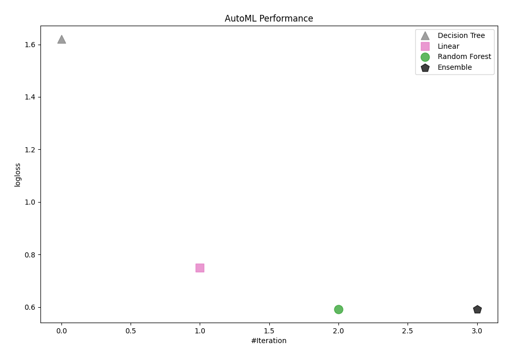
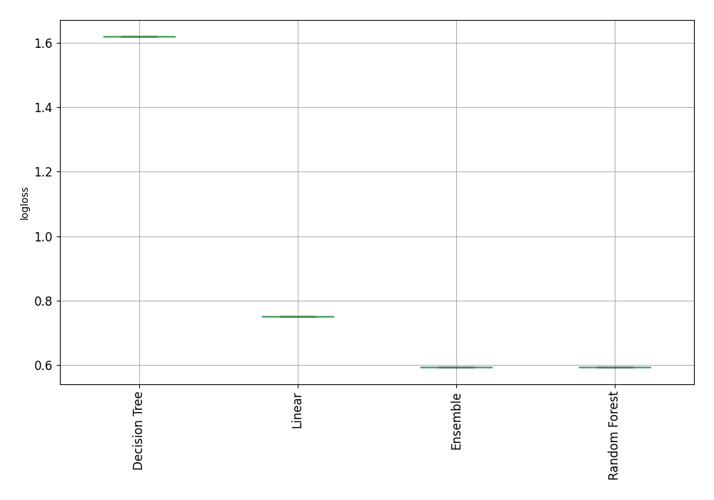
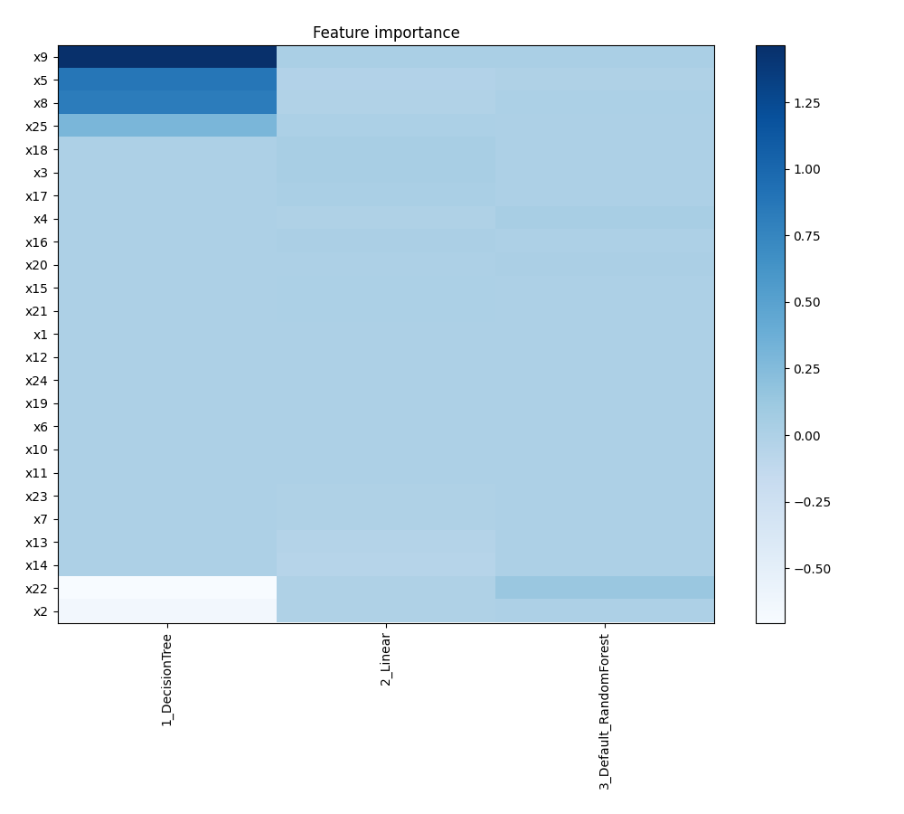
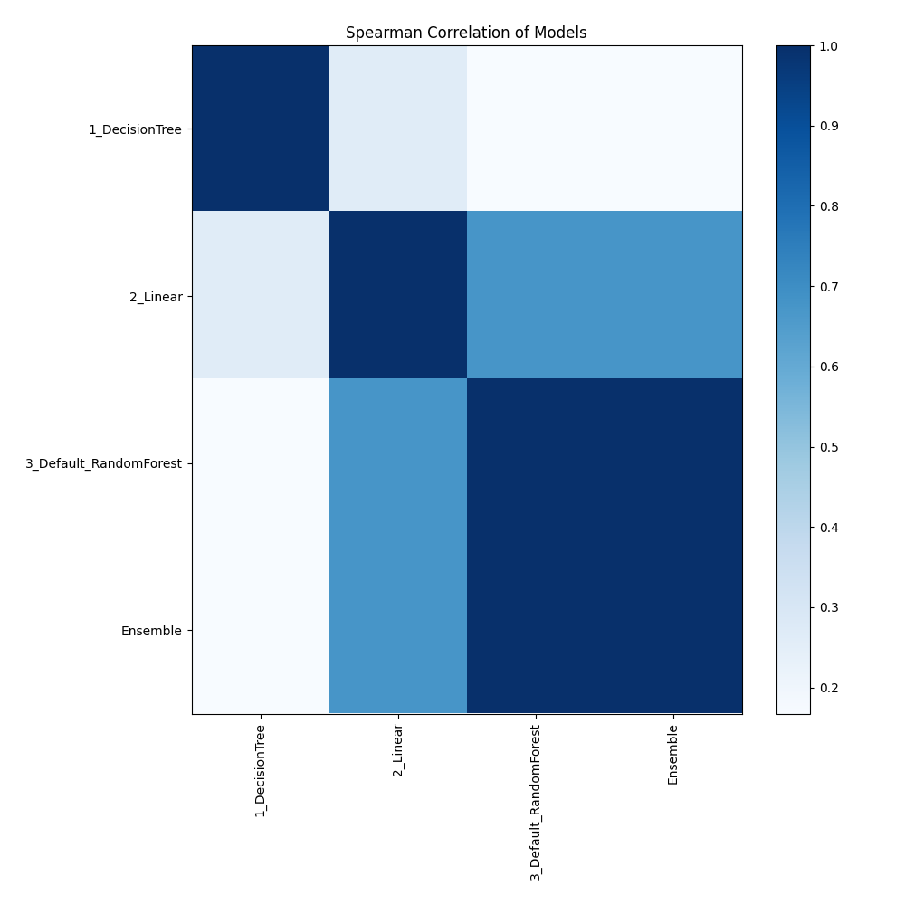

# AutoML Leaderboard

| Best model   | name                                                       | model_type    | metric_type   |   metric_value |   train_time |
|:-------------|:-----------------------------------------------------------|:--------------|:--------------|---------------:|-------------:|
|              | [1_DecisionTree](1_DecisionTree/README.md)                 | Decision Tree | logloss       |       1.61974  |         8.05 |
|              | [2_Linear](2_Linear/README.md)                             | Linear        | logloss       |       0.750095 |         4.62 |
| **the best** | [3_Default_RandomForest](3_Default_RandomForest/README.md) | Random Forest | logloss       |       0.592545 |         2.81 |
|              | [Ensemble](Ensemble/README.md)                             | Ensemble      | logloss       |       0.592545 |         0.5  |

### AutoML Performance

### AutoML Performance Boxplot

### Features Importance

### Spearman Correlation of Models

