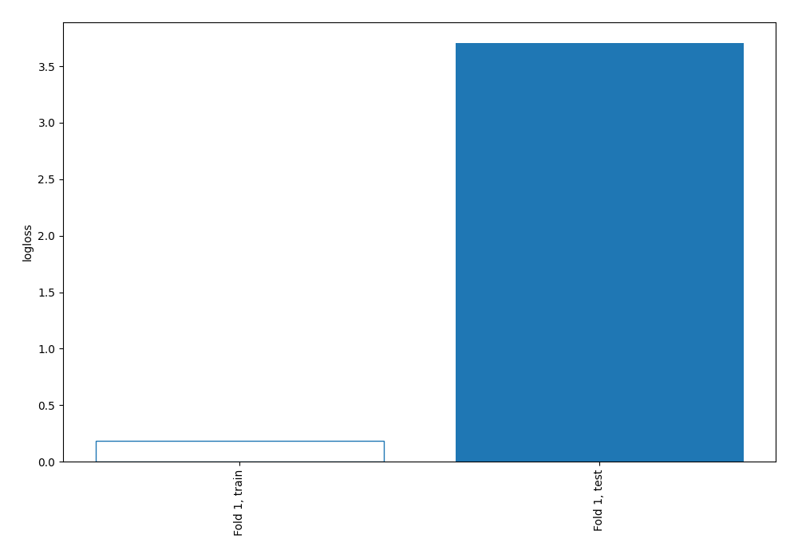
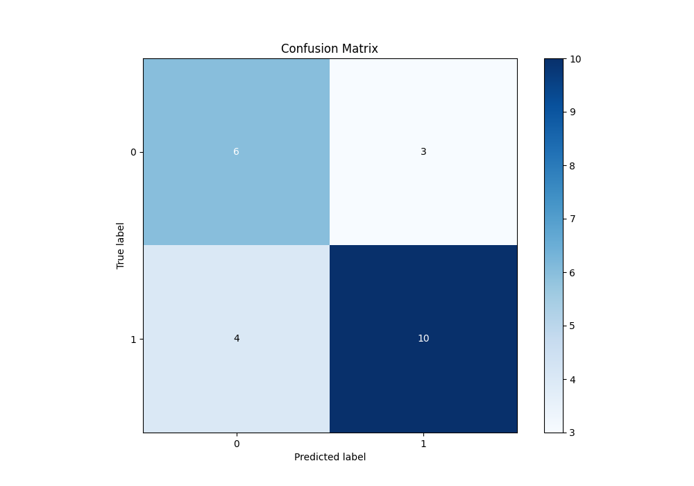
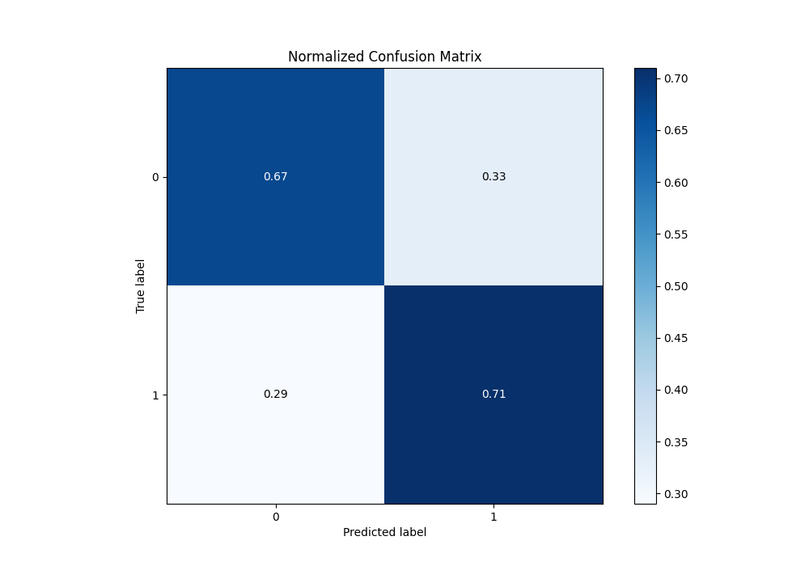

# Summary of 1_DecisionTree

[<< Go back](../README.md)

## Decision Tree
- **n_jobs**: -1
- **criterion**: gini
- **max_depth**: 3
- **explain_level**: 2

## Validation
 - **validation_type**: split
 - **train_ratio**: 0.75
 - **shuffle**: True
 - **stratify**: True

## Optimized metric
logloss

## Training time

6.1 seconds

## Metric details
|           |    score |   threshold |
|:----------|---------:|------------:|
| logloss   | 3.70441  |  nan        |
| auc       | 0.678571 |  nan        |
| f1        | 0.740741 |    0        |
| accuracy  | 0.695652 |    0        |
| precision | 0.818182 |    0.571429 |
| recall    | 0.714286 |    0        |
| mcc       | 0.410964 |    0.571429 |

## Metric details with threshold from accuracy metric
|           |    score |   threshold |
|:----------|---------:|------------:|
| logloss   | 3.70441  |         nan |
| auc       | 0.678571 |         nan |
| f1        | 0.740741 |           0 |
| accuracy  | 0.695652 |           0 |
| precision | 0.769231 |           0 |
| recall    | 0.714286 |           0 |
| mcc       | 0.375046 |           0 |

## Confusion matrix (at threshold=0.0)
|              |   Predicted as 0 |   Predicted as 1 |
|:-------------|-----------------:|-----------------:|
| Labeled as 0 |                6 |                3 |
| Labeled as 1 |                4 |               10 |

## Learning curves

## Permutation-based Importance

## Confusion Matrix

## Normalized Confusion Matrix

[<< Go back](../README.md)
