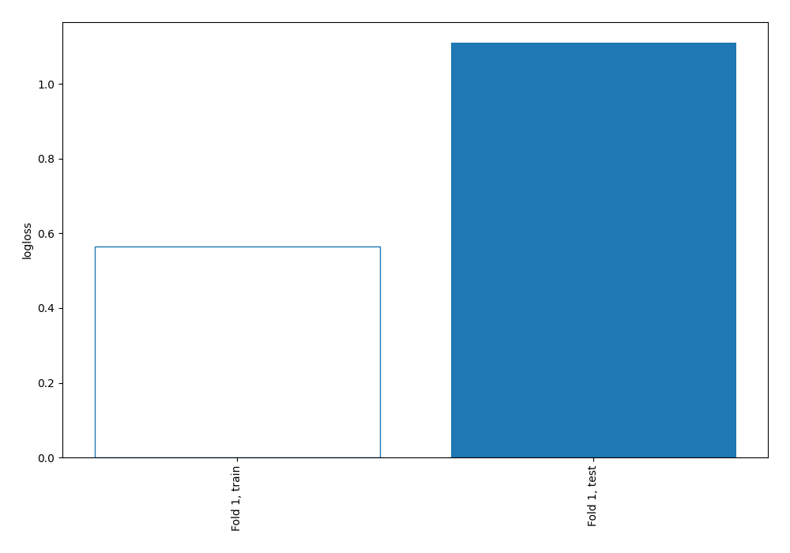
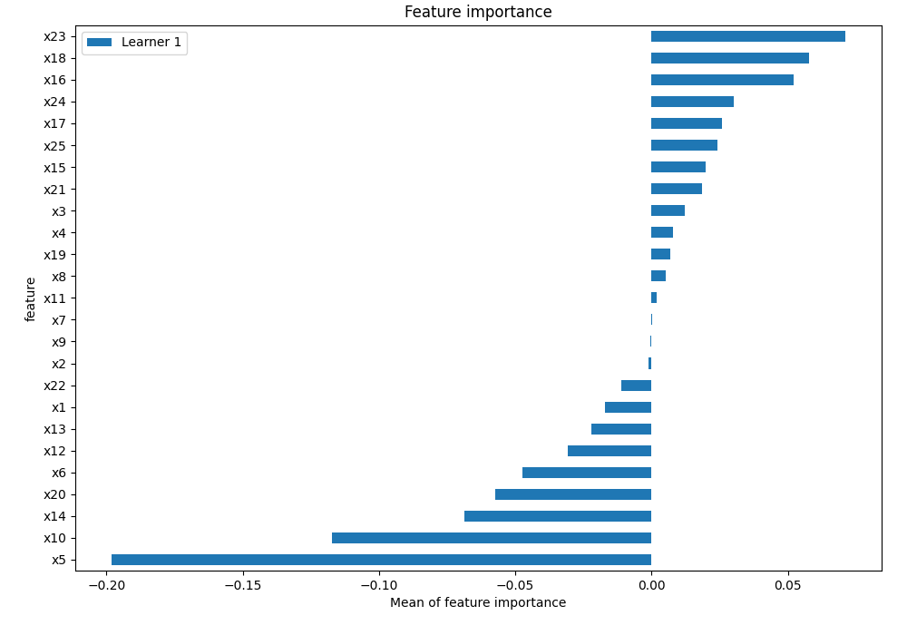
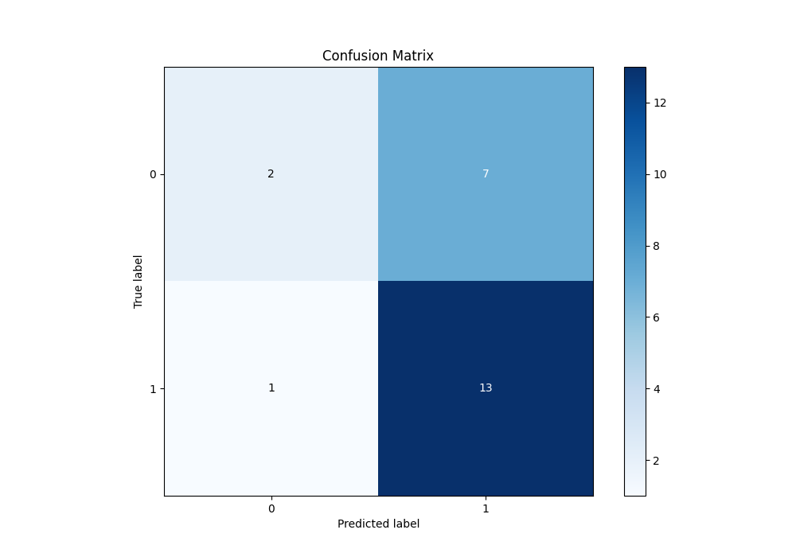
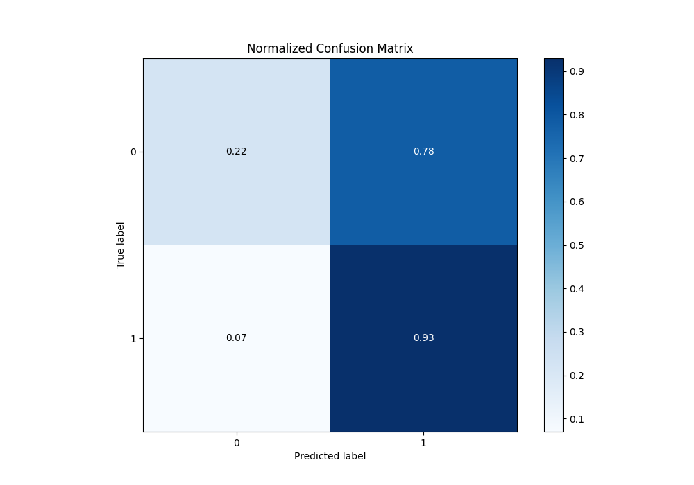
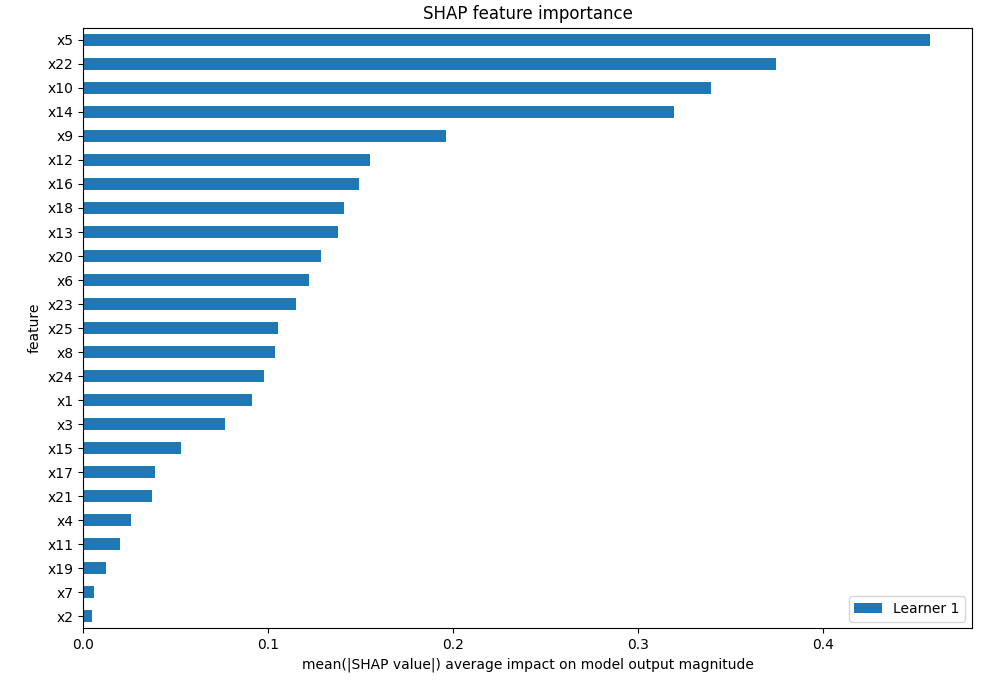
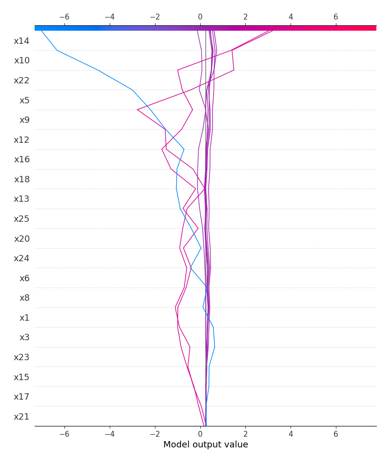
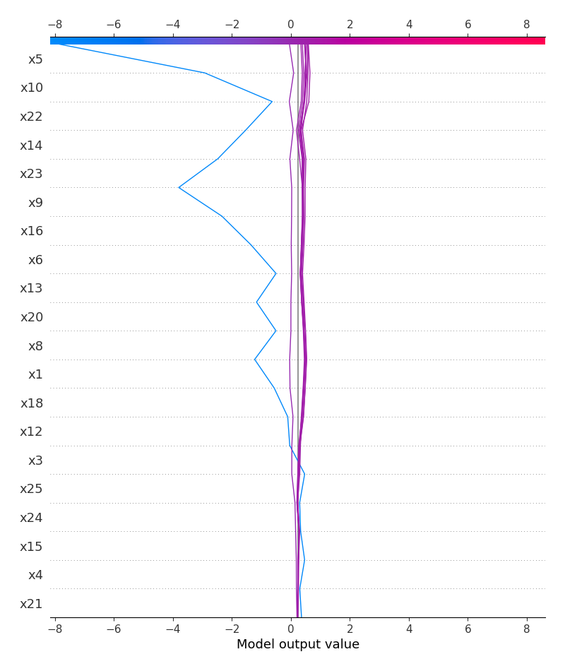
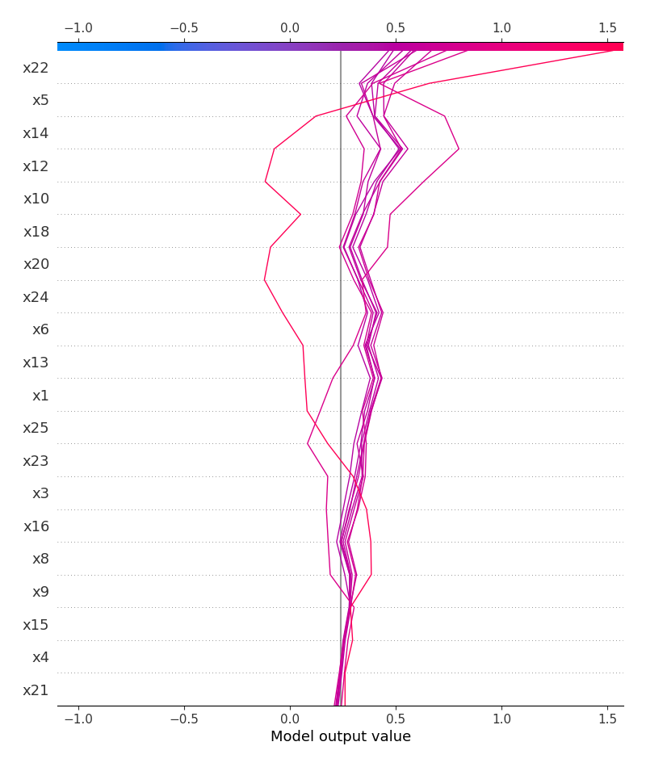

# Summary of 2_Linear

[<< Go back](../README.md)

## Logistic Regression (Linear)
- **n_jobs**: -1
- **explain_level**: 2

## Validation
 - **validation_type**: split
 - **train_ratio**: 0.75
 - **shuffle**: True
 - **stratify**: True

## Optimized metric
logloss

## Training time

3.2 seconds

## Metric details
|           |    score |     threshold |
|:----------|---------:|--------------:|
| logloss   | 1.11005  | nan           |
| auc       | 0.539683 | nan           |
| f1        | 0.764706 |   0.478384    |
| accuracy  | 0.652174 |   0.478384    |
| precision | 0.714286 |   0.613213    |
| recall    | 1        |   0.000357682 |
| mcc       | 0.269841 |   0.613213    |

## Metric details with threshold from accuracy metric
|           |    score |   threshold |
|:----------|---------:|------------:|
| logloss   | 1.11005  |  nan        |
| auc       | 0.539683 |  nan        |
| f1        | 0.764706 |    0.478384 |
| accuracy  | 0.652174 |    0.478384 |
| precision | 0.65     |    0.478384 |
| recall    | 0.928571 |    0.478384 |
| mcc       | 0.218521 |    0.478384 |

## Confusion matrix (at threshold=0.478384)
|              |   Predicted as 0 |   Predicted as 1 |
|:-------------|-----------------:|-----------------:|
| Labeled as 0 |                2 |                7 |
| Labeled as 1 |                1 |               13 |

## Learning curves

## Coefficients
| feature   |   Learner_1 |
|:----------|------------:|
| x22       |   0.752308  |
| x12       |   0.549107  |
| x14       |   0.505942  |
| x10       |   0.477793  |
| x5        |   0.44205   |
| x18       |   0.391015  |
| x20       |   0.351871  |
| x23       |   0.263127  |
| intercept |   0.239383  |
| x1        |   0.172167  |
| x3        |   0.149265  |
| x17       |   0.139497  |
| x15       |   0.128202  |
| x4        |   0.0768198 |
| x11       |   0.0653846 |
| x2        |  -0.0103809 |
| x7        |  -0.0161293 |
| x19       |  -0.0263929 |
| x21       |  -0.0869367 |
| x8        |  -0.183271  |
| x16       |  -0.196275  |
| x9        |  -0.223822  |
| x6        |  -0.224192  |
| x13       |  -0.248513  |
| x24       |  -0.261517  |
| x25       |  -0.444136  |

## Permutation-based Importance

## Confusion Matrix

## Normalized Confusion Matrix

## SHAP Importance

## SHAP Dependence plots

### Dependence (Fold 1)

## SHAP Decision plots

### Top-10 Worst decisions for class 0 (Fold 1)

### Top-10 Best decisions for class 0 (Fold 1)

### Top-10 Worst decisions for class 1 (Fold 1)

### Top-10 Best decisions for class 1 (Fold 1)

[<< Go back](../README.md)
