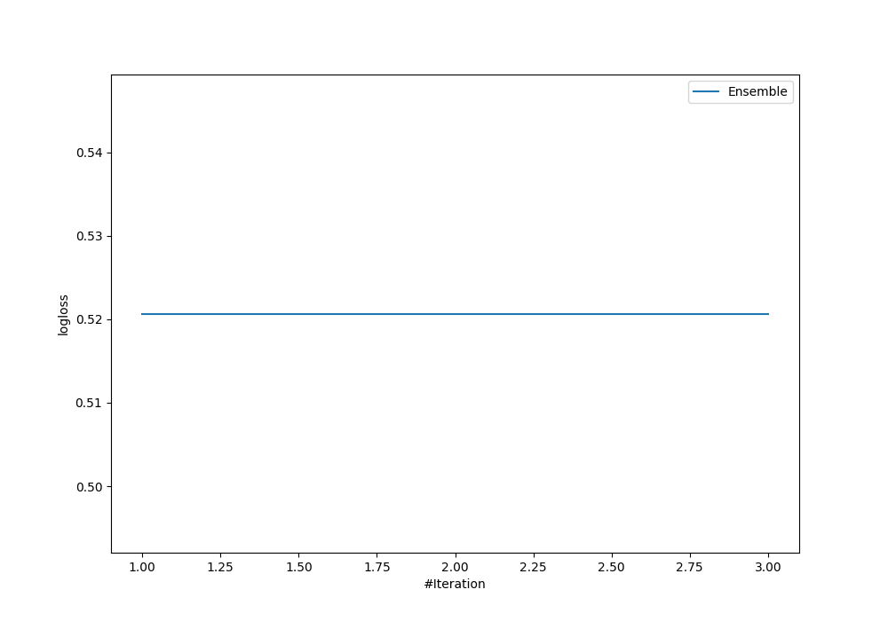
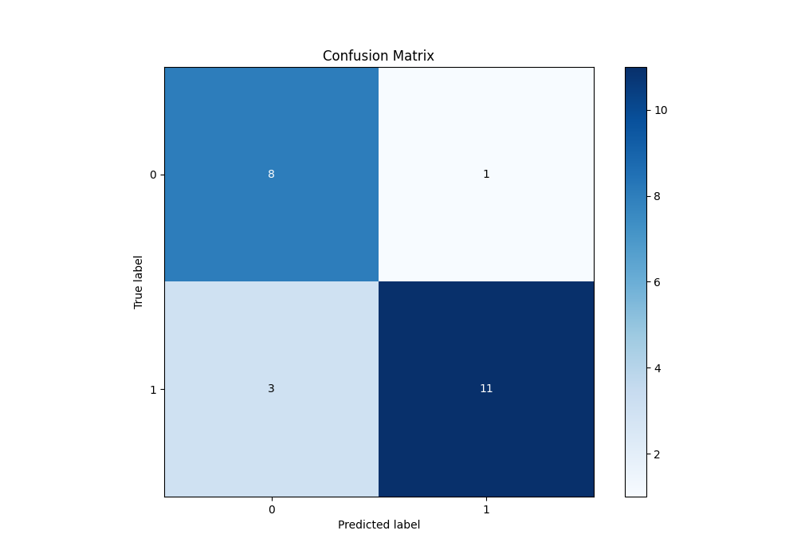
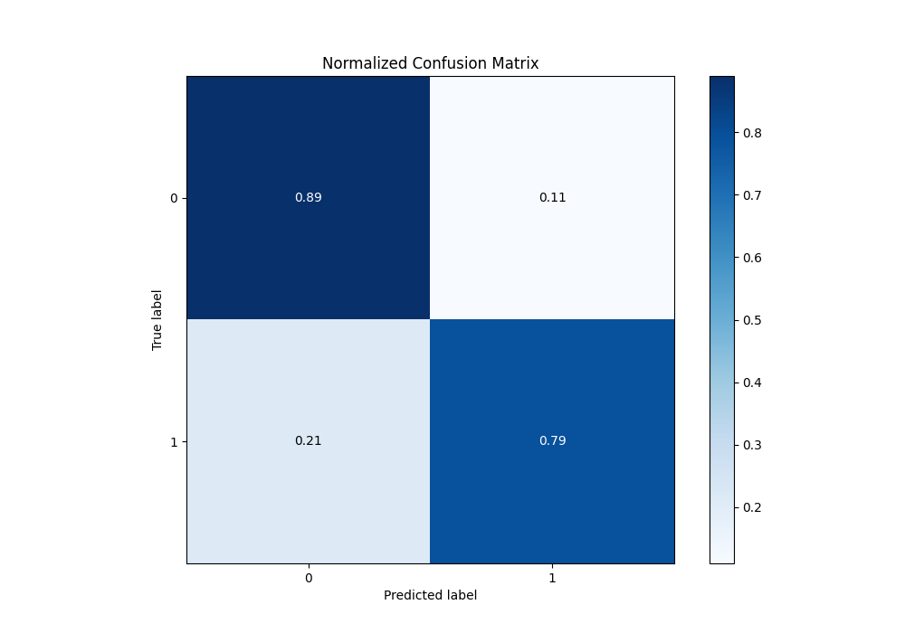

# Summary of Ensemble

[<< Go back](../README.md)

## Ensemble structure
| Model                  |   Weight |
|:-----------------------|---------:|
| 3_Default_RandomForest |        1 |

## Metric details
|           |    score |   threshold |
|:----------|---------:|------------:|
| logloss   | 0.520674 |  nan        |
| auc       | 0.876984 |  nan        |
| f1        | 0.846154 |    0.535188 |
| accuracy  | 0.826087 |    0.535188 |
| precision | 1        |    0.544116 |
| recall    | 1        |    0.110278 |
| mcc       | 0.703211 |    0.544116 |

## Metric details with threshold from accuracy metric
|           |    score |   threshold |
|:----------|---------:|------------:|
| logloss   | 0.520674 |  nan        |
| auc       | 0.876984 |  nan        |
| f1        | 0.846154 |    0.535188 |
| accuracy  | 0.826087 |    0.535188 |
| precision | 0.916667 |    0.535188 |
| recall    | 0.785714 |    0.535188 |
| mcc       | 0.659093 |    0.535188 |

## Confusion matrix (at threshold=0.535188)
|              |   Predicted as 0 |   Predicted as 1 |
|:-------------|-----------------:|-----------------:|
| Labeled as 0 |                8 |                1 |
| Labeled as 1 |                3 |               11 |

## Learning curves

## Confusion Matrix

## Normalized Confusion Matrix

[<< Go back](../README.md)
