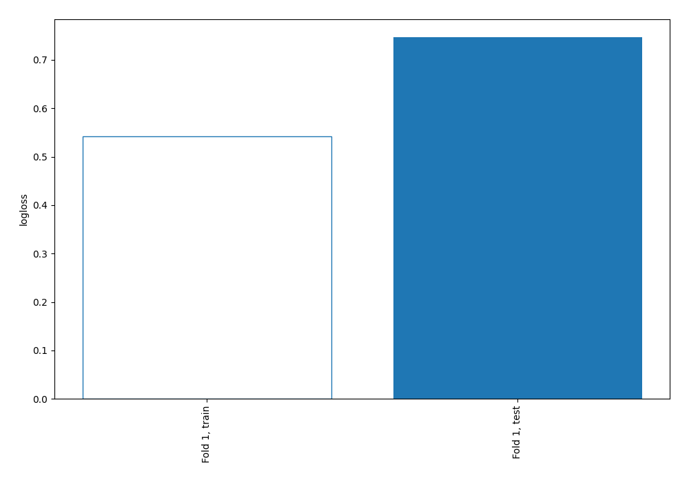
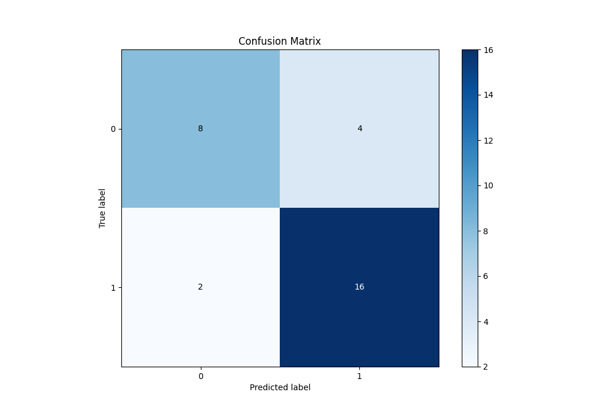
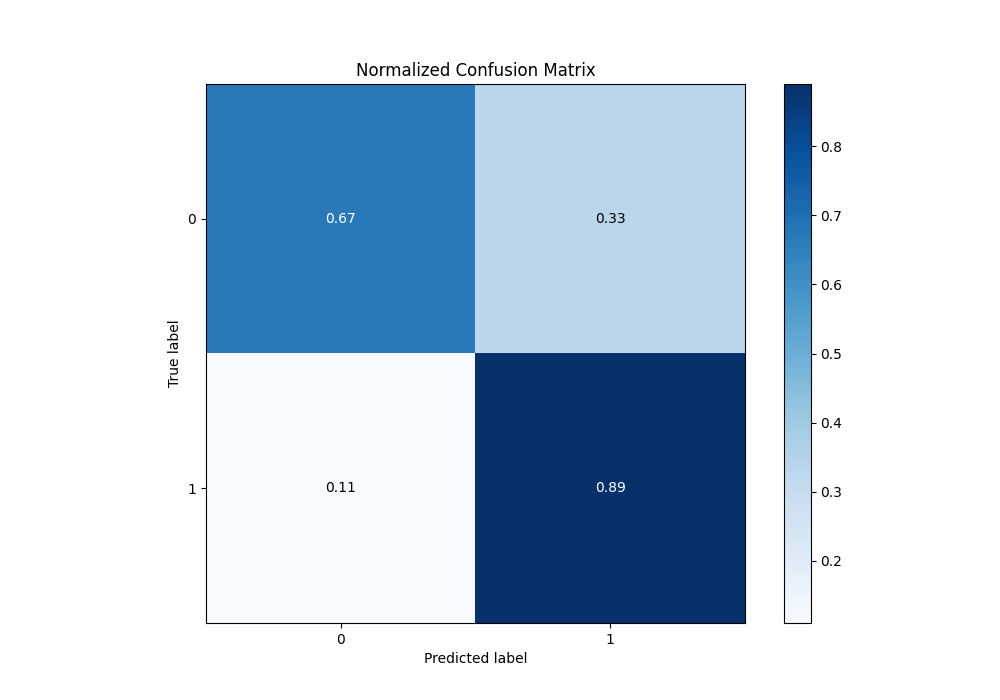
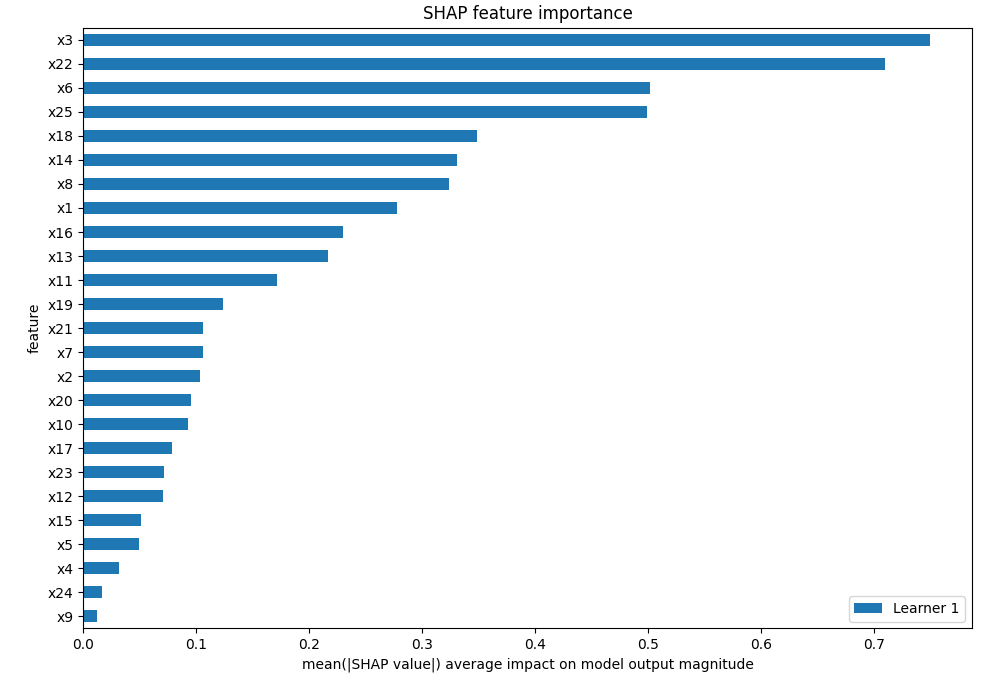
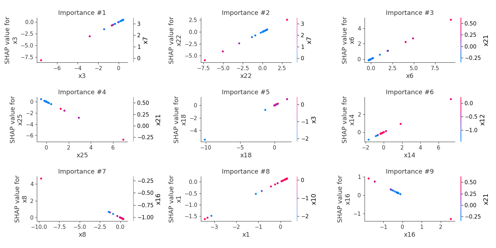
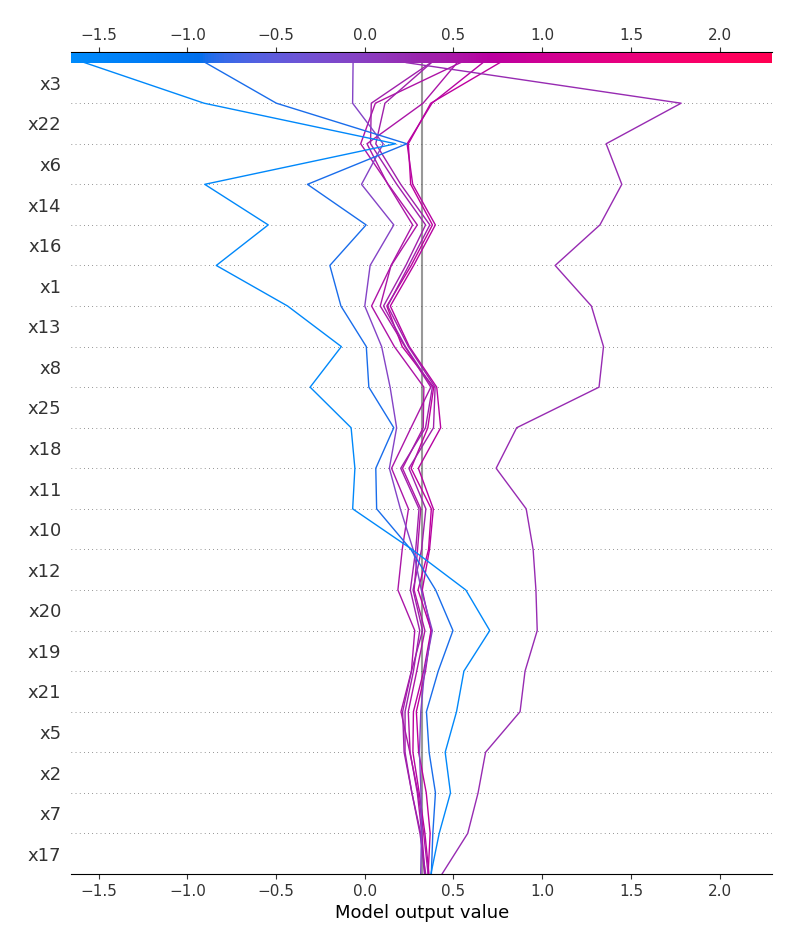
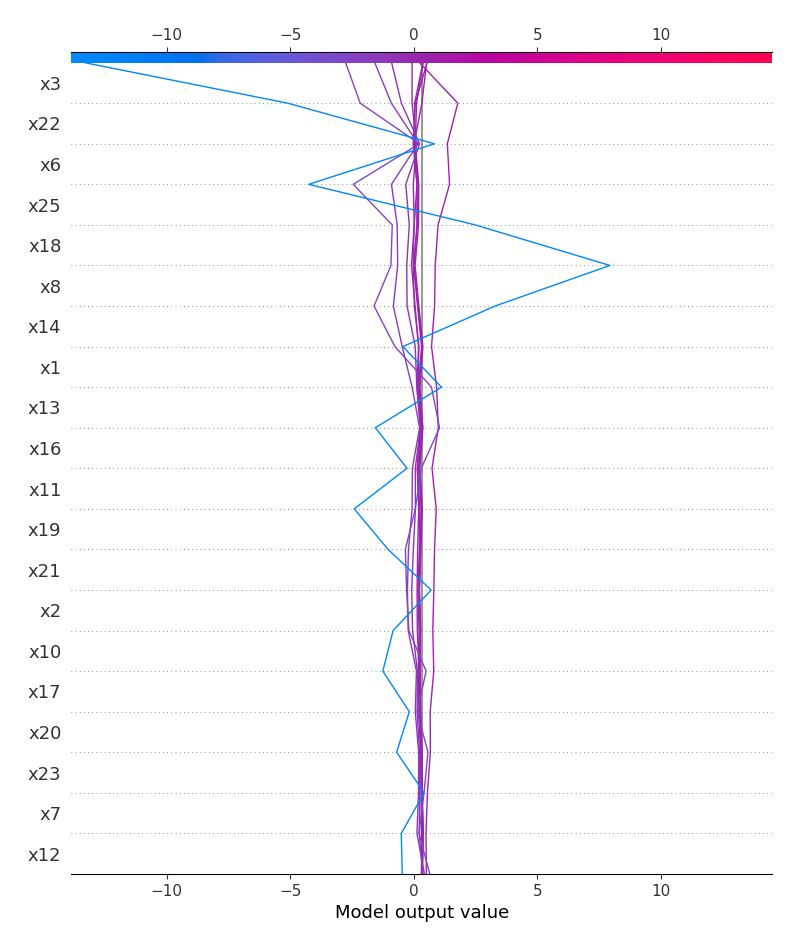
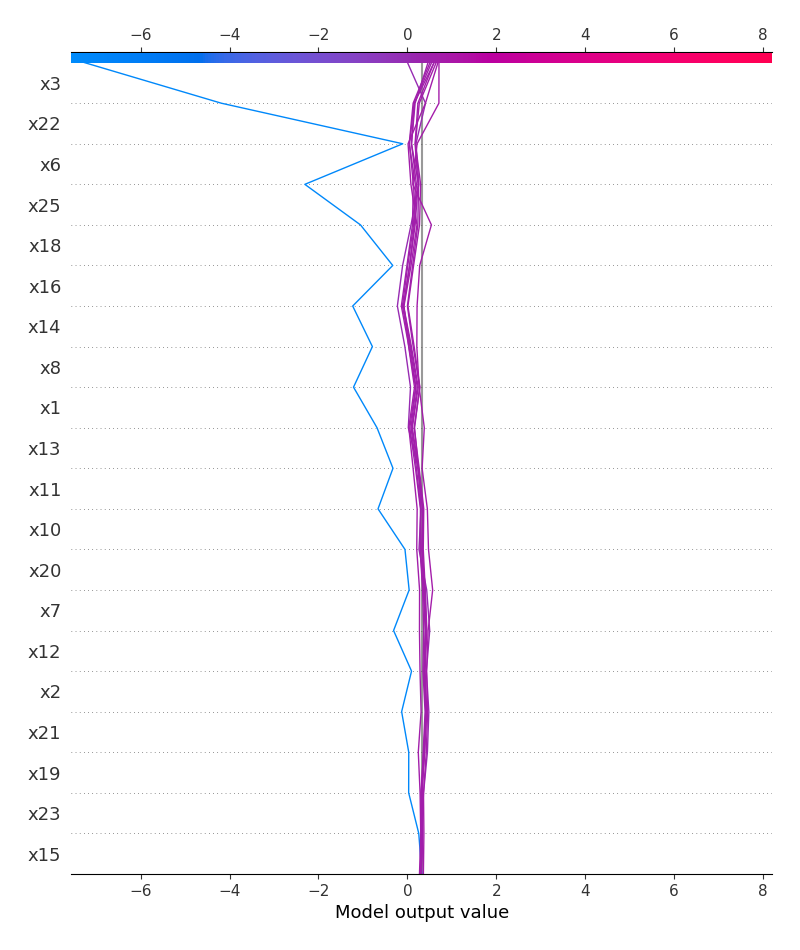
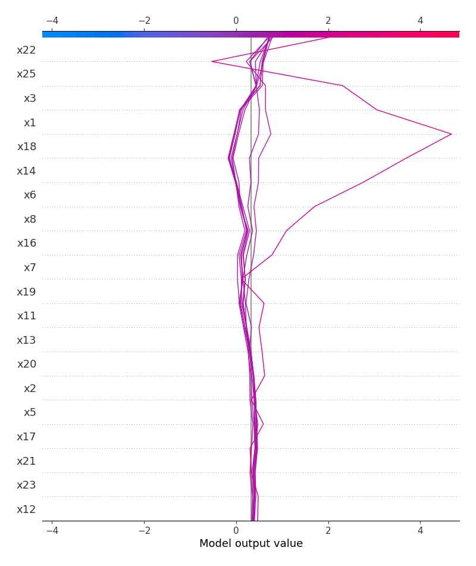

# Summary of 2_Linear

[<< Go back](../README.md)

## Logistic Regression (Linear)
- **n_jobs**: -1
- **explain_level**: 2

## Validation
 - **validation_type**: split
 - **train_ratio**: 0.75
 - **shuffle**: True
 - **stratify**: True

## Optimized metric
logloss

## Training time

6.3 seconds

## Metric details
|           |    score |     threshold |
|:----------|---------:|--------------:|
| logloss   | 0.746647 | nan           |
| auc       | 0.810185 | nan           |
| f1        | 0.842105 |   0.603262    |
| accuracy  | 0.8      |   0.603262    |
| precision | 1        |   0.683631    |
| recall    | 1        |   1.47167e-06 |
| mcc       | 0.600099 |   0.632176    |

## Metric details with threshold from accuracy metric
|           |    score |   threshold |
|:----------|---------:|------------:|
| logloss   | 0.746647 |  nan        |
| auc       | 0.810185 |  nan        |
| f1        | 0.842105 |    0.603262 |
| accuracy  | 0.8      |    0.603262 |
| precision | 0.8      |    0.603262 |
| recall    | 0.888889 |    0.603262 |
| mcc       | 0.57735  |    0.603262 |

## Confusion matrix (at threshold=0.603262)
|              |   Predicted as 0 |   Predicted as 1 |
|:-------------|-----------------:|-----------------:|
| Labeled as 0 |                8 |                4 |
| Labeled as 1 |                2 |               16 |

## Learning curves

## Coefficients
| feature   |   Learner_1 |
|:----------|------------:|
| x3        |   1.0893    |
| x22       |   0.810826  |
| x6        |   0.544356  |
| x18       |   0.538313  |
| x14       |   0.507676  |
| x1        |   0.473317  |
| x11       |   0.42227   |
| x17       |   0.334065  |
| intercept |   0.320733  |
| x20       |   0.320475  |
| x12       |   0.250908  |
| x10       |   0.211947  |
| x23       |   0.151574  |
| x7        |   0.149274  |
| x4        |   0.117184  |
| x15       |   0.0885477 |
| x9        |   0.03934   |
| x24       |  -0.0366881 |
| x5        |  -0.157142  |
| x2        |  -0.174753  |
| x21       |  -0.175608  |
| x19       |  -0.251252  |
| x13       |  -0.38512   |
| x8        |  -0.477123  |
| x16       |  -0.506046  |
| x25       |  -0.97177   |

## Permutation-based Importance

## Confusion Matrix

## Normalized Confusion Matrix

## SHAP Importance

## SHAP Dependence plots

### Dependence (Fold 1)

## SHAP Decision plots

### Top-10 Worst decisions for class 0 (Fold 1)

### Top-10 Best decisions for class 0 (Fold 1)

### Top-10 Worst decisions for class 1 (Fold 1)

### Top-10 Best decisions for class 1 (Fold 1)

[<< Go back](../README.md)
