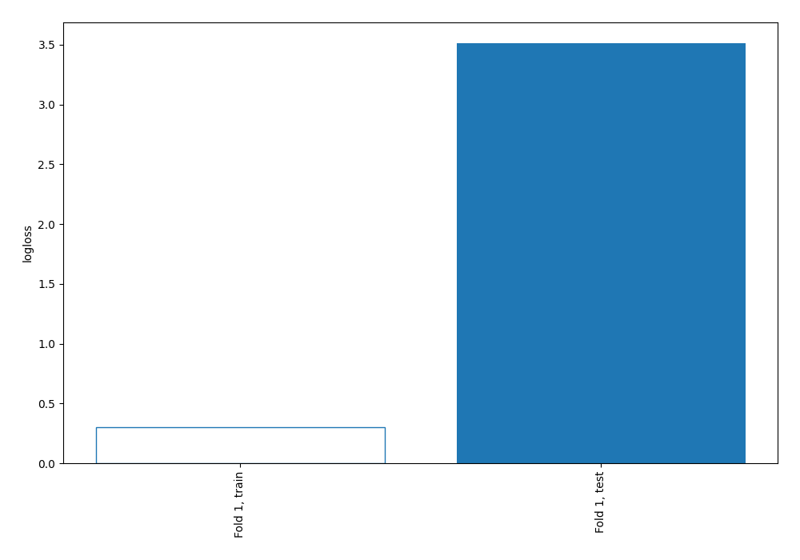
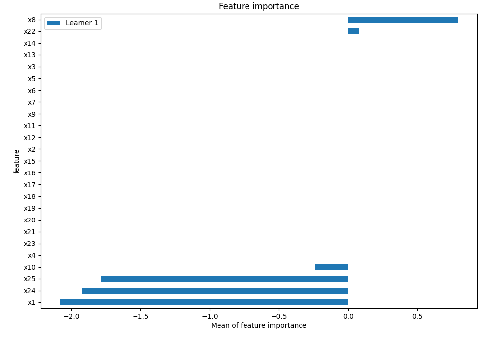
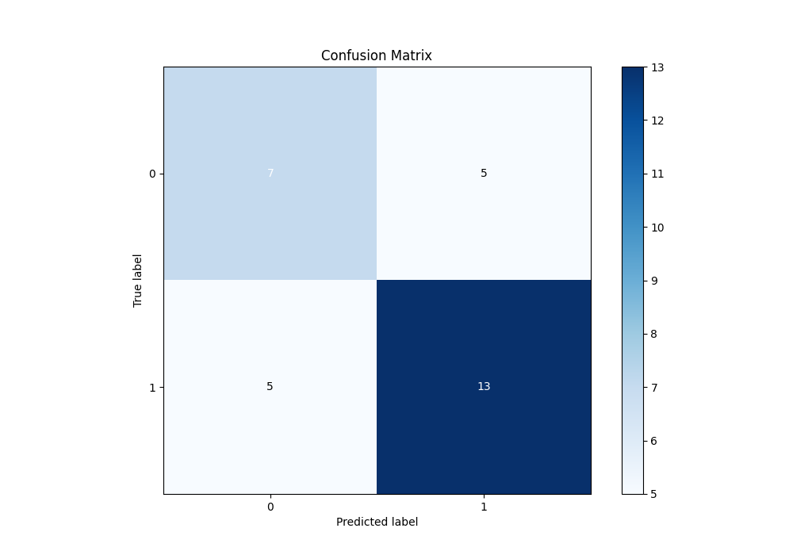
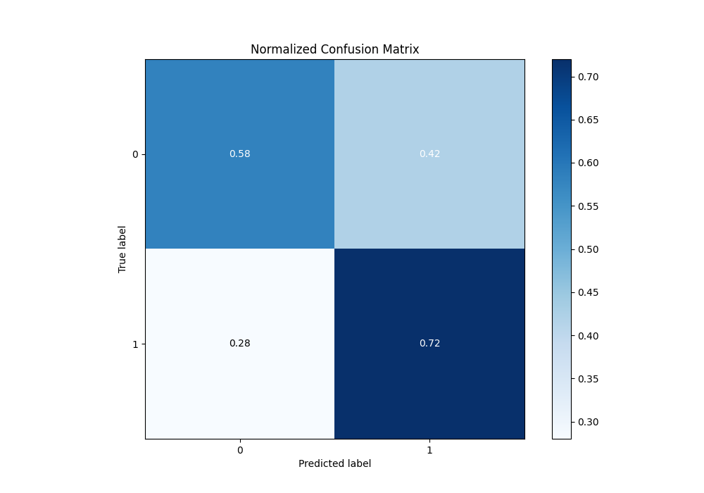

# Summary of 1_DecisionTree

[<< Go back](../README.md)

## Decision Tree
- **n_jobs**: -1
- **criterion**: gini
- **max_depth**: 3
- **explain_level**: 2

## Validation
 - **validation_type**: split
 - **train_ratio**: 0.75
 - **shuffle**: True
 - **stratify**: True

## Optimized metric
logloss

## Training time

6.9 seconds

## Metric details
|           |    score |   threshold |
|:----------|---------:|------------:|
| logloss   | 3.51158  |  nan        |
| auc       | 0.618056 |  nan        |
| f1        | 0.722222 |    0.590909 |
| accuracy  | 0.666667 |    0.590909 |
| precision | 0.75     |    0.777778 |
| recall    | 0.777778 |    0        |
| mcc       | 0.305556 |    0.590909 |

## Metric details with threshold from accuracy metric
|           |    score |   threshold |
|:----------|---------:|------------:|
| logloss   | 3.51158  |  nan        |
| auc       | 0.618056 |  nan        |
| f1        | 0.722222 |    0.590909 |
| accuracy  | 0.666667 |    0.590909 |
| precision | 0.722222 |    0.590909 |
| recall    | 0.722222 |    0.590909 |
| mcc       | 0.305556 |    0.590909 |

## Confusion matrix (at threshold=0.590909)
|              |   Predicted as 0 |   Predicted as 1 |
|:-------------|-----------------:|-----------------:|
| Labeled as 0 |                7 |                5 |
| Labeled as 1 |                5 |               13 |

## Learning curves

## Permutation-based Importance

## Confusion Matrix

## Normalized Confusion Matrix

[<< Go back](../README.md)
