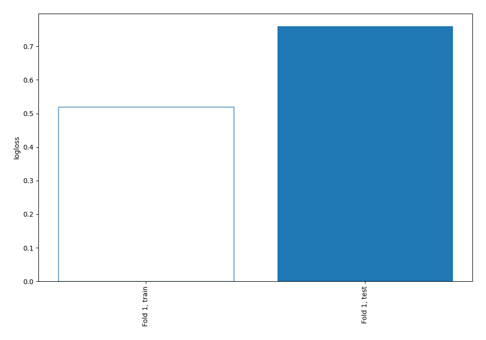
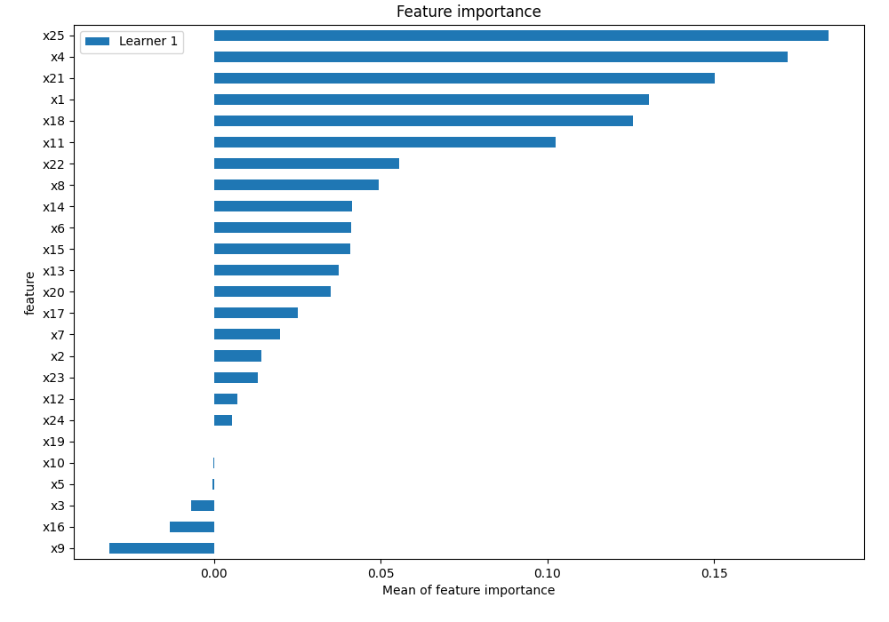
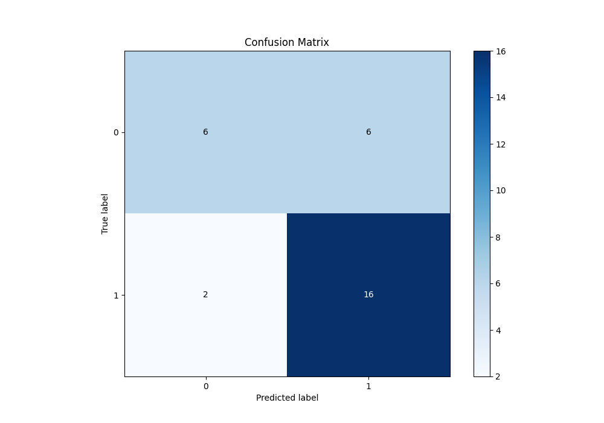
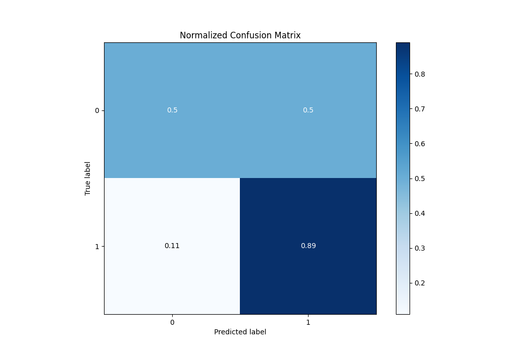
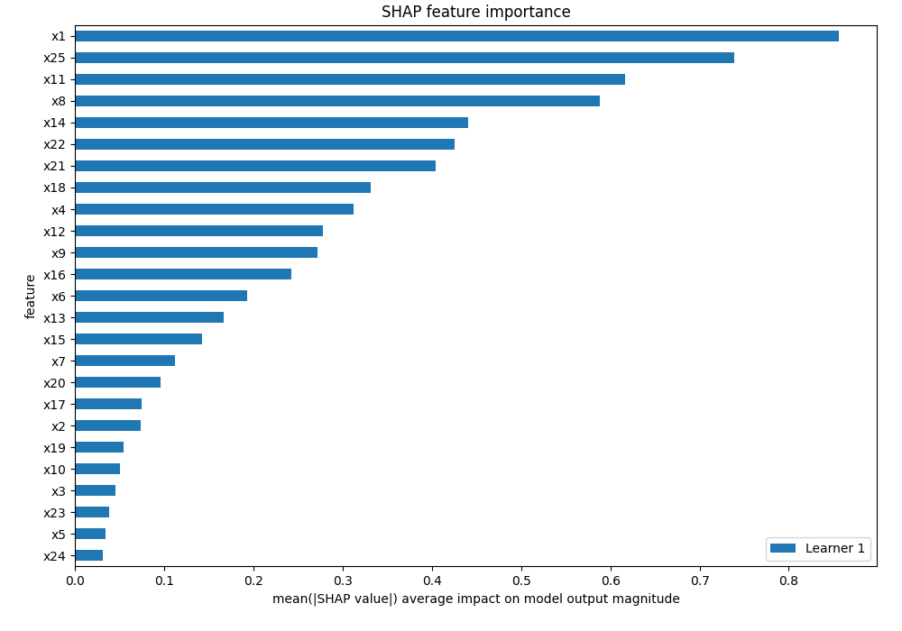
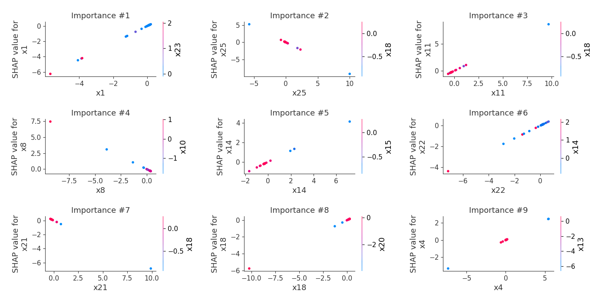
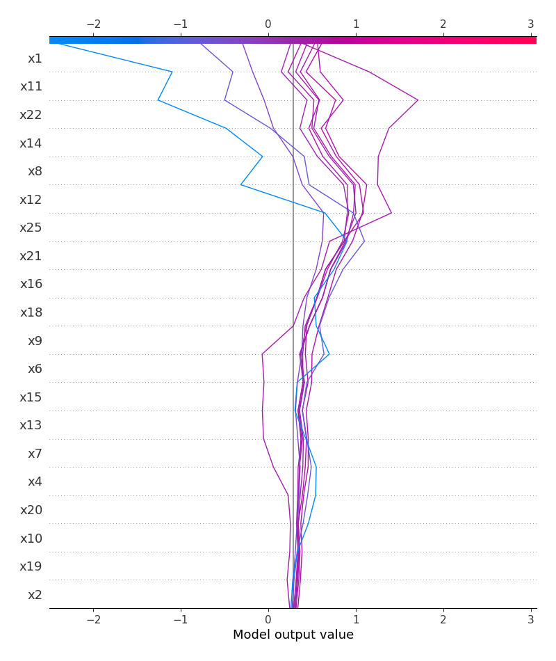
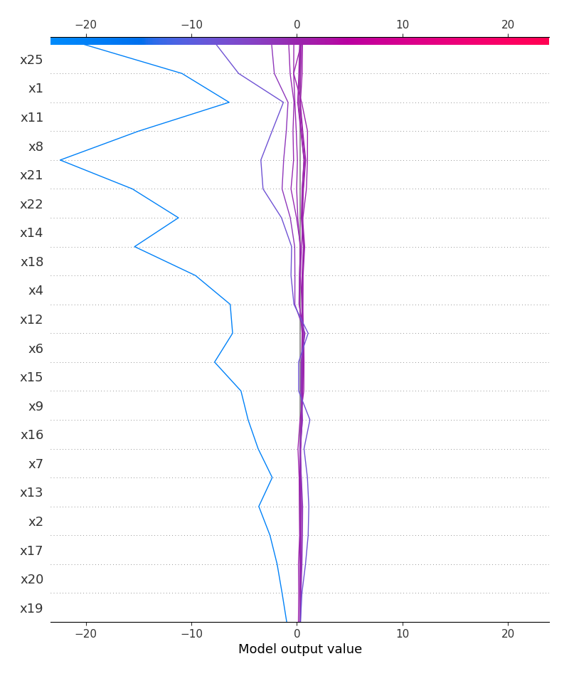
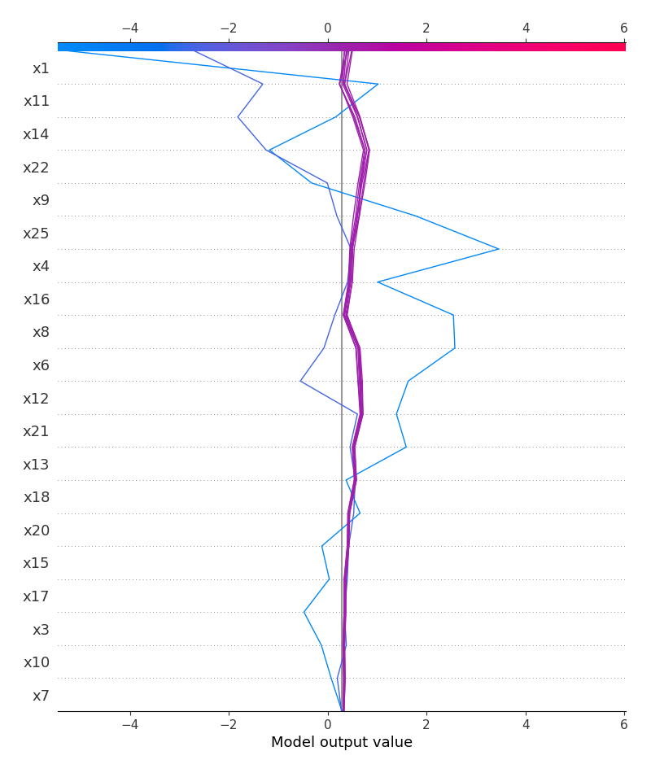
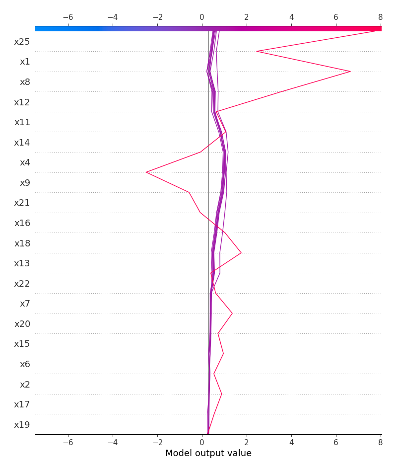

# Summary of 2_Linear

[<< Go back](../README.md)

## Logistic Regression (Linear)
- **n_jobs**: -1
- **explain_level**: 2

## Validation
 - **validation_type**: split
 - **train_ratio**: 0.75
 - **shuffle**: True
 - **stratify**: True

## Optimized metric
logloss

## Training time

3.9 seconds

## Metric details
|           |    score |     threshold |
|:----------|---------:|--------------:|
| logloss   | 0.759778 | nan           |
| auc       | 0.694444 | nan           |
| f1        | 0.8      |   0.573496    |
| accuracy  | 0.733333 |   0.573496    |
| precision | 1        |   0.651998    |
| recall    | 1        |   1.61273e-09 |
| mcc       | 0.43082  |   0.573496    |

## Metric details with threshold from accuracy metric
|           |    score |   threshold |
|:----------|---------:|------------:|
| logloss   | 0.759778 |  nan        |
| auc       | 0.694444 |  nan        |
| f1        | 0.8      |    0.573496 |
| accuracy  | 0.733333 |    0.573496 |
| precision | 0.727273 |    0.573496 |
| recall    | 0.888889 |    0.573496 |
| mcc       | 0.43082  |    0.573496 |

## Confusion matrix (at threshold=0.573496)
|              |   Predicted as 0 |   Predicted as 1 |
|:-------------|-----------------:|-----------------:|
| Labeled as 0 |                6 |                6 |
| Labeled as 1 |                2 |               16 |

## Learning curves

## Coefficients
| feature   |   Learner_1 |
|:----------|------------:|
| x1        |   1.10041   |
| x11       |   0.886938  |
| x12       |   0.673736  |
| x22       |   0.611695  |
| x14       |   0.578484  |
| x18       |   0.563907  |
| x4        |   0.448596  |
| x6        |   0.289367  |
| intercept |   0.283865  |
| x15       |   0.239722  |
| x2        |   0.127146  |
| x17       |   0.10297   |
| x5        |   0.0890722 |
| x3        |   0.0859104 |
| x24       |   0.0812298 |
| x23       |   0.0797064 |
| x10       |  -0.101898  |
| x19       |  -0.116048  |
| x20       |  -0.126943  |
| x7        |  -0.161185  |
| x13       |  -0.188016  |
| x16       |  -0.399572  |
| x9        |  -0.510406  |
| x21       |  -0.691224  |
| x8        |  -0.796672  |
| x25       |  -0.924301  |

## Permutation-based Importance

## Confusion Matrix

## Normalized Confusion Matrix

## SHAP Importance

## SHAP Dependence plots

### Dependence (Fold 1)

## SHAP Decision plots

### Top-10 Worst decisions for class 0 (Fold 1)

### Top-10 Best decisions for class 0 (Fold 1)

### Top-10 Worst decisions for class 1 (Fold 1)

### Top-10 Best decisions for class 1 (Fold 1)

[<< Go back](../README.md)
