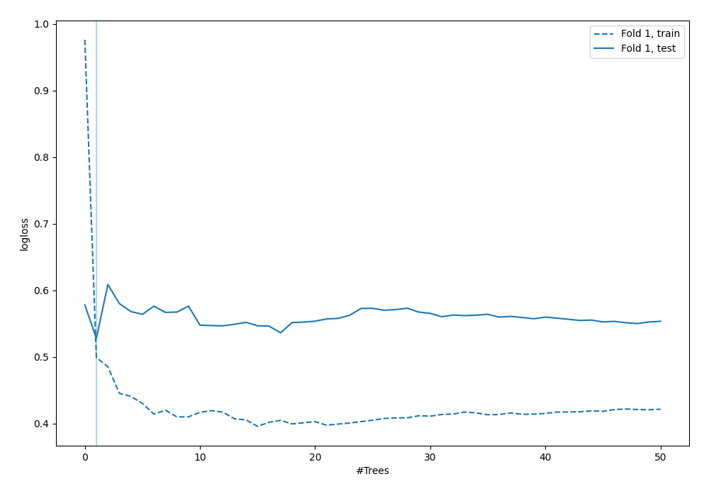
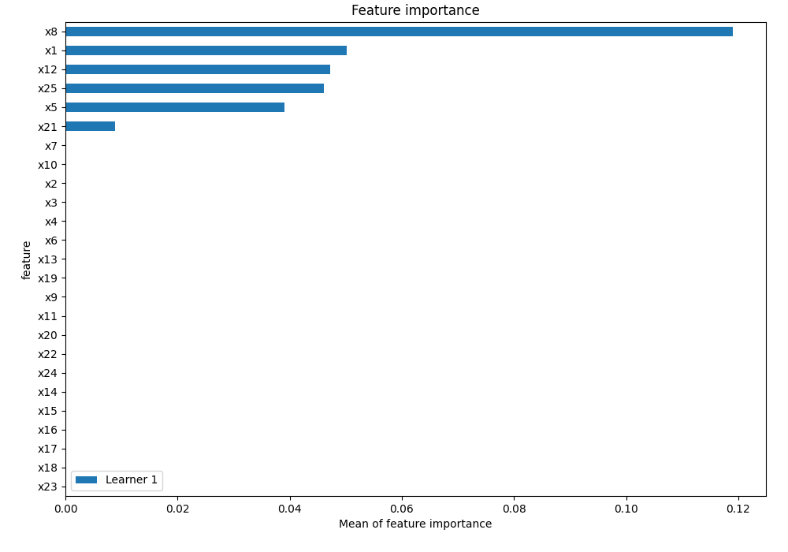
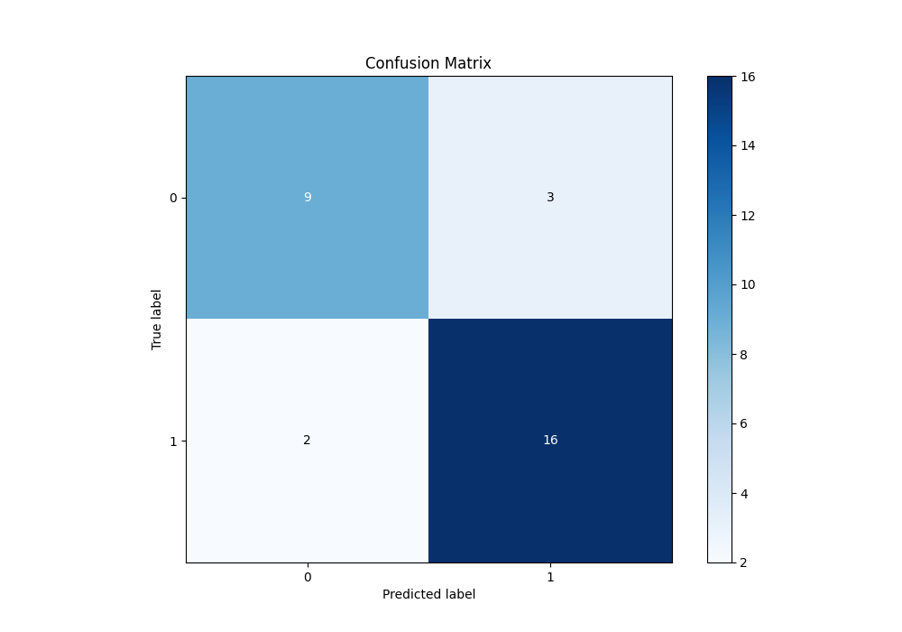

# Summary of 3_Default_RandomForest

[<< Go back](../README.md)

## Random Forest
- **n_jobs**: -1
- **criterion**: gini
- **max_features**: 0.9
- **min_samples_split**: 30
- **max_depth**: 4
- **eval_metric_name**: logloss
- **explain_level**: 2

## Validation
 - **validation_type**: split
 - **train_ratio**: 0.75
 - **shuffle**: True
 - **stratify**: True

## Optimized metric
logloss

## Training time

2.1 seconds

## Metric details
|           |    score |   threshold |
|:----------|---------:|------------:|
| logloss   | 0.527996 |  nan        |
| auc       | 0.793981 |  nan        |
| f1        | 0.864865 |    0.487215 |
| accuracy  | 0.833333 |    0.487215 |
| precision | 1        |    0.847619 |
| recall    | 1        |    0.183773 |
| mcc       | 0.659082 |    0.55     |

## Metric details with threshold from accuracy metric
|           |    score |   threshold |
|:----------|---------:|------------:|
| logloss   | 0.527996 |  nan        |
| auc       | 0.793981 |  nan        |
| f1        | 0.864865 |    0.487215 |
| accuracy  | 0.833333 |    0.487215 |
| precision | 0.842105 |    0.487215 |
| recall    | 0.888889 |    0.487215 |
| mcc       | 0.6495   |    0.487215 |

## Confusion matrix (at threshold=0.487215)
|              |   Predicted as 0 |   Predicted as 1 |
|:-------------|-----------------:|-----------------:|
| Labeled as 0 |                9 |                3 |
| Labeled as 1 |                2 |               16 |

## Learning curves

## Permutation-based Importance

## Confusion Matrix

## Normalized Confusion Matrix

[<< Go back](../README.md)
