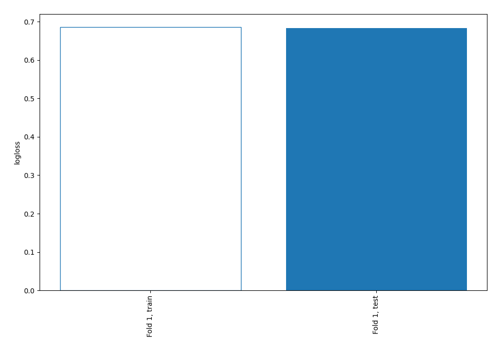
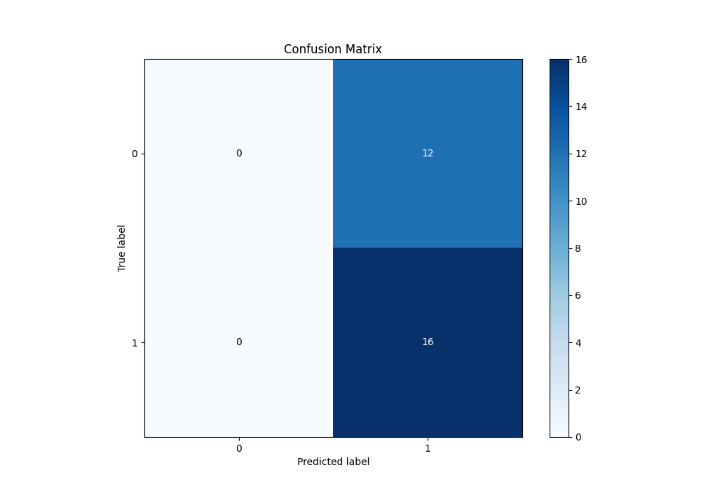
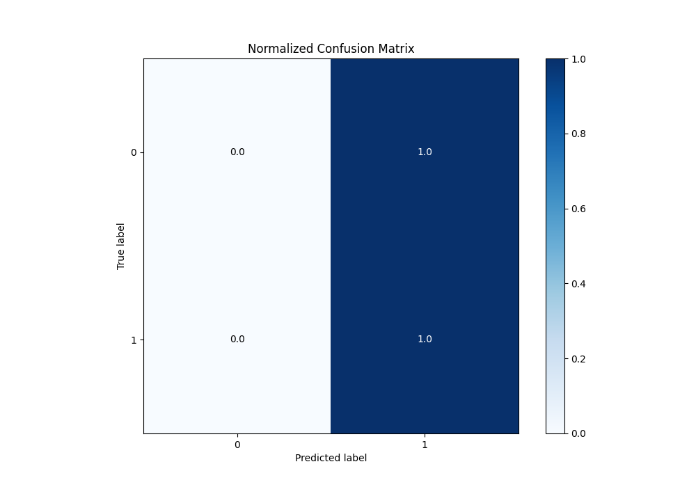

# Summary of 1_Baseline

[<< Go back](../README.md)

## Baseline Classifier (Baseline)
- **n_jobs**: -1
- **explain_level**: 2

## Validation
 - **validation_type**: split
 - **train_ratio**: 0.75
 - **shuffle**: True
 - **stratify**: True

## Optimized metric
logloss

## Training time

0.3 seconds

## Metric details
|           |    score |   threshold |
|:----------|---------:|------------:|
| logloss   | 0.68313  |  nan        |
| auc       | 0.5      |  nan        |
| f1        | 0.727273 |    0.504878 |
| accuracy  | 0.571429 |    0.504878 |
| precision | 0.571429 |    0.504878 |
| recall    | 1        |    0.504878 |
| mcc       | 0        |    0.504878 |

## Metric details with threshold from accuracy metric
|           |    score |   threshold |
|:----------|---------:|------------:|
| logloss   | 0.68313  |  nan        |
| auc       | 0.5      |  nan        |
| f1        | 0.727273 |    0.504878 |
| accuracy  | 0.571429 |    0.504878 |
| precision | 0.571429 |    0.504878 |
| recall    | 1        |    0.504878 |
| mcc       | 0        |    0.504878 |

## Confusion matrix (at threshold=0.504878)
|              |   Predicted as 0 |   Predicted as 1 |
|:-------------|-----------------:|-----------------:|
| Labeled as 0 |                0 |               12 |
| Labeled as 1 |                0 |               16 |

## Learning curves

## Confusion Matrix

## Normalized Confusion Matrix

[<< Go back](../README.md)
