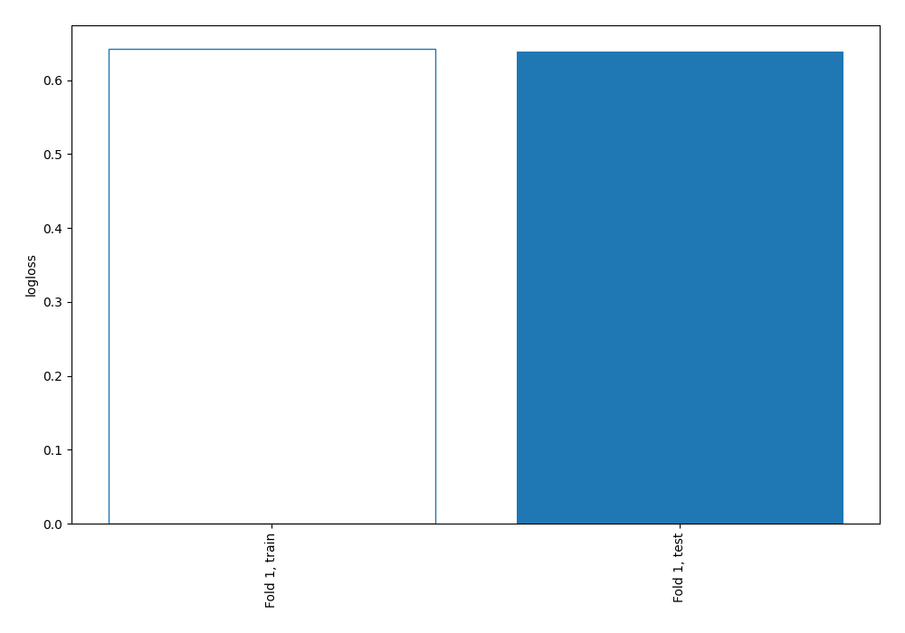
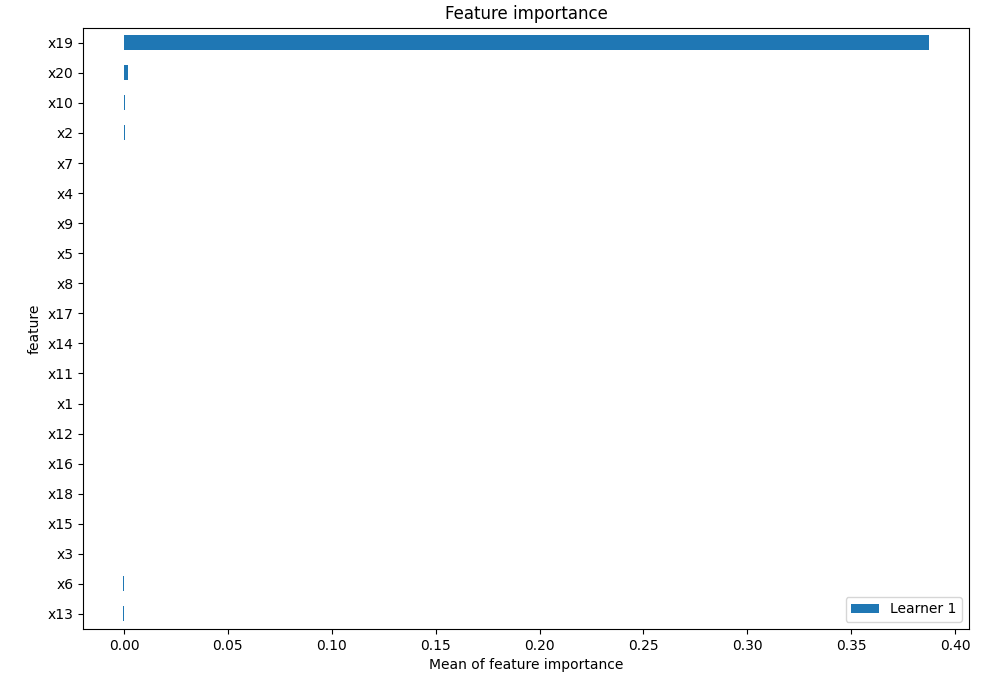
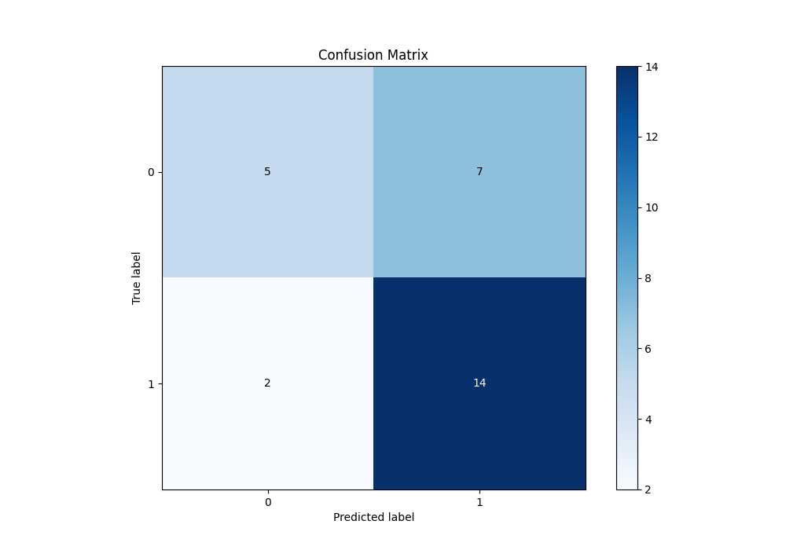
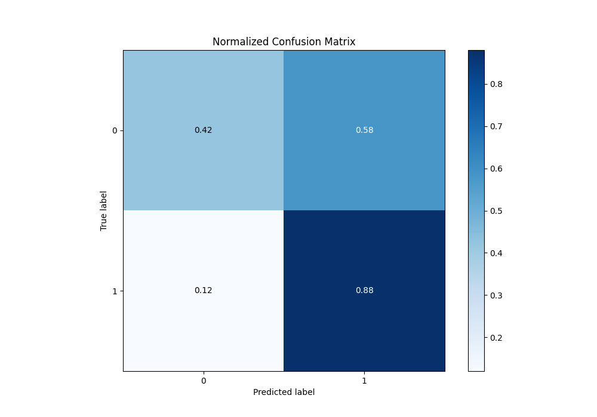
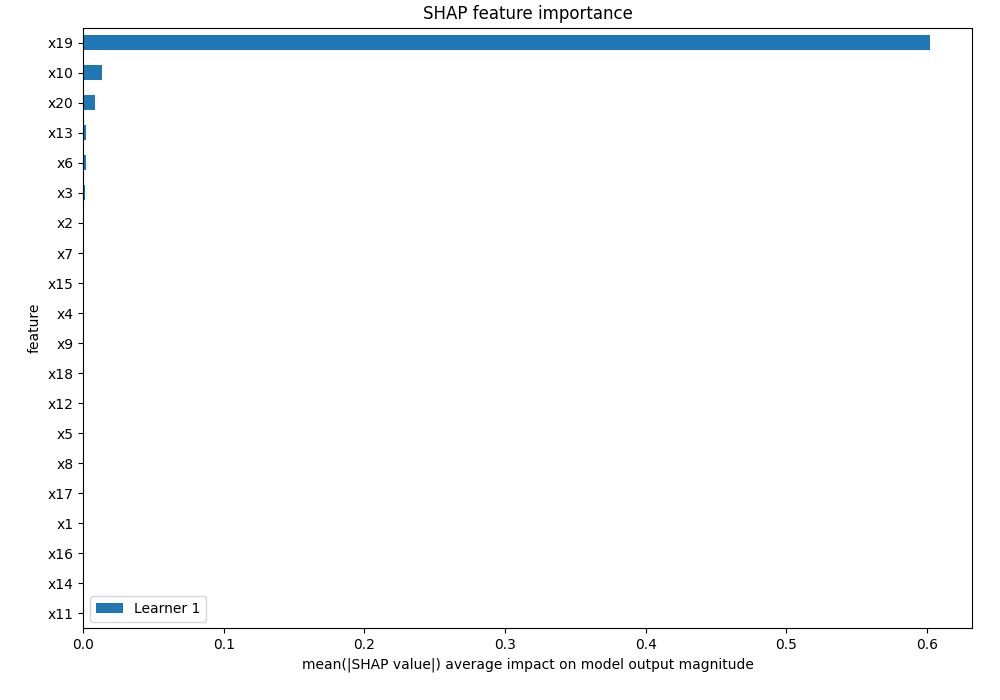
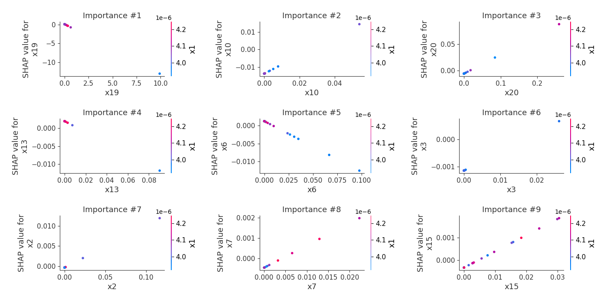
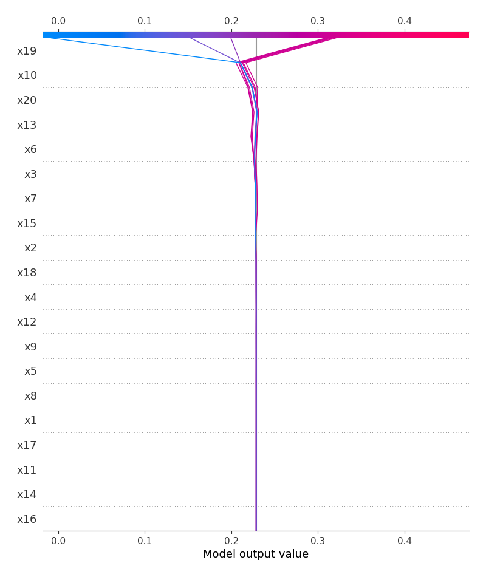
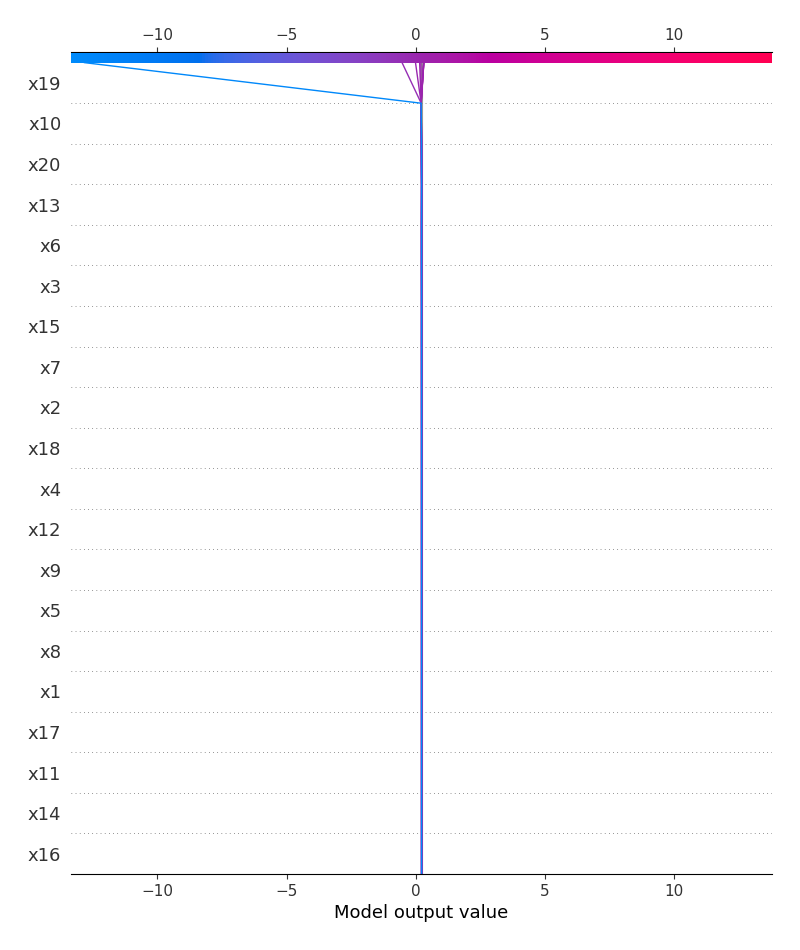
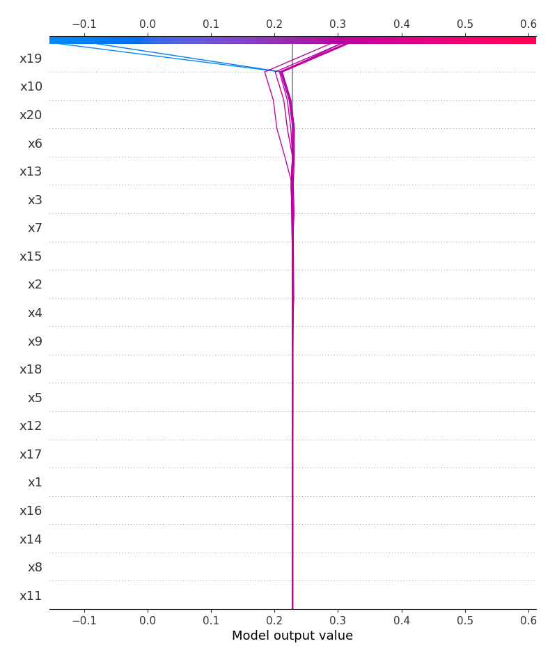
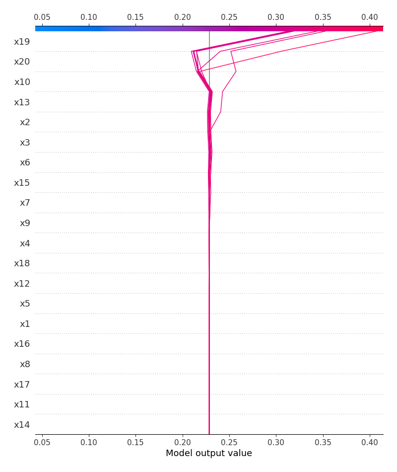

# Summary of 3_Linear

[<< Go back](../README.md)

## Logistic Regression (Linear)
- **n_jobs**: -1
- **explain_level**: 2

## Validation
 - **validation_type**: split
 - **train_ratio**: 0.75
 - **shuffle**: True
 - **stratify**: True

## Optimized metric
logloss

## Training time

4.3 seconds

## Metric details
|           |    score |     threshold |
|:----------|---------:|--------------:|
| logloss   | 0.638727 | nan           |
| auc       | 0.682292 | nan           |
| f1        | 0.761905 |   0.418009    |
| accuracy  | 0.678571 |   0.560637    |
| precision | 1        |   0.582331    |
| recall    | 1        |   2.43962e-06 |
| mcc       | 0.372104 |   0.577586    |

## Metric details with threshold from accuracy metric
|           |    score |   threshold |
|:----------|---------:|------------:|
| logloss   | 0.638727 |  nan        |
| auc       | 0.682292 |  nan        |
| f1        | 0.756757 |    0.560637 |
| accuracy  | 0.678571 |    0.560637 |
| precision | 0.666667 |    0.560637 |
| recall    | 0.875    |    0.560637 |
| mcc       | 0.333333 |    0.560637 |

## Confusion matrix (at threshold=0.560637)
|              |   Predicted as 0 |   Predicted as 1 |
|:-------------|-----------------:|-----------------:|
| Labeled as 0 |                5 |                7 |
| Labeled as 1 |                2 |               14 |

## Learning curves

## Coefficients
| feature   |    Learner_1 |
|:----------|-------------:|
| x10       |  0.518265    |
| x20       |  0.356896    |
| intercept |  0.314027    |
| x7        |  0.108871    |
| x2        |  0.104888    |
| x15       |  0.0720883   |
| x3        |  0.0703491   |
| x4        |  0.0351215   |
| x18       |  0.0343167   |
| x9        |  0.0210235   |
| x5        |  0.00564441  |
| x1        |  0.000912782 |
| x17       |  7.18981e-05 |
| x11       |  5.11735e-06 |
| x14       |  4.94906e-07 |
| x16       | -4.97955e-08 |
| x8        | -0.000162579 |
| x12       | -0.029254    |
| x6        | -0.141243    |
| x13       | -0.153097    |
| x19       | -1.32655     |

## Permutation-based Importance

## Confusion Matrix

## Normalized Confusion Matrix

## SHAP Importance

## SHAP Dependence plots

### Dependence (Fold 1)

## SHAP Decision plots

### Top-10 Worst decisions for class 0 (Fold 1)

### Top-10 Best decisions for class 0 (Fold 1)

### Top-10 Worst decisions for class 1 (Fold 1)

### Top-10 Best decisions for class 1 (Fold 1)

[<< Go back](../README.md)
