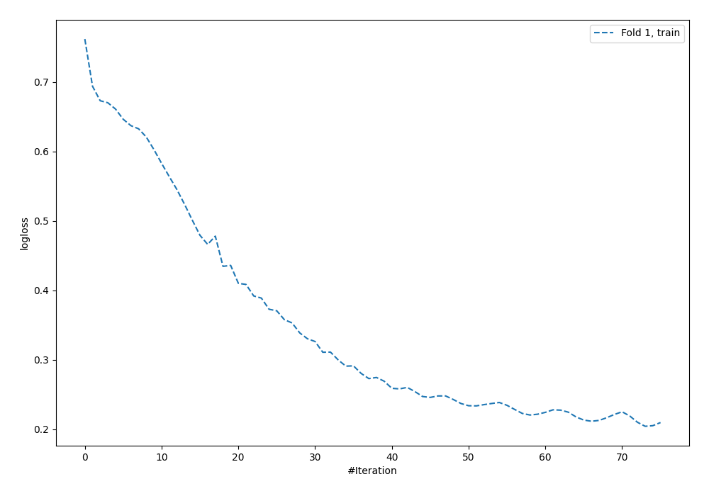
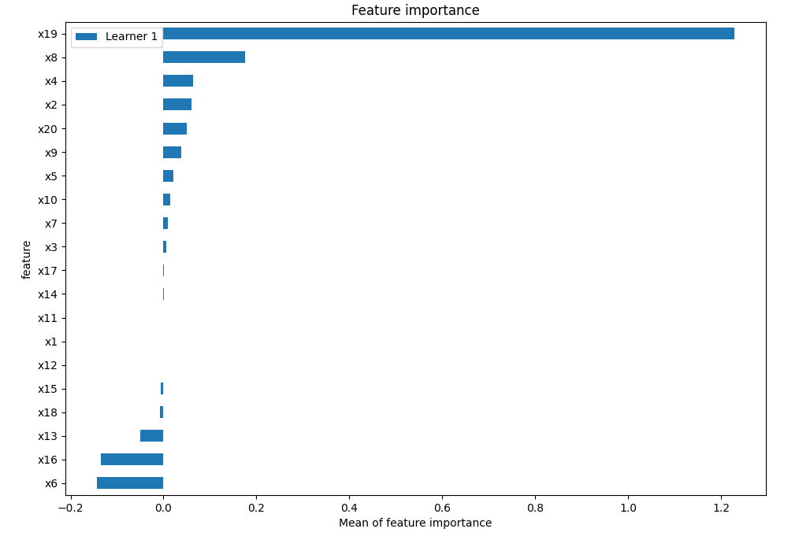
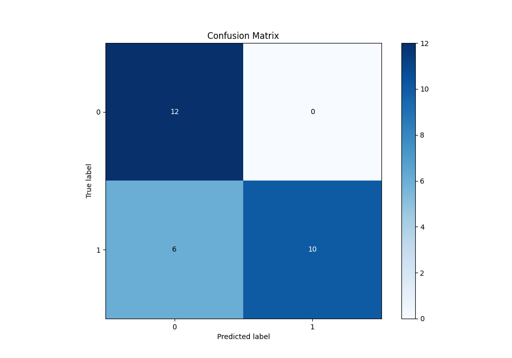
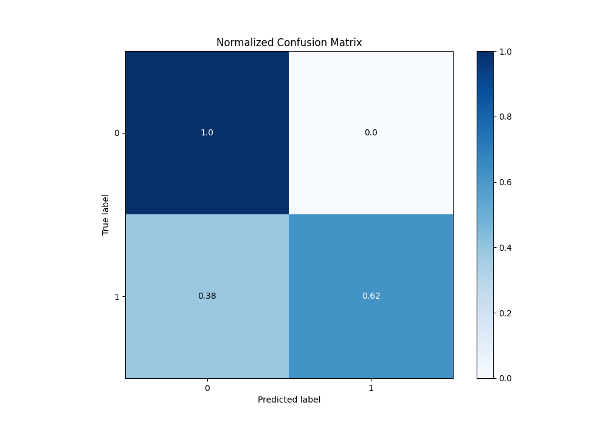

# Summary of 7_Default_NeuralNetwork

[<< Go back](../README.md)

## Neural Network
- **n_jobs**: -1
- **dense_1_size**: 32
- **dense_2_size**: 16
- **learning_rate**: 0.05
- **explain_level**: 2

## Validation
 - **validation_type**: split
 - **train_ratio**: 0.75
 - **shuffle**: True
 - **stratify**: True

## Optimized metric
logloss

## Training time

1.1 seconds

## Metric details
|           |    score |     threshold |
|:----------|---------:|--------------:|
| logloss   | 1.29712  | nan           |
| auc       | 0.770833 | nan           |
| f1        | 0.769231 |   0.647814    |
| accuracy  | 0.785714 |   0.647814    |
| precision | 1        |   0.647814    |
| recall    | 1        |   4.15126e-73 |
| mcc       | 0.645497 |   0.647814    |

## Metric details with threshold from accuracy metric
|           |    score |   threshold |
|:----------|---------:|------------:|
| logloss   | 1.29712  |  nan        |
| auc       | 0.770833 |  nan        |
| f1        | 0.769231 |    0.647814 |
| accuracy  | 0.785714 |    0.647814 |
| precision | 1        |    0.647814 |
| recall    | 0.625    |    0.647814 |
| mcc       | 0.645497 |    0.647814 |

## Confusion matrix (at threshold=0.647814)
|              |   Predicted as 0 |   Predicted as 1 |
|:-------------|-----------------:|-----------------:|
| Labeled as 0 |               12 |                0 |
| Labeled as 1 |                6 |               10 |

## Learning curves

## Permutation-based Importance

## Confusion Matrix

## Normalized Confusion Matrix

[<< Go back](../README.md)
