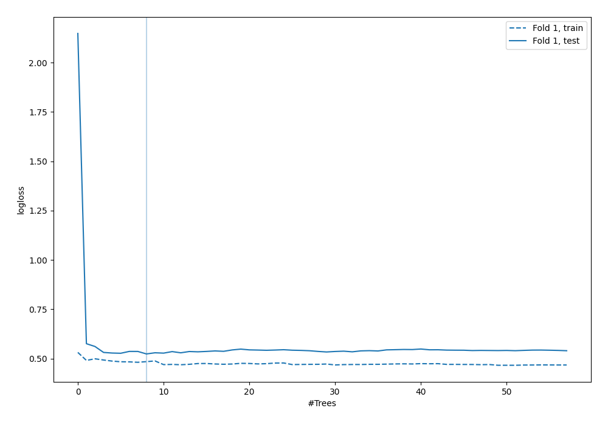
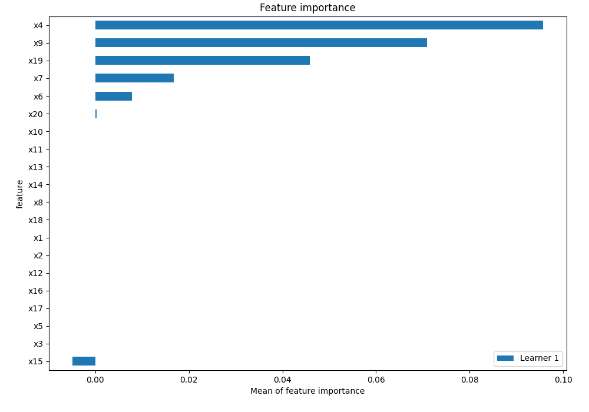
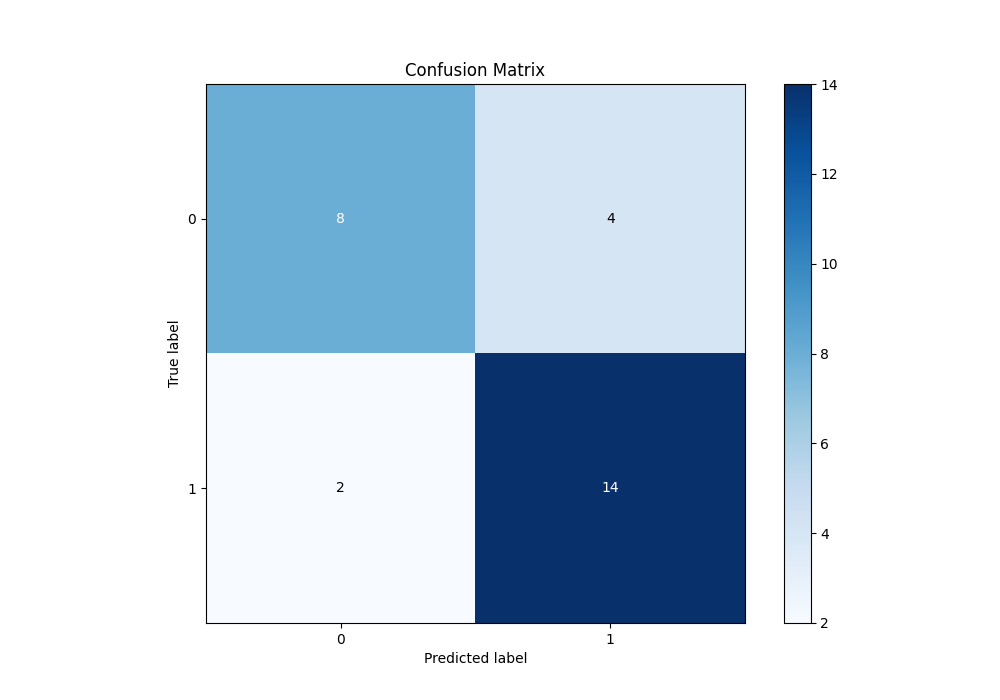
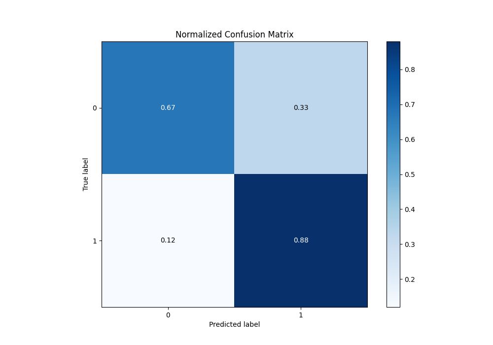

# Summary of 9_Default_ExtraTrees

[<< Go back](../README.md)

## Extra Trees Classifier (Extra Trees)
- **n_jobs**: -1
- **criterion**: gini
- **max_features**: 0.9
- **min_samples_split**: 30
- **max_depth**: 4
- **eval_metric_name**: logloss
- **explain_level**: 2

## Validation
 - **validation_type**: split
 - **train_ratio**: 0.75
 - **shuffle**: True
 - **stratify**: True

## Optimized metric
logloss

## Training time

2.0 seconds

## Metric details
|           |    score |   threshold |
|:----------|---------:|------------:|
| logloss   | 0.52371  |  nan        |
| auc       | 0.861979 |  nan        |
| f1        | 0.823529 |    0.465922 |
| accuracy  | 0.785714 |    0.465922 |
| precision | 1        |    0.520224 |
| recall    | 1        |    0.206693 |
| mcc       | 0.59604  |    0.520224 |

## Metric details with threshold from accuracy metric
|           |    score |   threshold |
|:----------|---------:|------------:|
| logloss   | 0.52371  |  nan        |
| auc       | 0.861979 |  nan        |
| f1        | 0.823529 |    0.465922 |
| accuracy  | 0.785714 |    0.465922 |
| precision | 0.777778 |    0.465922 |
| recall    | 0.875    |    0.465922 |
| mcc       | 0.559431 |    0.465922 |

## Confusion matrix (at threshold=0.465922)
|              |   Predicted as 0 |   Predicted as 1 |
|:-------------|-----------------:|-----------------:|
| Labeled as 0 |                8 |                4 |
| Labeled as 1 |                2 |               14 |

## Learning curves

## Permutation-based Importance

## Confusion Matrix

## Normalized Confusion Matrix

[<< Go back](../README.md)
