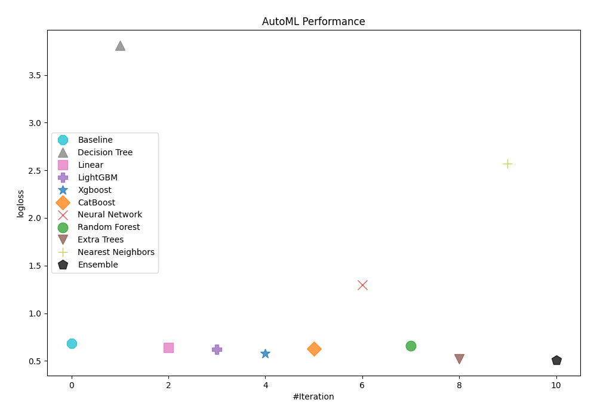
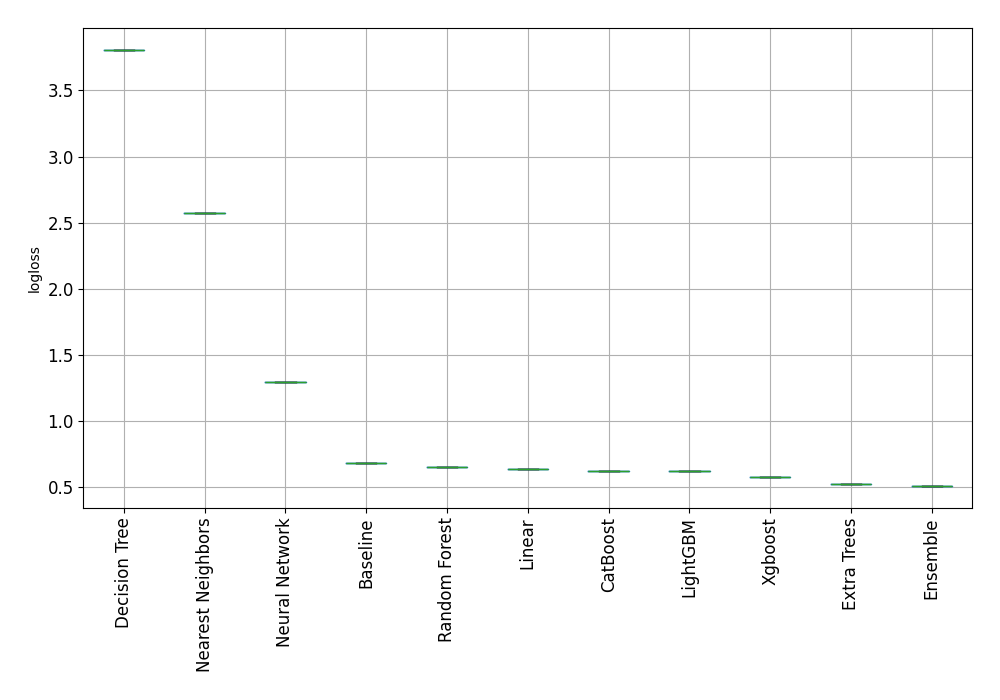
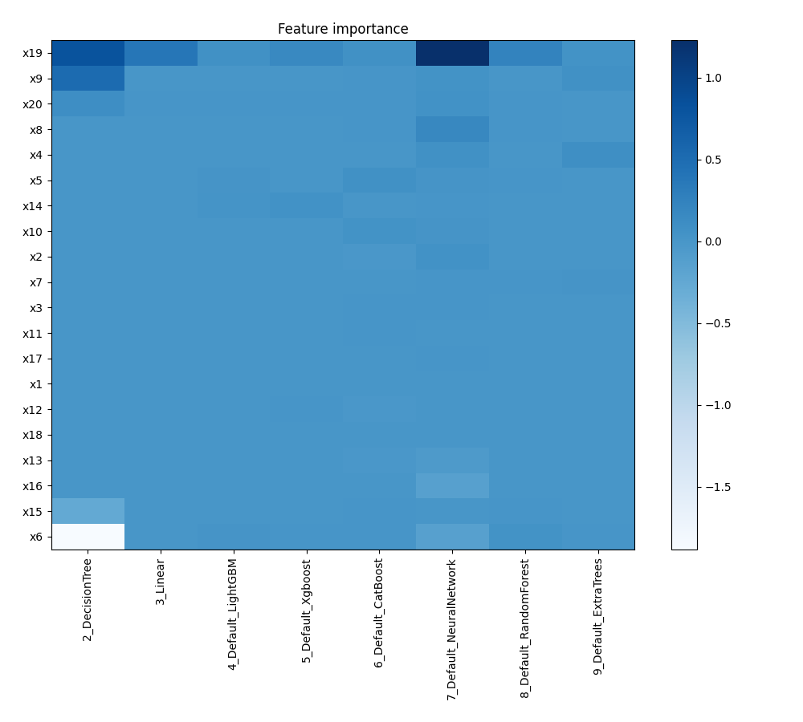
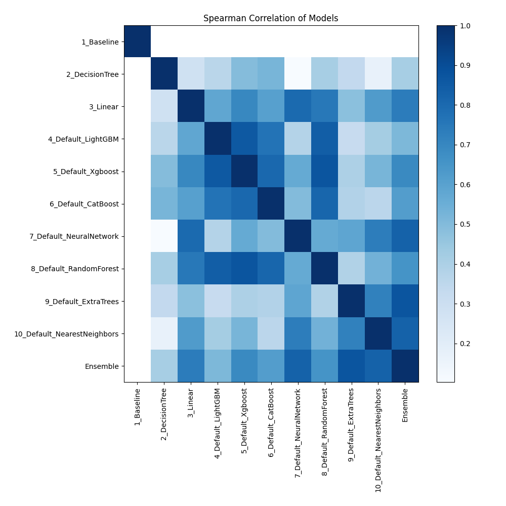

# AutoML Leaderboard

| Best model   | name                                                                 | model_type        | metric_type   |   metric_value |   train_time |
|:-------------|:---------------------------------------------------------------------|:------------------|:--------------|---------------:|-------------:|
|              | [1_Baseline](1_Baseline/README.md)                                   | Baseline          | logloss       |       0.68313  |         0.73 |
|              | [2_DecisionTree](2_DecisionTree/README.md)                           | Decision Tree     | logloss       |       3.80813  |         3.34 |
|              | [3_Linear](3_Linear/README.md)                                       | Linear            | logloss       |       0.638727 |         5.57 |
|              | [4_Default_LightGBM](4_Default_LightGBM/README.md)                   | LightGBM          | logloss       |       0.622751 |        11.18 |
|              | [5_Default_Xgboost](5_Default_Xgboost/README.md)                     | Xgboost           | logloss       |       0.577587 |         8.09 |
|              | [6_Default_CatBoost](6_Default_CatBoost/README.md)                   | CatBoost          | logloss       |       0.625571 |         2.16 |
|              | [7_Default_NeuralNetwork](7_Default_NeuralNetwork/README.md)         | Neural Network    | logloss       |       1.29712  |         2.12 |
|              | [8_Default_RandomForest](8_Default_RandomForest/README.md)           | Random Forest     | logloss       |       0.657093 |         7.71 |
|              | [9_Default_ExtraTrees](9_Default_ExtraTrees/README.md)               | Extra Trees       | logloss       |       0.52371  |         3.16 |
|              | [10_Default_NearestNeighbors](10_Default_NearestNeighbors/README.md) | Nearest Neighbors | logloss       |       2.57217  |         1.72 |
| **the best** | [Ensemble](Ensemble/README.md)                                       | Ensemble          | logloss       |       0.510656 |         1.19 |

### AutoML Performance

### AutoML Performance Boxplot

### Features Importance

### Spearman Correlation of Models

