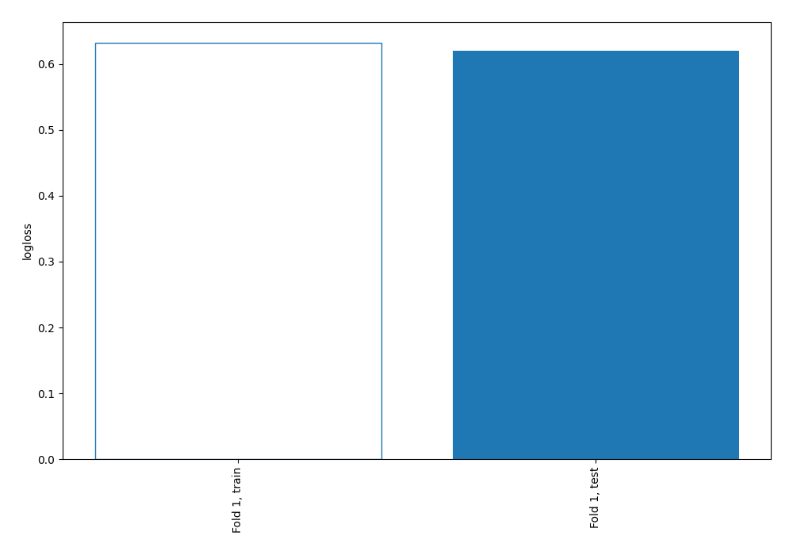
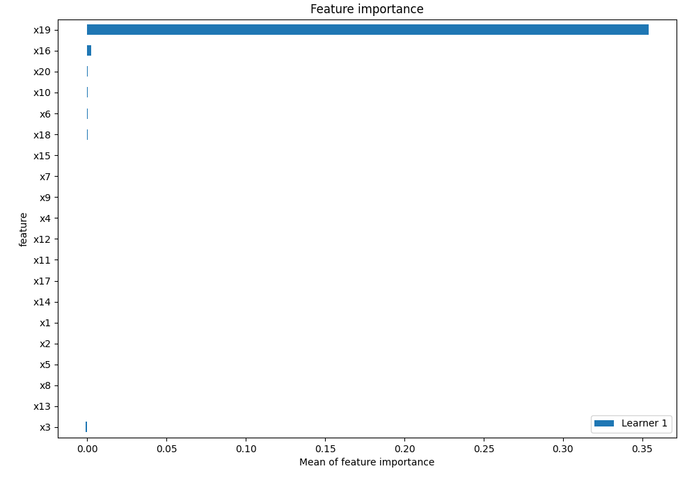
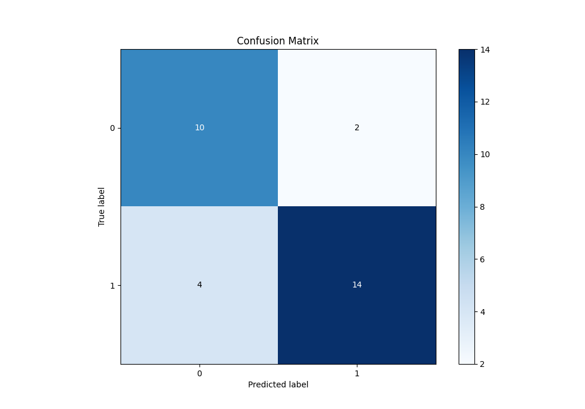
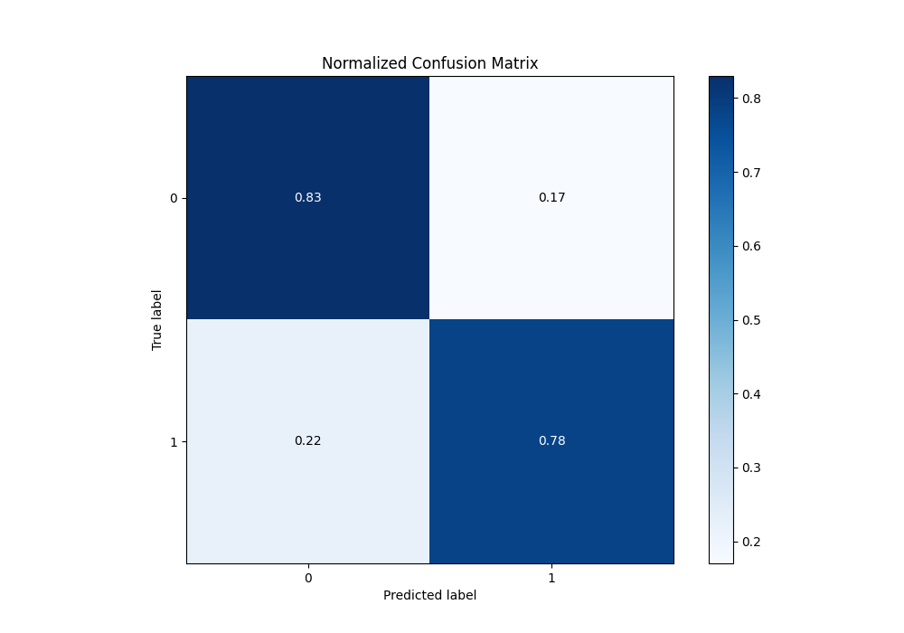
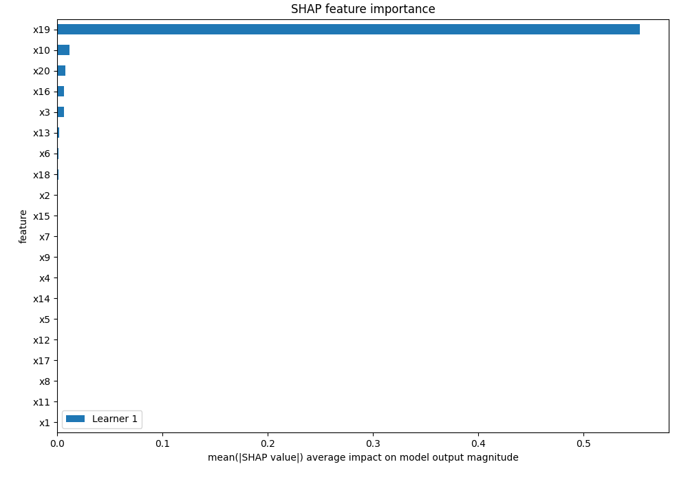
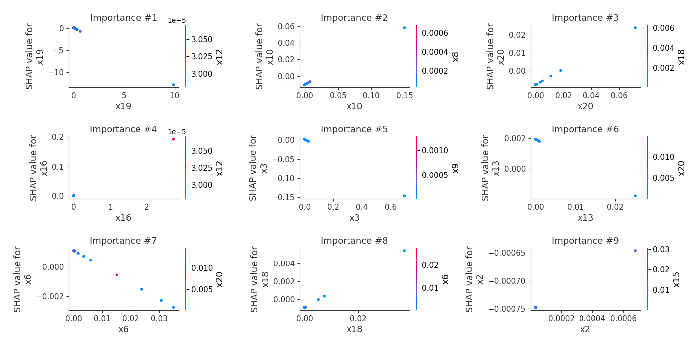
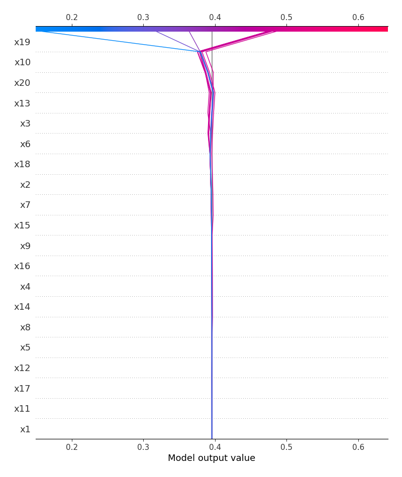
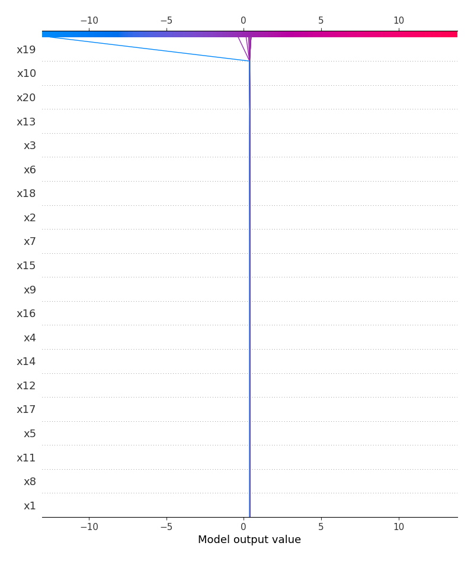
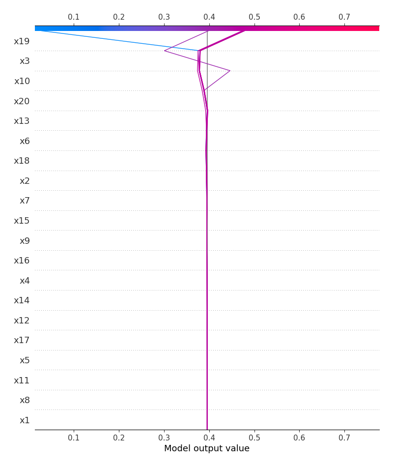
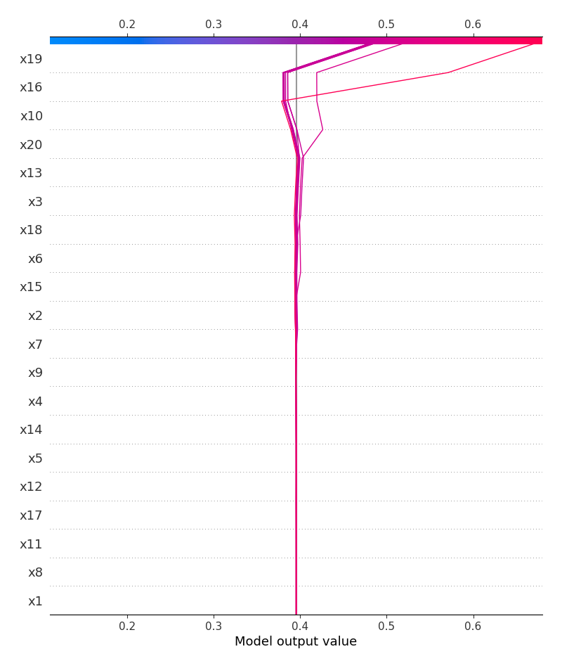

# Summary of 3_Linear

[<< Go back](../README.md)

## Logistic Regression (Linear)
- **n_jobs**: -1
- **explain_level**: 2

## Validation
 - **validation_type**: split
 - **train_ratio**: 0.75
 - **shuffle**: True
 - **stratify**: True

## Optimized metric
logloss

## Training time

3.9 seconds

## Metric details
|           |    score |     threshold |
|:----------|---------:|--------------:|
| logloss   | 0.620155 | nan           |
| auc       | 0.791667 | nan           |
| f1        | 0.823529 |   0.617013    |
| accuracy  | 0.8      |   0.617013    |
| precision | 1        |   0.622732    |
| recall    | 1        |   3.34556e-06 |
| mcc       | 0.600099 |   0.617013    |

## Metric details with threshold from accuracy metric
|           |    score |   threshold |
|:----------|---------:|------------:|
| logloss   | 0.620155 |  nan        |
| auc       | 0.791667 |  nan        |
| f1        | 0.823529 |    0.617013 |
| accuracy  | 0.8      |    0.617013 |
| precision | 0.875    |    0.617013 |
| recall    | 0.777778 |    0.617013 |
| mcc       | 0.600099 |    0.617013 |

## Confusion matrix (at threshold=0.617013)
|              |   Predicted as 0 |   Predicted as 1 |
|:-------------|-----------------:|-----------------:|
| Labeled as 0 |               10 |                2 |
| Labeled as 1 |                4 |               14 |

## Learning curves

## Coefficients
| feature   |    Learner_1 |
|:----------|-------------:|
| intercept |  0.477164    |
| x10       |  0.459969    |
| x20       |  0.43963     |
| x18       |  0.170834    |
| x2        |  0.157986    |
| x7        |  0.104252    |
| x9        |  0.0846581   |
| x16       |  0.0706642   |
| x14       |  0.0571939   |
| x4        |  0.057037    |
| x15       |  0.0553879   |
| x17       |  0.0274571   |
| x5        |  0.0247925   |
| x11       |  0.0166567   |
| x8        |  0.00223355  |
| x1        |  0.000926747 |
| x12       | -0.0351515   |
| x6        | -0.111637    |
| x13       | -0.149787    |
| x3        | -0.211561    |
| x19       | -1.31113     |

## Permutation-based Importance

## Confusion Matrix

## Normalized Confusion Matrix

## SHAP Importance

## SHAP Dependence plots

### Dependence (Fold 1)

## SHAP Decision plots

### Top-10 Worst decisions for class 0 (Fold 1)

### Top-10 Best decisions for class 0 (Fold 1)

### Top-10 Worst decisions for class 1 (Fold 1)

### Top-10 Best decisions for class 1 (Fold 1)

[<< Go back](../README.md)
