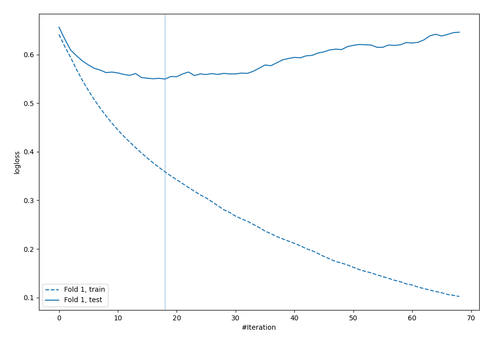
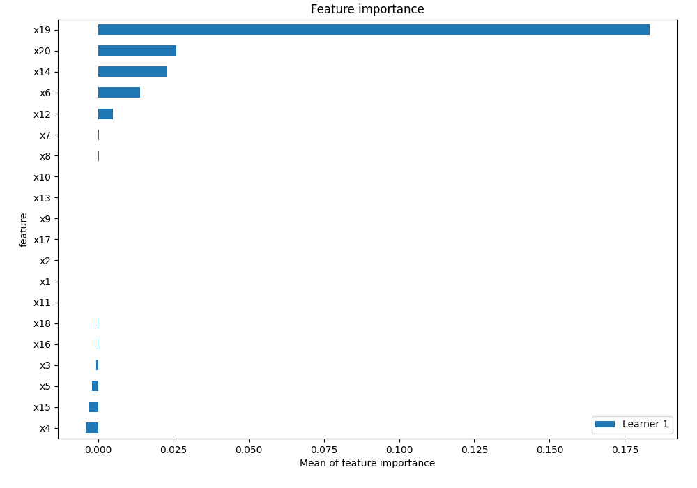
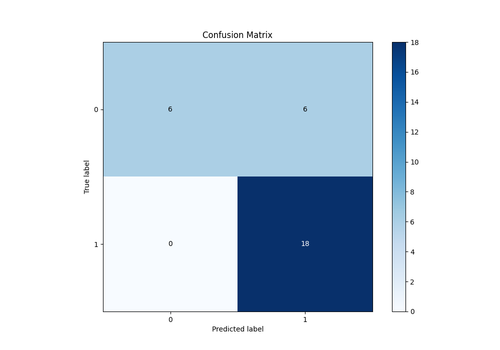
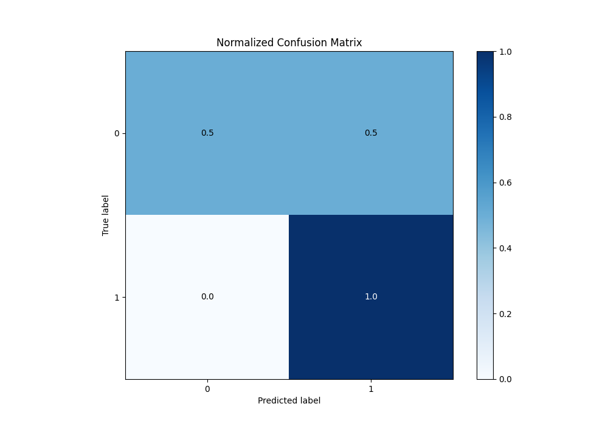
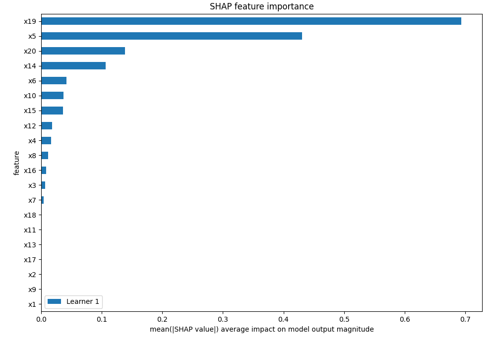
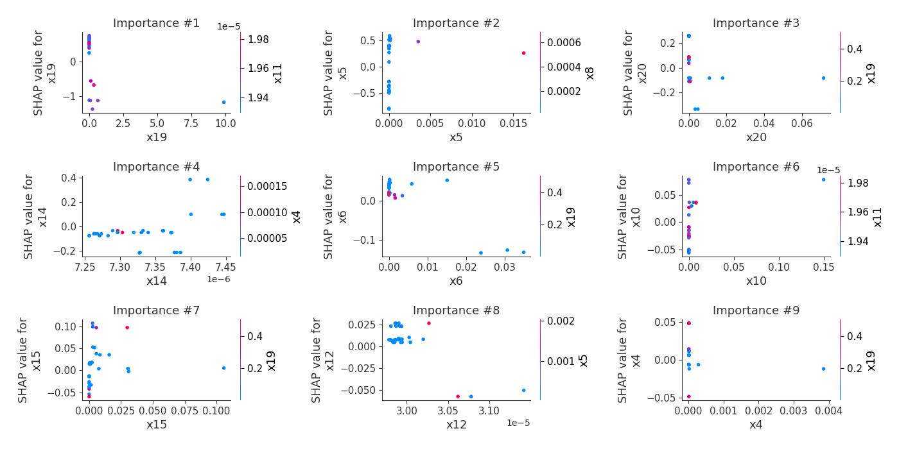
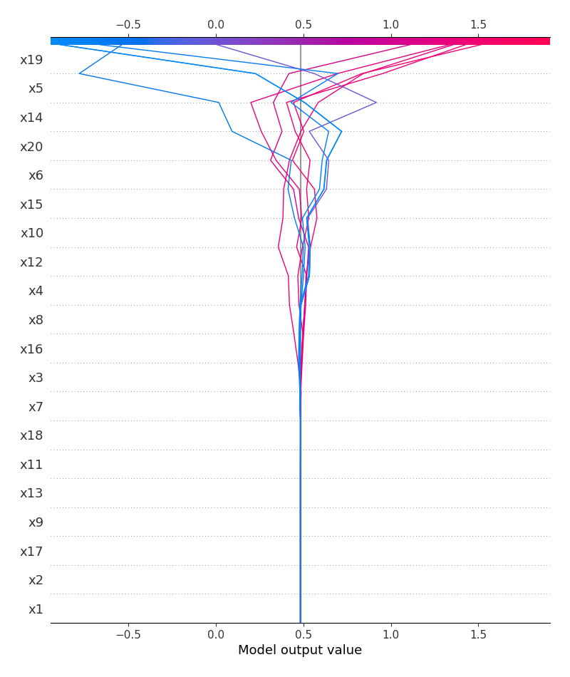
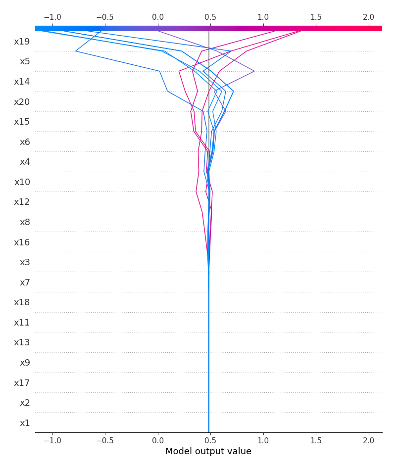
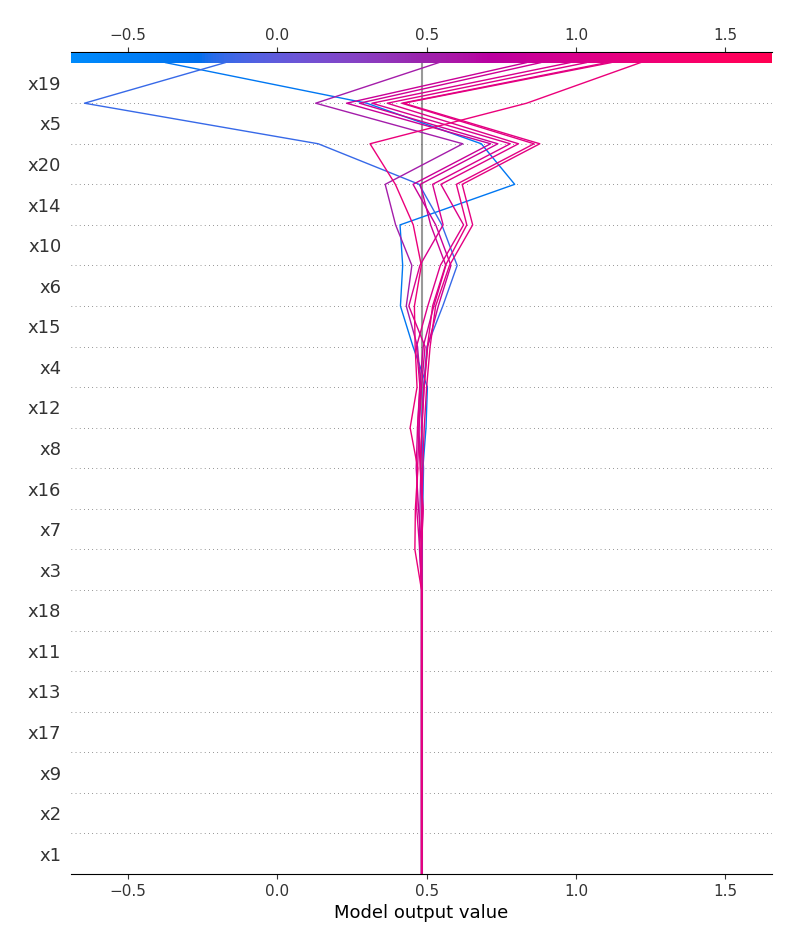
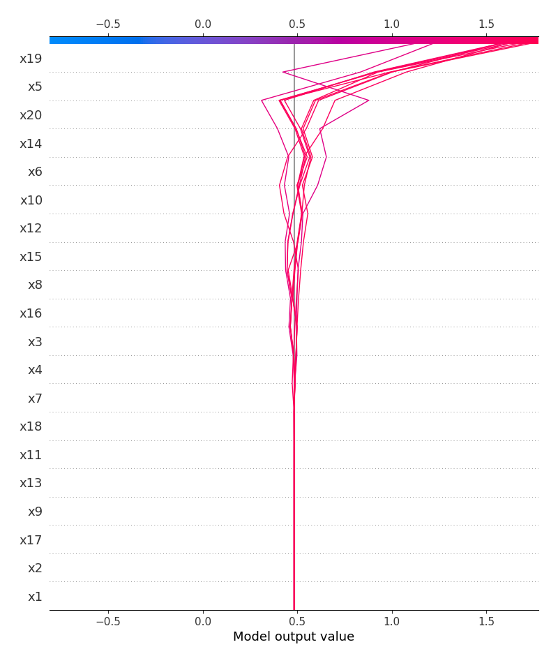

# Summary of 4_Default_LightGBM

[<< Go back](../README.md)

## LightGBM
- **n_jobs**: -1
- **objective**: binary
- **num_leaves**: 63
- **learning_rate**: 0.05
- **feature_fraction**: 0.9
- **bagging_fraction**: 0.9
- **min_data_in_leaf**: 10
- **metric**: binary_logloss
- **custom_eval_metric_name**: None
- **explain_level**: 2

## Validation
 - **validation_type**: split
 - **train_ratio**: 0.75
 - **shuffle**: True
 - **stratify**: True

## Optimized metric
logloss

## Training time

5.3 seconds

## Metric details
|           |    score |   threshold |
|:----------|---------:|------------:|
| logloss   | 0.549539 |  nan        |
| auc       | 0.768519 |  nan        |
| f1        | 0.857143 |    0.388349 |
| accuracy  | 0.8      |    0.388349 |
| precision | 1        |    0.823504 |
| recall    | 1        |    0.224889 |
| mcc       | 0.612372 |    0.388349 |

## Metric details with threshold from accuracy metric
|           |    score |   threshold |
|:----------|---------:|------------:|
| logloss   | 0.549539 |  nan        |
| auc       | 0.768519 |  nan        |
| f1        | 0.857143 |    0.388349 |
| accuracy  | 0.8      |    0.388349 |
| precision | 0.75     |    0.388349 |
| recall    | 1        |    0.388349 |
| mcc       | 0.612372 |    0.388349 |

## Confusion matrix (at threshold=0.388349)
|              |   Predicted as 0 |   Predicted as 1 |
|:-------------|-----------------:|-----------------:|
| Labeled as 0 |                6 |                6 |
| Labeled as 1 |                0 |               18 |

## Learning curves

## Permutation-based Importance

## Confusion Matrix

## Normalized Confusion Matrix

## SHAP Importance

## SHAP Dependence plots

### Dependence (Fold 1)

## SHAP Decision plots

### Top-10 Worst decisions for class 0 (Fold 1)

### Top-10 Best decisions for class 0 (Fold 1)

### Top-10 Worst decisions for class 1 (Fold 1)

### Top-10 Best decisions for class 1 (Fold 1)

[<< Go back](../README.md)
