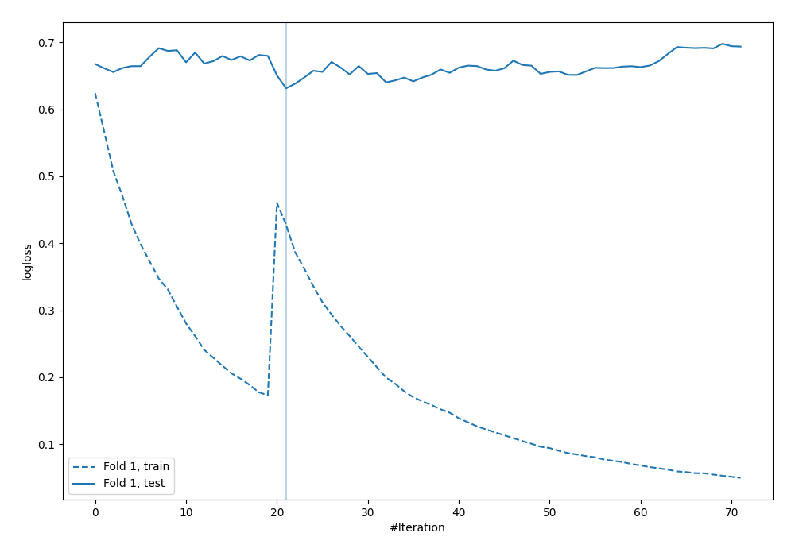
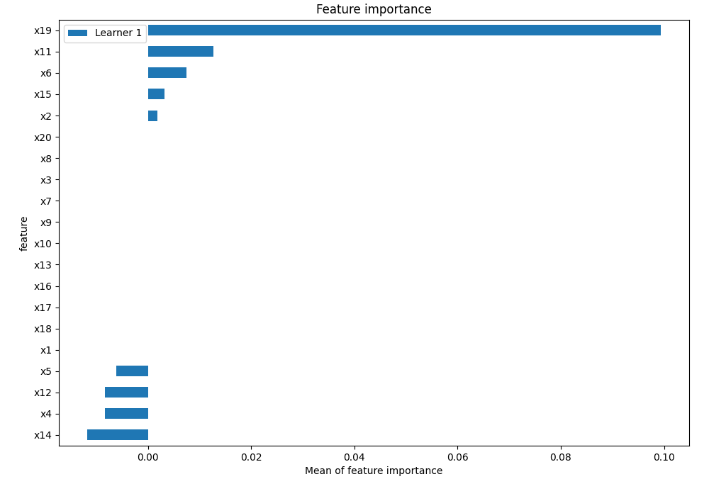
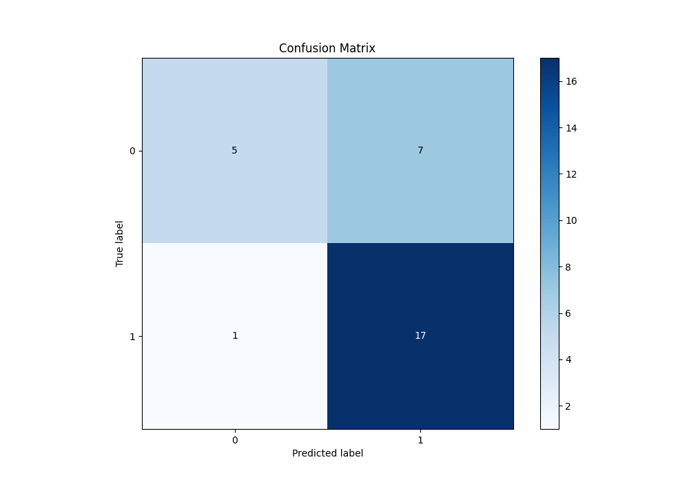
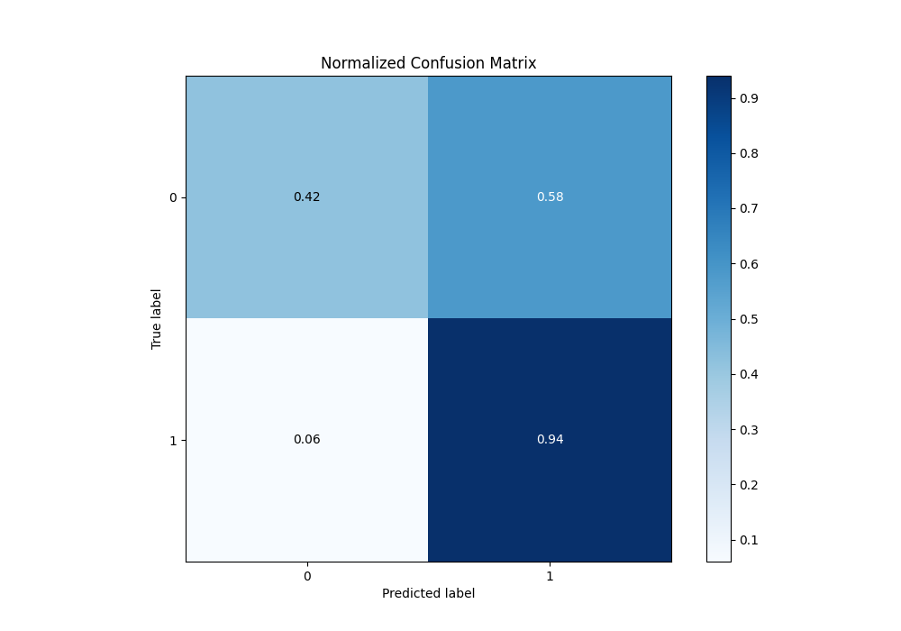

# Summary of 6_Default_CatBoost

[<< Go back](../README.md)

## CatBoost
- **n_jobs**: -1
- **learning_rate**: 0.1
- **depth**: 6
- **rsm**: 1
- **loss_function**: Logloss
- **eval_metric**: Logloss
- **explain_level**: 2

## Validation
 - **validation_type**: split
 - **train_ratio**: 0.75
 - **shuffle**: True
 - **stratify**: True

## Optimized metric
logloss

## Training time

1.3 seconds

## Metric details
|           |    score |   threshold |
|:----------|---------:|------------:|
| logloss   | 0.631223 |  nan        |
| auc       | 0.622685 |  nan        |
| f1        | 0.809524 |    0.423089 |
| accuracy  | 0.733333 |    0.423089 |
| precision | 1        |    0.743947 |
| recall    | 1        |    0.25394  |
| mcc       | 0.442269 |    0.423089 |

## Metric details with threshold from accuracy metric
|           |    score |   threshold |
|:----------|---------:|------------:|
| logloss   | 0.631223 |  nan        |
| auc       | 0.622685 |  nan        |
| f1        | 0.809524 |    0.423089 |
| accuracy  | 0.733333 |    0.423089 |
| precision | 0.708333 |    0.423089 |
| recall    | 0.944444 |    0.423089 |
| mcc       | 0.442269 |    0.423089 |

## Confusion matrix (at threshold=0.423089)
|              |   Predicted as 0 |   Predicted as 1 |
|:-------------|-----------------:|-----------------:|
| Labeled as 0 |                5 |                7 |
| Labeled as 1 |                1 |               17 |

## Learning curves

## Permutation-based Importance

## Confusion Matrix

## Normalized Confusion Matrix

[<< Go back](../README.md)
