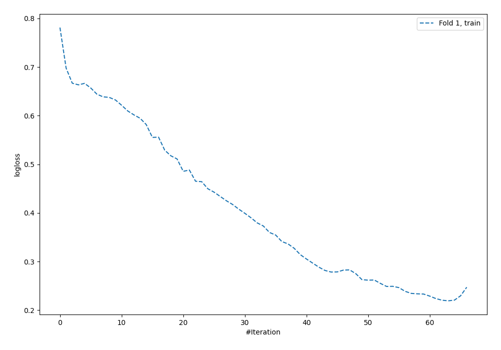
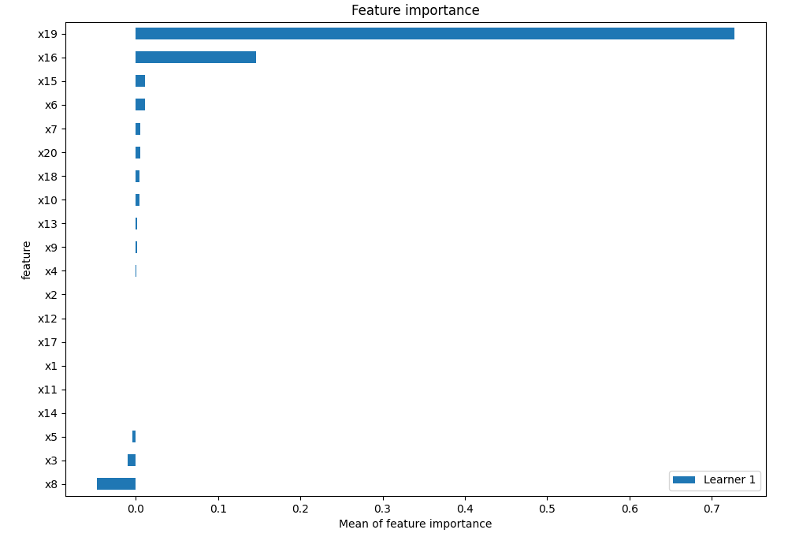
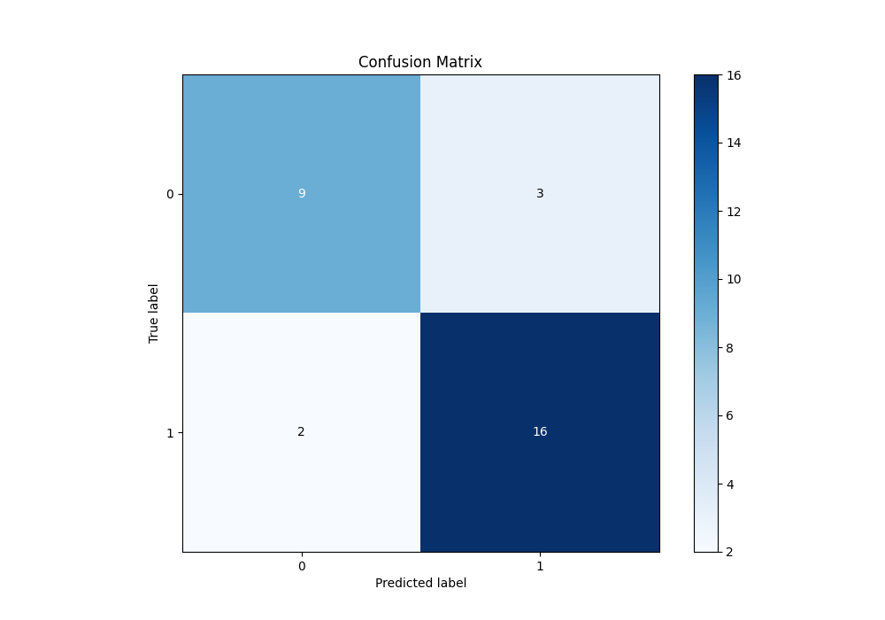
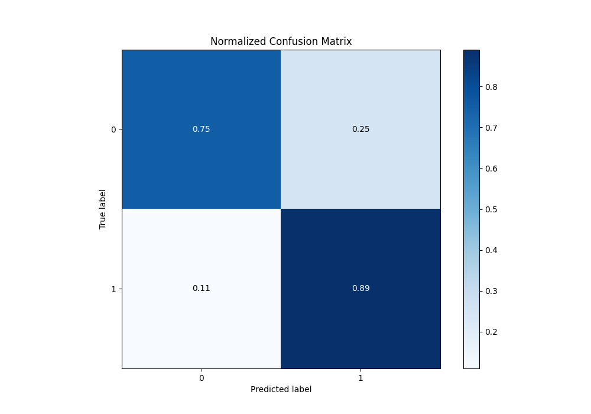

# Summary of 7_Default_NeuralNetwork

[<< Go back](../README.md)

## Neural Network
- **n_jobs**: -1
- **dense_1_size**: 32
- **dense_2_size**: 16
- **learning_rate**: 0.05
- **explain_level**: 2

## Validation
 - **validation_type**: split
 - **train_ratio**: 0.75
 - **shuffle**: True
 - **stratify**: True

## Optimized metric
logloss

## Training time

1.2 seconds

## Metric details
|           |    score |     threshold |
|:----------|---------:|--------------:|
| logloss   | 0.641274 | nan           |
| auc       | 0.791667 | nan           |
| f1        | 0.864865 |   0.481113    |
| accuracy  | 0.833333 |   0.481113    |
| precision | 1        |   0.938407    |
| recall    | 1        |   4.73171e-12 |
| mcc       | 0.659082 |   0.521451    |

## Metric details with threshold from accuracy metric
|           |    score |   threshold |
|:----------|---------:|------------:|
| logloss   | 0.641274 |  nan        |
| auc       | 0.791667 |  nan        |
| f1        | 0.864865 |    0.481113 |
| accuracy  | 0.833333 |    0.481113 |
| precision | 0.842105 |    0.481113 |
| recall    | 0.888889 |    0.481113 |
| mcc       | 0.6495   |    0.481113 |

## Confusion matrix (at threshold=0.481113)
|              |   Predicted as 0 |   Predicted as 1 |
|:-------------|-----------------:|-----------------:|
| Labeled as 0 |                9 |                3 |
| Labeled as 1 |                2 |               16 |

## Learning curves

## Permutation-based Importance

## Confusion Matrix

## Normalized Confusion Matrix

[<< Go back](../README.md)
