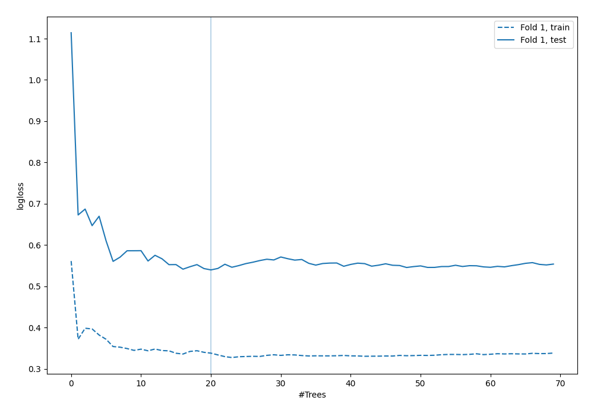
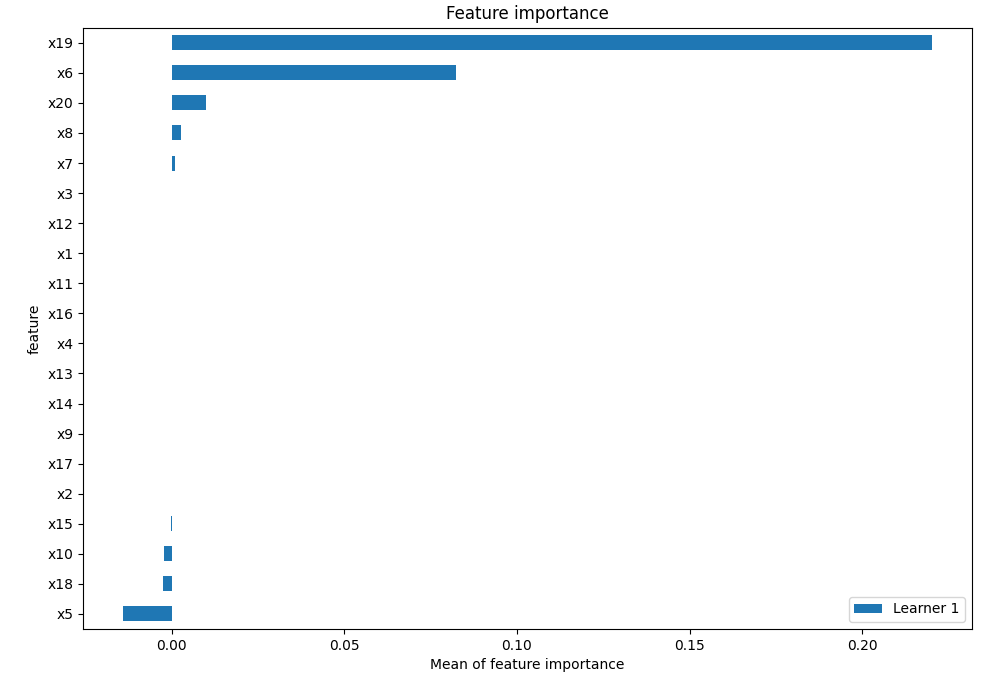
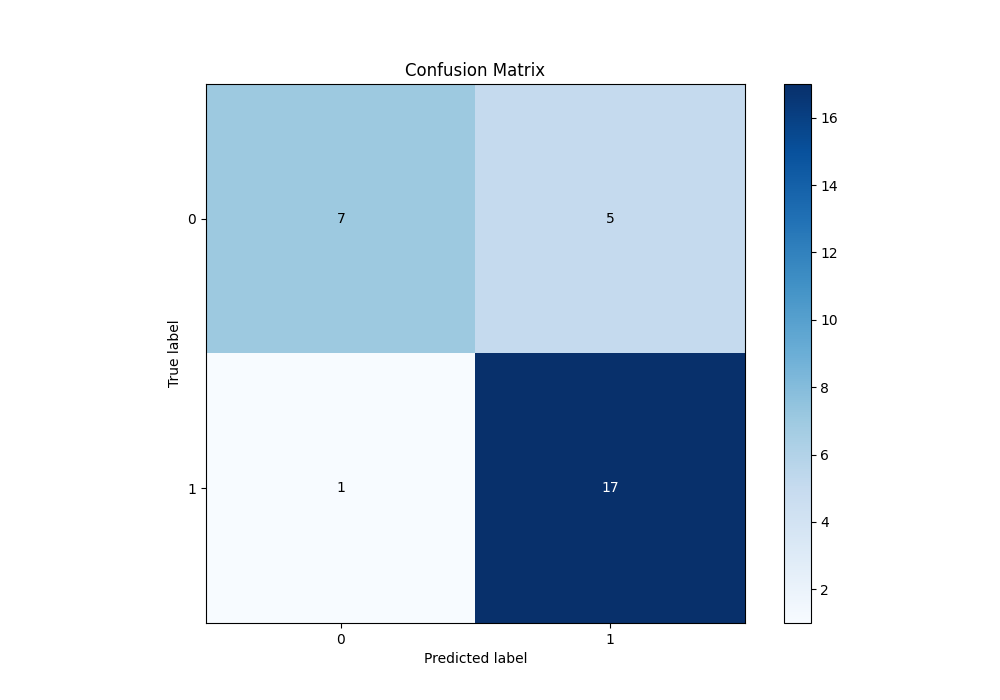
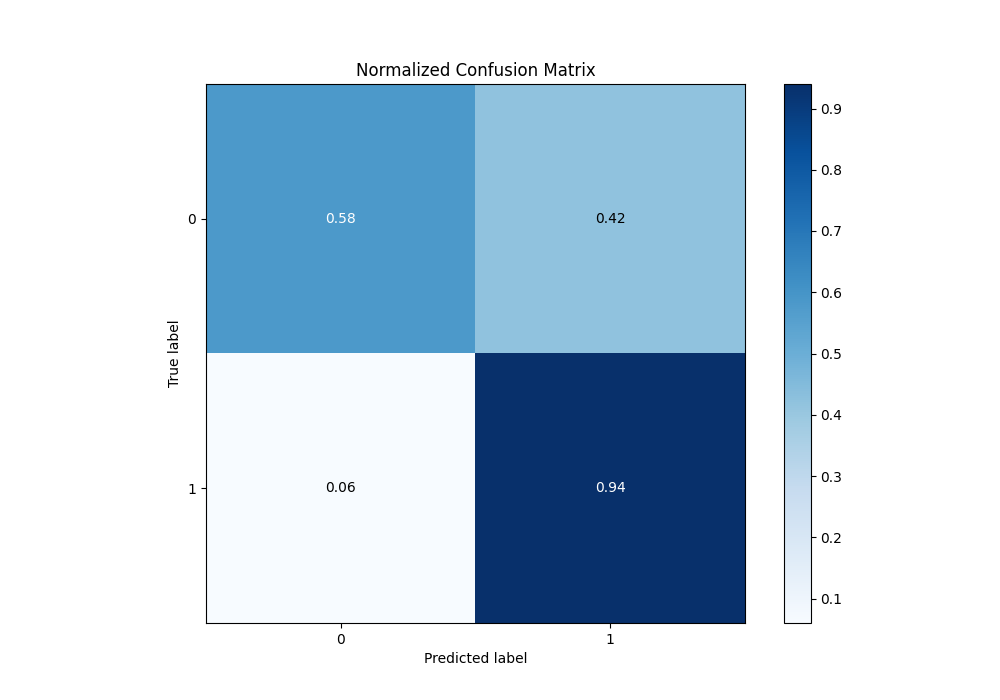

# Summary of 8_Default_RandomForest

[<< Go back](../README.md)

## Random Forest
- **n_jobs**: -1
- **criterion**: gini
- **max_features**: 0.9
- **min_samples_split**: 30
- **max_depth**: 4
- **eval_metric_name**: logloss
- **explain_level**: 2

## Validation
 - **validation_type**: split
 - **train_ratio**: 0.75
 - **shuffle**: True
 - **stratify**: True

## Optimized metric
logloss

## Training time

2.6 seconds

## Metric details
|           |    score |   threshold |
|:----------|---------:|------------:|
| logloss   | 0.539705 |  nan        |
| auc       | 0.75     |  nan        |
| f1        | 0.85     |    0.490702 |
| accuracy  | 0.8      |    0.490702 |
| precision | 1        |    0.885475 |
| recall    | 1        |    0.158814 |
| mcc       | 0.584685 |    0.490702 |

## Metric details with threshold from accuracy metric
|           |    score |   threshold |
|:----------|---------:|------------:|
| logloss   | 0.539705 |  nan        |
| auc       | 0.75     |  nan        |
| f1        | 0.85     |    0.490702 |
| accuracy  | 0.8      |    0.490702 |
| precision | 0.772727 |    0.490702 |
| recall    | 0.944444 |    0.490702 |
| mcc       | 0.584685 |    0.490702 |

## Confusion matrix (at threshold=0.490702)
|              |   Predicted as 0 |   Predicted as 1 |
|:-------------|-----------------:|-----------------:|
| Labeled as 0 |                7 |                5 |
| Labeled as 1 |                1 |               17 |

## Learning curves

## Permutation-based Importance

## Confusion Matrix

## Normalized Confusion Matrix

[<< Go back](../README.md)
