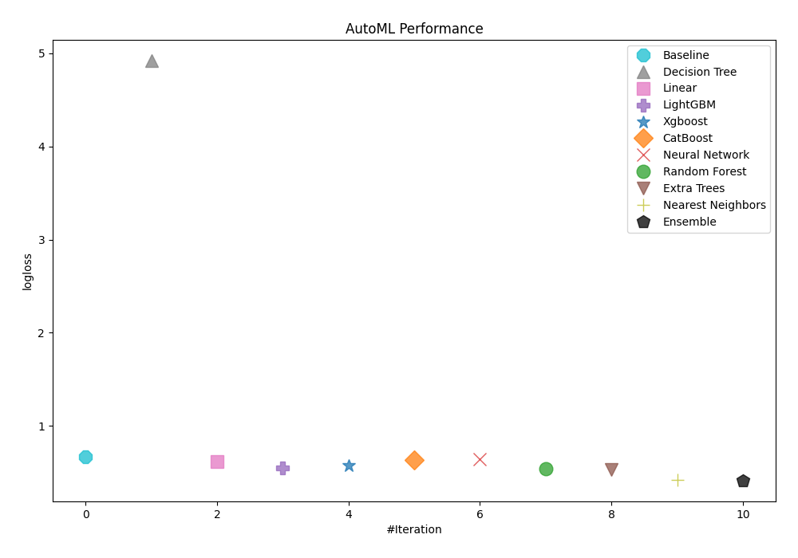
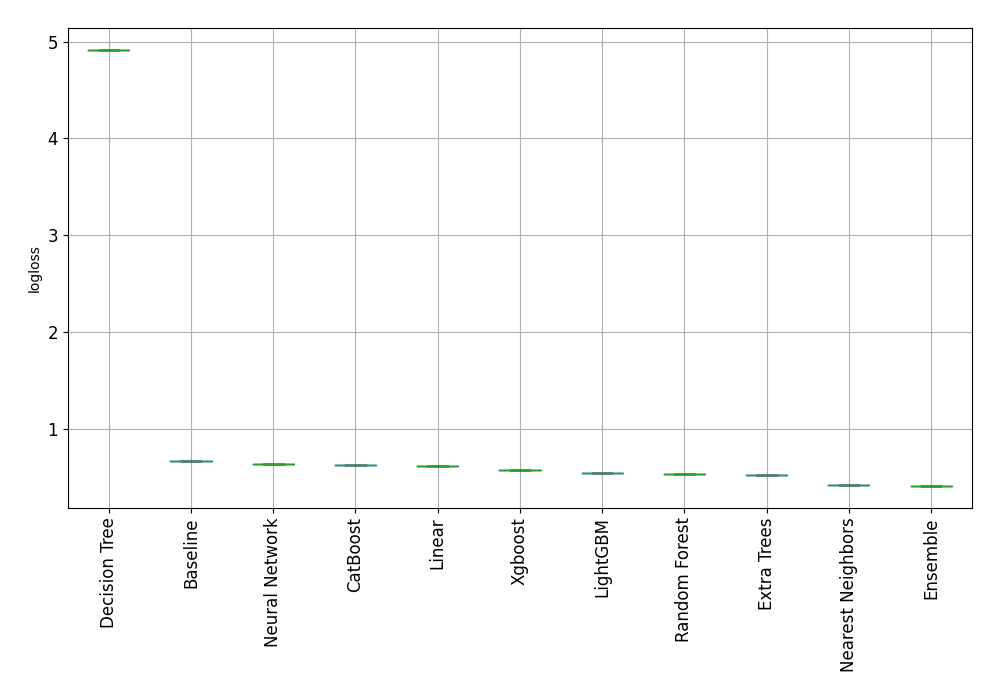
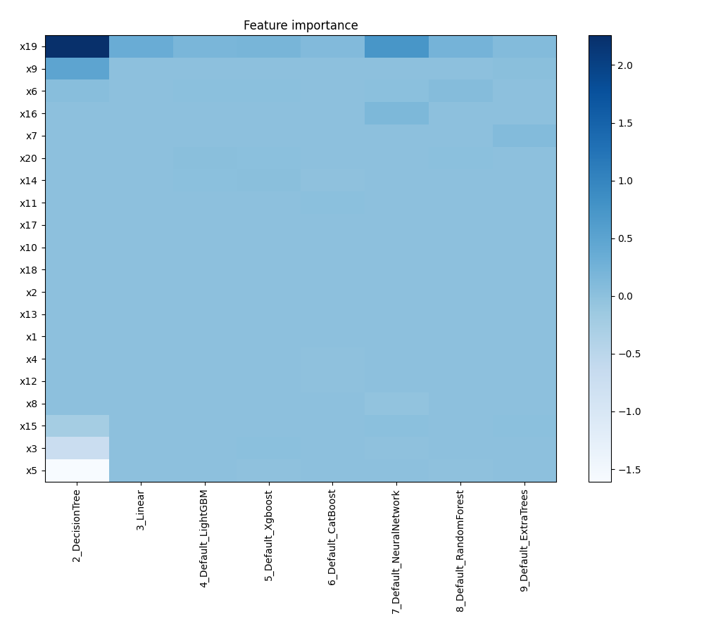
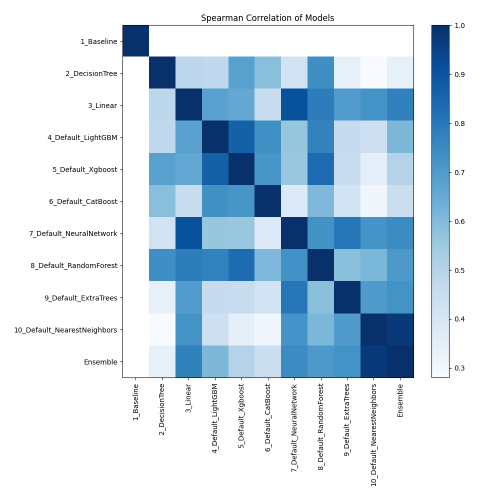

# AutoML Leaderboard

| Best model   | name                                                                 | model_type        | metric_type   |   metric_value |   train_time |
|:-------------|:---------------------------------------------------------------------|:------------------|:--------------|---------------:|-------------:|
|              | [1_Baseline](1_Baseline/README.md)                                   | Baseline          | logloss       |       0.673012 |         0.7  |
|              | [2_DecisionTree](2_DecisionTree/README.md)                           | Decision Tree     | logloss       |       4.91702  |         2.39 |
|              | [3_Linear](3_Linear/README.md)                                       | Linear            | logloss       |       0.620155 |         5.35 |
|              | [4_Default_LightGBM](4_Default_LightGBM/README.md)                   | LightGBM          | logloss       |       0.549539 |         6.77 |
|              | [5_Default_Xgboost](5_Default_Xgboost/README.md)                     | Xgboost           | logloss       |       0.575748 |         6.06 |
|              | [6_Default_CatBoost](6_Default_CatBoost/README.md)                   | CatBoost          | logloss       |       0.631223 |         2.33 |
|              | [7_Default_NeuralNetwork](7_Default_NeuralNetwork/README.md)         | Neural Network    | logloss       |       0.641274 |         2.53 |
|              | [8_Default_RandomForest](8_Default_RandomForest/README.md)           | Random Forest     | logloss       |       0.539705 |         3.77 |
|              | [9_Default_ExtraTrees](9_Default_ExtraTrees/README.md)               | Extra Trees       | logloss       |       0.53249  |         3.77 |
|              | [10_Default_NearestNeighbors](10_Default_NearestNeighbors/README.md) | Nearest Neighbors | logloss       |       0.424817 |         1.5  |
| **the best** | [Ensemble](Ensemble/README.md)                                       | Ensemble          | logloss       |       0.415375 |         1.27 |

### AutoML Performance

### AutoML Performance Boxplot

### Features Importance

### Spearman Correlation of Models

